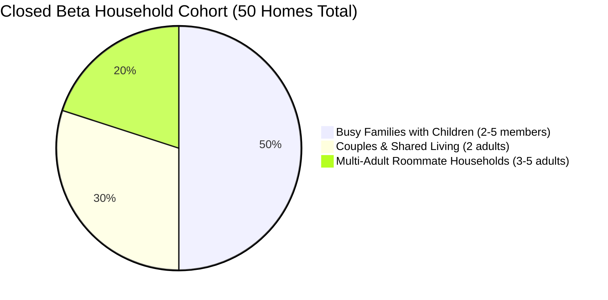
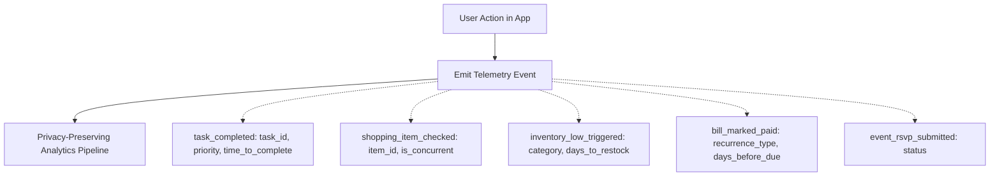

# Ozhzo Verse — Closed Beta Strategy & Execution Plan (BETA_PLAN.md)

**Phase**: Closed Beta (Private Household Cohort)  
**Cohort Size**: 20–50 Real Households (approx. 60–180 Active Family Members)  
**Duration**: 6 Weeks  
**Primary Goal**: Validate product-market fit, multi-member family engagement, daily utility retention, and usability frictionless execution.

---

## 1. Beta Objectives

1. **Validate Core Value Hypothesis**: Verify that households managing chores, groceries, inventory, bills, and calendar routines in a unified workspace experience significantly less cognitive friction than using fragmented spreadsheets, messaging apps, and paper notes.
2. **Measure Multi-Member Family Participation**: Confirm that non-admin family members (spouses, older children, roommates) actively participate (checking off groceries, completing chores, and viewing schedules) rather than a single family manager maintaining everything alone.
3. **Assess Daily/Weekly Retention**: Determine if households establish daily or multi-day routine usage (D7 $\ge 70\%$, D30 $\ge 60\%$).
4. **Identify Usability Friction & Critical Edge Cases**: Surface UX friction points in onboarding, in-store shopping concurrency, chore recurrence, and mobile keyboard responsiveness before general public availability.

---

## 2. Target User Cohorts & Participant Profiles

To ensure diverse behavioral feedback, the 20–50 participating Homes will be structured across 3 distinct household archetypes:



### Cohort Archetypes:
1. **Busy Families with Children (25 Homes)**:
   - *Profile*: 2 parents + 1–3 children (ages 8–18).
   - *Key Focus*: Chore delegation (`TASK`), shared calendar appointments (`EVENT`), grocery checklists (`SHOP`).
2. **Couples & Shared Domestic Partners (15 Homes)**:
   - *Profile*: 2 working adults co-managing a household.
   - *Key Focus*: Recurring utility bills (`BILL`), pantry supplies & low-stock alerts (`INV`), in-store grocery synchronization (`SHOP`).
3. **Multi-Adult Roommate Households (10 Homes)**:
   - *Profile*: 3–5 independent adults sharing an apartment/house.
   - *Key Focus*: Shared utility bill splitting, chore rotation, household supply replenishment.

---

## 3. Onboarding & Cohort Rollout Strategy

```mermaid
flowchart LR
    STAGE1[Week 1: Pilot Alpha Cohort (5 Homes)] --> STAGE2[Weeks 2-3: Wave 1 Expansion (20 Homes)]
    STAGE2 --> STAGE3[Weeks 4-6: Full Cohort Scale (50 Homes)]
```

### 3.1 Seamless Onboarding Flow
1. **VIP Invitation Delivery**: Home creator receives a personalized onboarding link (`https://app.ozhzo.com/invite/beta-cohort-xxx`).
2. **One-Click Home Initialization**: Creator signs up, names their Home, and confirms default currency and timezone.
3. **Instant Family Member Invitation**: In-app QR code and WhatsApp/SMS copyable invite links allow spouses and children to join in under 30 seconds with 1 tap.
4. **Zero-Friction Default Data**: Homes are pre-bootstrapped with standard household categories (`Pantry`, `Fridge`, `Cleaning`) and a default shopping list to eliminate blank-canvas paralysis.

---

## 4. Feedback Collection & Qualitative Insights

| Channel | Frequency | Target Audience | Focus Area |
|---|---|---|---|
| **In-App Feedback Widget** | Continuous (Always visible) | All beta users | One-click rating (1–5 stars) with optional screenshot & comment |
| **Weekly Pulse Micro-Surveys** | Weekly (2 questions max) | Home Admins | "Did your household feel more organized this week? (Yes/No)" |
| **1-on-1 Family Video Interviews** | Weeks 2 & 5 (30 mins) | 10 Selected Homes | Deep-dive user observation of daily routines & shopping flows |
| **Private Community (Discord/Slack)** | Continuous | Highly engaged users | Real-time discussions, feature feedback, community connection |

---

## 5. Bug Reporting & Issue Escalation Protocol

### 5.1 Reporting Channels
- **In-App "Report an Issue" Dialog**: Automatically captures device model, OS version, browser, user ID, home ID, and console breadcrumbs.
- **Automated Sentry / Telemetry Alerts**: Real-time stack trace ingestion for any unhandled client or API errors.

### 5.2 Bug Triage SLA
- **P0 (Critical Blocker)**: Crash on login, data loss, cross-home data leak, or broken in-store shopping check. $\rightarrow$ **Hotfix within 4 hours**.
- **P1 (High Severity)**: Notification failure, recurring chore calculation error, or broken mobile layout. $\rightarrow$ **Fix within 24 hours**.
- **P2 (Medium / Usability)**: Text truncation, visual styling glitch, minor animation stutter. $\rightarrow$ **Scheduled for weekly beta patch**.

---

## 6. Privacy-Preserving Product Analytics

Telemetry tracks aggregated action completions without inspecting personal household notes or financial amounts:



### Core Funnel Metrics:
1. **Activation Rate**: % of invited homes where $\ge 2$ members complete at least 1 action within 48 hours.
2. **Weekly Engagement Depth**: Average number of chore completions, grocery checkoffs, and calendar views per active Home per week.
3. **Cross-Member Collaboration Ratio**: % of total household actions performed by non-creator members.

---

## 7. Retention & Cohort Health Measurement

| Metric | Target Closed Beta Benchmark | Definition & Calculation |
|---|---|---|
| **Day 1 Retention (D1)** | $\ge 80\%$ | % of users returning 24 hours after sign-up |
| **Day 7 Retention (D7)** | $\ge 70\%$ | % of households with active engagement in Week 1 |
| **Day 30 Retention (D30)** | $\ge 60\%$ | % of households regularly organizing routines in Month 1 |
| **Weekly Active Households (WAH)** | $\ge 75\%$ | Households executing $\ge 3$ actions per week |
| **Multi-Member Engagement** | $\ge 65\%$ | Active homes where $\ge 2$ family members take actions |

---

## 8. Closed Beta Success & Exit Criteria

To authorize the transition from Closed Beta to Public Launch, the following exit criteria must be satisfied:

1. **Household Retention Gate**: $\ge 60\%$ D30 retention across the 50-Home cohort.
2. **Reliability & Stability Gate**: Zero P0/P1 security or data integrity bugs open for $> 24$ hours; $99.9\%$ API uptime.
3. **Usability & CSAT Gate**: Net Promoter Score (NPS) $\ge +45$ or Customer Satisfaction (CSAT) $\ge 4.5 / 5.0$.
4. **Feature Scope Discipline**: Zero major unapproved feature creep added during the beta period. Focus strictly on usability polish, performance, and bug elimination.
