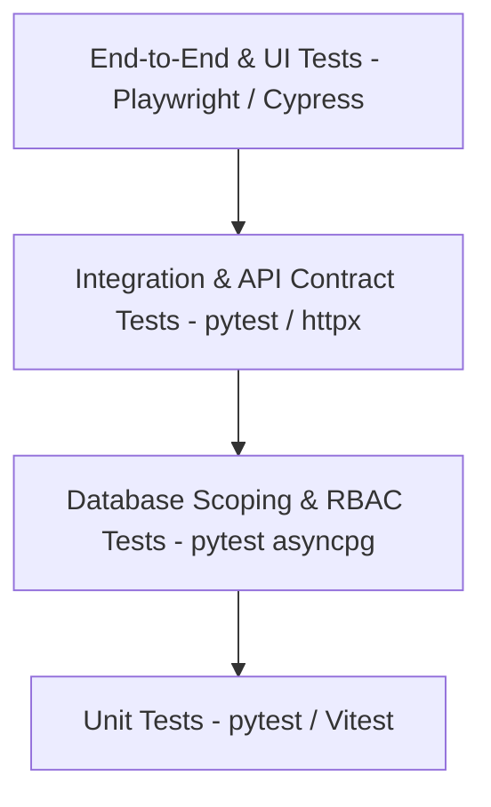
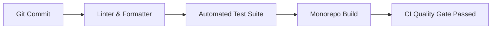

# Ozhzo Verse — Master Quality Assurance Strategy & Test Plan (TEST_PLAN.md)

**Document Version**: 1.0.0 (MVP Baseline)  
**Target Applications**: Web Client (Next.js), Core Backend API (FastAPI / Python), Database (PostgreSQL 16), Cache & Events (Redis 7)  
**Quality Objective**: 100% PRD Functional Coverage, Multi-Tenant Data Isolation, Cryptographic Integrity, and Zero Regressions.

---

## 1. QA Strategy & Testing Pyramid

Ozhzo Verse utilizes an automated, multi-tiered test pyramid ensuring end-to-end verification from database queries up to user-facing browser workflows.

### 1.1 Test Levels & Execution Frameworks

| Test Level | Scope | Framework / Tooling | Target Coverage | Execution Frequency |
|---|---|---|---|---|
| **Unit Tests** | Domain models, stock calculation, permission matrices, pricing math, date math. | `pytest` (Backend), `Vitest` / `Jest` (Web) | $\ge 90\%$ | Pre-commit & CI |
| **Database Tests** | Foreign key cascades, compound indexes, constraints, soft deletions, migrations. | `pytest` + `testcontainers` PostgreSQL | 100% Schema | Every PR / CI |
| **API Contract Tests** | Endpoint request/response DTO schemas, HTTP status codes, validation errors (422). | `pytest` + `httpx.AsyncClient` | 100% Endpoints | Every PR / CI |
| **Authorization / RBAC Tests** | Cross-home isolation, Role permissions (`OWNER`, `ADMIN`, `MEMBER`, `CHILD`, `GUEST`). | `pytest` parameterized matrix | 100% Matrix | Every PR / CI |
| **Integration Tests** | Multi-service workflows (e.g. low-stock triggers notification, mark paid spawns next bill). | `pytest` (AsyncSession + Redis) | Core Workflows | Every PR / CI |
| **UI & Component Tests** | React component rendering, empty/loading/error states, design system tokens. | React Testing Library / Vitest | Key Views | Every PR / CI |
| **End-to-End (E2E) Tests** | Full browser user journeys (Registration $\rightarrow$ Home Creation $\rightarrow$ Chore completion). | Playwright / Chromium | Critical Paths | Staging & Nightly |
| **Regression Tests** | Automated execution of all historical test suites to prevent regression bugs. | CI Automation Pipeline | 100% Suites | On every push |
| **Performance Tests** | Query latency ($<50$ms p95), Redis PubSub broadcast latency, concurrent list updates. | Locust / k6 | 1,000 req/sec | Pre-release |
| **Security Tests** | Cross-tenant IDOR attacks, SQL injection attempts, XSS escaping, token replay attacks. | OWASP ZAP / Custom Suites | Zero High/Crit | Pre-release |

---

## 2. Requirements-to-Test Traceability Matrix (RTM)

| PRD Module | PRD Req ID | PRD Requirement Summary | Test Case ID | Test Level | Automated Suite |
|---|---|---|---|---|---|
| **Auth** | `AUTH-001` | User registration with Argon2id/Bcrypt password hashing | `TEST-AUTH-001` | Unit & API | `test_auth_sprint1.py` |
| **Auth** | `AUTH-002` | JWT access token (15m) & refresh token (30d) issuance | `TEST-AUTH-002` | API Contract | `test_auth_sprint1.py` |
| **Auth** | `AUTH-003` | Token refresh endpoint with rotating JTI token blacklist | `TEST-AUTH-003` | Integration | `test_auth_sprint1.py` |
| **Auth** | `AUTH-004` | Password reset flow with single-use cryptographic token | `TEST-AUTH-004` | Integration | `test_auth_sprint1.py` |
| **Auth** | `AUTH-005` | Instant session revocation on logout & password reset | `TEST-AUTH-005` | Security / API | `test_auth_sprint1.py` |
| **Home** | `HOME-001` | Home creation assigning creator as `OWNER` | `TEST-HOME-001` | Unit & API | `test_homes_sprint2.py` |
| **Home** | `HOME-002` | Default category & shopping list initialization | `TEST-HOME-002` | Integration | `test_homes_sprint2.py` |
| **Home** | `HOME-003` | Home profile & settings update (`name`, `currency`, `tz`) | `TEST-HOME-003` | API Contract | `test_homes_sprint2.py` |
| **Home** | `HOME-004` | Multi-home switcher listing user's active memberships | `TEST-HOME-004` | API Contract | `test_homes_sprint2.py` |
| **Home** | `HOME-005` | Owner-only home soft-deletion & 30-day grace period | `TEST-HOME-005` | RBAC & DB | `test_homes_sprint2.py` |
| **Members** | `MEM-001` | High-entropy 64-char invite tokens with 7-day expiration | `TEST-MEM-001` | Unit & API | `test_members_sprint3.py` |
| **Members** | `MEM-002` | Role designation on invitation (`ADMIN`, `MEMBER`, `CHILD`, `GUEST`) | `TEST-MEM-002` | API Contract | `test_members_sprint3.py` |
| **Members** | `MEM-003` | Accept invitation attaching user with designated role | `TEST-MEM-003` | Integration | `test_members_sprint3.py` |
| **Members** | `MEM-004` | View member roster & pending invitations | `TEST-MEM-004` | API Contract | `test_members_sprint3.py` |
| **Members** | `MEM-005` | Member removal with Owner protection & Free tier caps | `TEST-MEM-005` | RBAC & Security | `test_members_sprint3.py` |
| **Inventory** | `INV-001` | Inventory categories listing & creation | `TEST-INV-001` | API Contract | `test_inventory_sprint5.py` |
| **Inventory** | `INV-002` | Add supply with decimal quantity, unit, threshold, location | `TEST-INV-002` | API & DB | `test_inventory_sprint5.py` |
| **Inventory** | `INV-003` | Stock status engine (`IN_STOCK`, `LOW_STOCK`, `OUT_OF_STOCK`, `EXPIRED`) | `TEST-INV-003` | Unit Test | `test_inventory_sprint5.py` |
| **Inventory** | `INV-004` | Low stock automated `NotificationModel` generation | `TEST-INV-004` | Integration | `test_inventory_sprint5.py` |
| **Inventory** | `INV-005` | Supply search, filter, sort & soft deletion | `TEST-INV-005` | API Contract | `test_inventory_sprint5.py` |
| **Shopping** | `SHOP-001` | Shopping list creation & item addition | `TEST-SHOP-001` | API Contract | `test_shopping_sprint6.py` |
| **Shopping** | `SHOP-002` | Check/uncheck item with optimistic concurrency control | `TEST-SHOP-002` | Concurrency | `test_shopping_sprint6.py` |
| **Shopping** | `SHOP-003` | Convert low-stock inventory supply into shopping list item | `TEST-SHOP-003` | Integration | `test_shopping_sprint6.py` |
| **Shopping** | `SHOP-004` | Real-time Redis broadcast sync on item toggle | `TEST-SHOP-004` | Integration | `test_shopping_sprint6.py` |
| **Shopping** | `SHOP-005` | Child & Guest in-store shopping check permissions | `TEST-SHOP-005` | RBAC Matrix | `test_shopping_sprint6.py` |
| **Tasks** | `TASK-001` | Create task with priority, due date, and recurrence rule | `TEST-TASK-001` | API & DB | `test_tasks_sprint7.py` |
| **Tasks** | `TASK-002` | Task assignment generating `TASK_ASSIGNED` notification | `TEST-TASK-002` | Integration | `test_tasks_sprint7.py` |
| **Tasks** | `TASK-003` | Complete chore recording `completed_by` and timestamp | `TEST-TASK-003` | API Contract | `test_tasks_sprint7.py` |
| **Tasks** | `TASK-004` | Recurring task automatic next iteration instantiation | `TEST-TASK-004` | Unit & DB | `test_tasks_sprint7.py` |
| **Tasks** | `TASK-005` | Reopen completed chore and delete task | `TEST-TASK-005` | API Contract | `test_tasks_sprint7.py` |
| **Bills** | `BILL-001` | Create bill with amount, currency, due date, and reminders | `TEST-BILL-001` | API & DB | `test_bills_sprint8.py` |
| **Bills** | `BILL-002` | Record bill payment into `BillPaymentModel` | `TEST-BILL-002` | API & DB | `test_bills_sprint8.py` |
| **Bills** | `BILL-003` | Recurring bill spawning upon payment | `TEST-BILL-003` | Integration | `test_bills_sprint8.py` |
| **Bills** | `BILL-004` | Automated `BILL_DUE` notification dispatch | `TEST-BILL-004` | Integration | `test_bills_sprint8.py` |
| **Bills** | `BILL-005` | Strict financial privacy (Child & Guest 403 Forbidden) | `TEST-BILL-005` | Security / RBAC | `test_bills_sprint8.py` |
| **Calendar** | `EVENT-001` | Schedule family event with date/time, location, all-day flag | `TEST-EVENT-001` | API & DB | `test_calendar_sprint9.py` |
| **Calendar** | `EVENT-002` | Attach participants and dispatch calendar notifications | `TEST-EVENT-002` | Integration | `test_calendar_sprint9.py` |
| **Calendar** | `EVENT-003` | RSVP status update (`ACCEPTED`, `DECLINED`) | `TEST-EVENT-003` | API Contract | `test_calendar_sprint9.py` |
| **Calendar** | `EVENT-004` | Date range boundary querying for calendar rendering | `TEST-EVENT-004` | API Contract | `test_calendar_sprint9.py` |
| **Calendar** | `EVENT-005` | All-member calendar visibility (Child & Guest view allowed) | `TEST-EVENT-005` | RBAC Matrix | `test_calendar_sprint9.py` |
| **Notifications** | `NOTIF-001` | Centralized `NotificationService` multi-channel dispatch | `TEST-NOTIF-001` | Unit & Service | `test_notifications_sprint10.py` |
| **Notifications** | `NOTIF-002` | Support for all 6 required notification types | `TEST-NOTIF-002` | Unit Test | `test_notifications_sprint10.py` |
| **Notifications** | `NOTIF-003` | Granular user preference suppression engine | `TEST-NOTIF-003` | Service / Logic | `test_notifications_sprint10.py` |
| **Notifications** | `NOTIF-004` | Single notification mark as read | `TEST-NOTIF-004` | API Contract | `test_notifications_sprint10.py` |
| **Notifications** | `NOTIF-005` | Atomic bulk mark all notifications read | `TEST-NOTIF-005` | API Contract | `test_notifications_sprint10.py` |
| **Subscription** | `SUB-001` | Dynamic subscription plan creation and pricing config | `TEST-SUB-001` | Unit & DB | `test_subscriptions_sprint11.py` |
| **Subscription** | `SUB-002` | 1-year free admin introductory trial calculation | `TEST-SUB-002` | Business Logic | `test_subscriptions_sprint11.py` |
| **Subscription** | `SUB-003` | Additional member seat requirements & annual pricing math | `TEST-SUB-003` | Business Logic | `test_subscriptions_sprint11.py` |
| **Subscription** | `SUB-004` | Post-trial expiration status transition to `PAST_DUE` | `TEST-SUB-004` | Lifecycle Test | `test_subscriptions_sprint11.py` |
| **Subscription** | `SUB-005` | Update paid member seat allocation | `TEST-SUB-005` | API Contract | `test_subscriptions_sprint11.py` |

---

## 3. Detailed Test Case Specifications

### 3.1 Authentication Test Cases (`AUTH`)

#### `TEST-AUTH-001`: User Registration
- **Type**: Functional / Unit & API
- **Precondition**: Email does not exist in `users`.
- **Steps**:
  1. Send `POST /api/v1/auth/register` with valid email, name, and strong password.
  2. Verify HTTP 201 response.
  3. Verify database stores hashed password (starts with `$argon2id$` or `$2b$`).
- **Expected Result**: User record and UserProfile record created; JWT access & refresh tokens returned.

#### `TEST-AUTH-002`: JWT Token Issuance & Validation
- **Type**: API Contract & Security
- **Steps**:
  1. Send `POST /api/v1/auth/login` with valid credentials.
  2. Inspect access token claims (`sub`, `exp`, `iat`, `jti`, `type="access"`).
  3. Access protected route `GET /api/v1/users/me` with Bearer token.
- **Expected Result**: HTTP 200 with user profile.

#### `TEST-AUTH-003`: Token Refresh & Rotation
- **Type**: Integration & Security
- **Steps**:
  1. Send `POST /api/v1/auth/refresh` with refresh token.
  2. Verify new token pair is returned.
  3. Attempt replay of the old refresh token.
- **Expected Result**: First request returns 200; second replay attempt returns 401 (revoked).

#### `TEST-AUTH-004`: Password Reset Flow
- **Type**: Integration
- **Steps**:
  1. Send `POST /api/v1/auth/forgot-password` with user email.
  2. Retrieve reset token from Redis `password_reset:{token}`.
  3. Send `POST /api/v1/auth/reset-password` with token and new password.
  4. Attempt login with old password (fails), then new password (succeeds).
- **Expected Result**: Password updated; token invalidated.

#### `TEST-AUTH-005`: Session Revocation on Logout
- **Type**: Security
- **Steps**:
  1. Log in and acquire access token.
  2. Send `POST /api/v1/auth/logout`.
  3. Attempt to call protected endpoint with revoked access token.
- **Expected Result**: Returns HTTP 401 "Token has been revoked".

---

### 3.2 Home Management Test Cases (`HOME`)

#### `TEST-HOME-001`: Home Creation & Owner Custody
- **Type**: Unit & API
- **Steps**:
  1. Authenticated user sends `POST /api/v1/homes` with home name and currency.
  2. Verify creator is enrolled in `home_members` with `role='OWNER'`.
- **Expected Result**: Home created; creator assigned `OWNER`.

#### `TEST-HOME-002`: Default Category Bootstrap
- **Type**: Integration
- **Steps**:
  1. Create home.
  2. Query `GET /api/v1/homes/{home_id}/inventory/categories`.
- **Expected Result**: Returns 6 default categories (`Pantry`, `Fridge`, `Freezer`, `Cleaning`, `Medicine`, `Other`).

#### `TEST-HOME-003`: Home Settings Mutation
- **Type**: API Contract
- **Steps**:
  1. Admin sends `PATCH /api/v1/homes/{home_id}` with new name.
- **Expected Result**: Name updated; audit timestamps recorded.

#### `TEST-HOME-004`: Multi-Home Listing
- **Type**: API Contract
- **Steps**:
  1. Query `GET /api/v1/homes` for a multi-home member.
- **Expected Result**: Returns all active homes and user roles.

#### `TEST-HOME-005`: Owner-Only Home Deletion
- **Type**: RBAC & Security
- **Steps**:
  1. Member with `role='ADMIN'` attempts `DELETE /api/v1/homes/{home_id}` $\rightarrow$ Returns 403.
  2. Member with `role='OWNER'` executes `DELETE` $\rightarrow$ Returns 200 with soft deletion.
- **Expected Result**: Only Owner can delete home.

---

### 3.3 Home Members & Invitations Test Cases (`MEM`)

#### `TEST-MEM-001`: High-Entropy Invitation Generation
- **Type**: Unit & Security
- **Steps**:
  1. Send `POST /api/v1/homes/{home_id}/invitations` with role `MEMBER`.
  2. Validate invite token entropy (64 hex characters) and 7-day expiration.
- **Expected Result**: Unique token created in database.

#### `TEST-MEM-002`: Role Designation Support
- **Type**: API Contract
- **Steps**:
  1. Generate invites for `ADMIN`, `MEMBER`, `CHILD`, and `GUEST`.
- **Expected Result**: Role stored accurately in `invitations` table.

#### `TEST-MEM-003`: Invitation Acceptance & Enrollment
- **Type**: Integration
- **Steps**:
  1. Invitee calls `POST /api/v1/invitations/{token}/accept`.
  2. Verify membership created in `home_members` with designated role.
  3. Attempt duplicate acceptance.
- **Expected Result**: Enrolls member; second attempt returns 410 Gone.

#### `TEST-MEM-004`: Member Roster Retrieval
- **Type**: API Contract
- **Steps**:
  1. Call `GET /api/v1/homes/{home_id}/members`.
- **Expected Result**: Returns list of all active members with profile names and roles.

#### `TEST-MEM-005`: Cross-Home Member Removal & Limits
- **Type**: RBAC & Security
- **Steps**:
  1. Admin removes a regular member $\rightarrow$ Returns 200.
  2. Admin attempts to remove Home Owner $\rightarrow$ Returns 403 Forbidden.
- **Expected Result**: Protected owner hierarchy strictly enforced.

---

### 3.4 Household Inventory Test Cases (`INV`)

#### `TEST-INV-001`: Category Management
- **Type**: API Contract
- **Steps**:
  1. Query categories and create custom category `POST /inventory/categories`.
- **Expected Result**: Returns category with item counts.

#### `TEST-INV-002`: Add Item with Decimal Precision
- **Type**: API & DB
- **Steps**:
  1. Send `POST /inventory/items` with `quantity=2.5`, `unit="kg"`, `min_threshold=1.0`.
- **Expected Result**: Decimal quantity stored accurately; status computed as `IN_STOCK`.

#### `TEST-INV-003`: Stock Status State Engine
- **Type**: Unit Test
- **Steps**:
  1. Test status logic across `(quantity > min_threshold)` $\rightarrow$ `IN_STOCK`.
  2. Test `(quantity <= min_threshold)` $\rightarrow$ `LOW_STOCK`.
  3. Test `(quantity == 0)` $\rightarrow$ `OUT_OF_STOCK`.
  4. Test `(expiry_date < TODAY)` $\rightarrow$ `EXPIRED`.
- **Expected Result**: All status transitions match PRD state machine.

#### `TEST-INV-004`: Automated Low Stock Notification
- **Type**: Integration
- **Steps**:
  1. Create item with `quantity=0.5` and `min_threshold=1.0`.
  2. Query `notifications` table for home members.
- **Expected Result**: `INVENTORY_LOW` notification dispatched to active adult members.

#### `TEST-INV-005`: Search & Filter
- **Type**: API Contract
- **Steps**:
  1. Search items by partial name or storage location.
- **Expected Result**: Correct matching items returned.

---

### 3.5 Shopping Lists Test Cases (`SHOP`)

#### `TEST-SHOP-001`: Create List & Add Item
- **Type**: API Contract
- **Steps**:
  1. Create shopping item with priority `HIGH` and quantity `2.0`.
- **Expected Result**: Item stored with `is_checked=False`, `version=1`.

#### `TEST-SHOP-002`: Optimistic Concurrency Conflict Detection
- **Type**: Concurrency & Unit
- **Steps**:
  1. Client A sends check toggle with `version=1` $\rightarrow$ Succeeds, server becomes `version=2`.
  2. Client B sends check toggle with stale `version=1`.
- **Expected Result**: Client B receives HTTP 409 Conflict.

#### `TEST-SHOP-003`: Low-Stock Inventory Conversion
- **Type**: Integration
- **Steps**:
  1. Call `POST /shopping/convert-from-inventory/{item_id}`.
- **Expected Result**: Shopping item added with calculated replenishment quantity `(min_threshold * 2) - quantity`.

#### `TEST-SHOP-004`: Real-Time Event Broadcast
- **Type**: Integration
- **Steps**:
  1. Check item. Verify Redis channel `home:{home_id}:shopping` receives `ITEM_CHECKED` payload.
- **Expected Result**: Real-time event published.

#### `TEST-SHOP-005`: Child & Guest In-Store Check Rights
- **Type**: RBAC Matrix
- **Steps**:
  1. Authenticate as `CHILD` role and call `PATCH /shopping/items/{id}/check`.
- **Expected Result**: Allowed (HTTP 200).

---

### 3.6 Household Tasks & Chores Test Cases (`TASK`)

#### `TEST-TASK-001`: Create Chore with Recurrence
- **Type**: API & DB
- **Steps**:
  1. Send `POST /tasks` with `recurrence_rule="WEEKLY"`.
- **Expected Result**: Task stored with status `TODO`.

#### `TEST-TASK-002`: Task Assignment Notification
- **Type**: Integration
- **Steps**:
  1. Assign task to member.
  2. Verify `NotificationModel` contains `TASK_ASSIGNED` record for assignee.
- **Expected Result**: Notification created with due date.

#### `TEST-TASK-003`: Complete Chore & Attribution
- **Type**: API Contract
- **Steps**:
  1. Call `PATCH /tasks/{id}/complete`.
- **Expected Result**: Status becomes `COMPLETED`, `completed_at` populated, `completed_by` stored.

#### `TEST-TASK-004`: Recurring Task Next Iteration
- **Type**: Integration
- **Steps**:
  1. Complete a task with `recurrence_rule="DAILY"`.
- **Expected Result**: Current task completed, and a new `TODO` task is automatically inserted with `due_date = current_due + 1 day`.

#### `TEST-TASK-005`: Reopen Chore
- **Type**: API Contract
- **Steps**:
  1. Call `PATCH /tasks/{id}/reopen` on completed task.
- **Expected Result**: Status transitions back to `TODO`, `completed_at` cleared.

---

### 3.7 Bills & Reminders Test Cases (`BILL`)

#### `TEST-BILL-001`: Create Bill & Reminder Schedule
- **Type**: API & DB
- **Steps**:
  1. Send `POST /bills` with `reminder_days_before=[7, 3, 1]`.
- **Expected Result**: Bill created; 3 `BillReminderModel` records generated.

#### `TEST-BILL-002`: Record Bill Payment
- **Type**: API & DB
- **Steps**:
  1. Call `POST /bills/{id}/payments`.
- **Expected Result**: Payment logged in `BillPaymentModel`; bill marked `PAID`.

#### `TEST-BILL-003`: Recurring Bill Spawning
- **Type**: Integration
- **Steps**:
  1. Mark recurring `MONTHLY` bill as paid.
- **Expected Result**: Next month's bill created with new reminder schedule.

#### `TEST-BILL-004`: Bill Due Notification Dispatch
- **Type**: Integration
- **Steps**:
  1. Trigger reminder check.
- **Expected Result**: Dispatches `BILL_DUE` notification to home members.

#### `TEST-BILL-005`: Role Privacy Safeguards
- **Type**: Security & RBAC
- **Steps**:
  1. User with `role='CHILD'` calls `GET /bills` $\rightarrow$ Returns 403 Forbidden.
  2. User with `role='GUEST'` calls `GET /bills` $\rightarrow$ Returns 403 Forbidden.
- **Expected Result**: Financial data strictly hidden from children and guests.

---

### 3.8 Home Calendar Test Cases (`EVENT`)

#### `TEST-EVENT-001`: Schedule Event
- **Type**: API Contract
- **Steps**:
  1. Send `POST /events` with start time, end time, location, all-day flag.
- **Expected Result**: Event created in database.

#### `TEST-EVENT-002`: Participant Invitations & Alerting
- **Type**: Integration
- **Steps**:
  1. Schedule event with 2 participants.
- **Expected Result**: `EventParticipantModel` records inserted; `EVENT_REMINDER` notifications dispatched.

#### `TEST-EVENT-003`: RSVP Lifecycle
- **Type**: API Contract
- **Steps**:
  1. Participant sends `PATCH /events/{id}/status` with `status="ACCEPTED"`.
- **Expected Result**: Participant status updated.

#### `TEST-EVENT-004`: Date Range Filtering
- **Type**: API Contract
- **Steps**:
  1. Query `GET /events?start_date=2026-08-01&end_date=2026-08-31`.
- **Expected Result**: Returns only events within specified boundary.

#### `TEST-EVENT-005`: Universal Household Visibility
- **Type**: RBAC Matrix
- **Steps**:
  1. Call `GET /events` as `CHILD` and `GUEST`.
- **Expected Result**: Returns 200 OK with family events.

---

### 3.9 Notifications System Test Cases (`NOTIF`)

#### `TEST-NOTIF-001`: Centralized Notification Dispatch
- **Type**: Unit & Service
- **Steps**:
  1. Call `notification_service.dispatch()`.
- **Expected Result**: Payload stored in `notifications` and published over Redis.

#### `TEST-NOTIF-002`: All 6 Standard Notification Types
- **Type**: Unit Test
- **Steps**:
  1. Validate dispatching for `TASK_ASSIGNED`, `BILL_REMINDER`, `LOW_STOCK`, `EVENT_REMINDER`, `HOME_INVITATION`, `SYSTEM`.
- **Expected Result**: All 6 types validated.

#### `TEST-NOTIF-003`: Preference Suppression Engine
- **Type**: Business Logic
- **Steps**:
  1. User sets `low_stock_enabled=False`.
  2. Dispatch `LOW_STOCK` notification.
- **Expected Result**: Notification is suppressed (zero DB records added).

#### `TEST-NOTIF-004`: Single Mark as Read
- **Type**: API Contract
- **Steps**:
  1. Call `PATCH /notifications/{id}/read`.
- **Expected Result**: `is_read=True`, `read_at` recorded.

#### `TEST-NOTIF-005`: Atomic Bulk Mark All Read
- **Type**: API Contract
- **Steps**:
  1. Call `POST /notifications/mark-all-read`.
- **Expected Result**: All unread notifications for current user updated.

---

### 3.10 Subscription Foundation Test Cases (`SUB`)

#### `TEST-SUB-001`: Configurable Dynamic Pricing
- **Type**: Unit & DB
- **Steps**:
  1. Query `GET /subscriptions/plans`.
- **Expected Result**: Returns plans with backend-configured admin and member prices.

#### `TEST-SUB-002`: 1-Year Free Admin Entitlement
- **Type**: Business Logic
- **Steps**:
  1. Query subscription during first 365 days.
- **Expected Result**: Home Admin entitlement is marked `is_free_entitled=True`.

#### `TEST-SUB-003`: Additional Member Seat Math
- **Type**: Business Logic
- **Steps**:
  1. Household has 3 active members (1 Owner + 2 Members).
- **Expected Result**: `required_paid_seats = 2`, `annual_total_price = $20.00`.

#### `TEST-SUB-004`: Post-Trial Expiration Transition
- **Type**: Lifecycle Test
- **Steps**:
  1. Evaluate home with `introductory_period_ends_at < NOW()` and 0 paid seats.
- **Expected Result**: Status transitions to `PAST_DUE`.

#### `TEST-SUB-005`: Paid Member Seat Adjustment
- **Type**: API Contract
- **Steps**:
  1. Owner sends `POST /subscriptions/homes/{home_id}/seats` with `paid_member_seats=4`.
- **Expected Result**: Database updated; new seat count reflected immediately.

---

## 4. Continuous Integration & Quality Gates

### Quality Gate Criteria
1. **Linter & Formatting**: Zero errors across TypeScript, CSS, and Python (`bash scripts/lint.sh`).
2. **Automated Test Suite**: 100% test pass rate across all 11 sprint test modules (`bash scripts/test.sh`).
3. **Monorepo Build**: Clean production compile of web client, backend, and shared type packages (`bash scripts/build.sh`).
