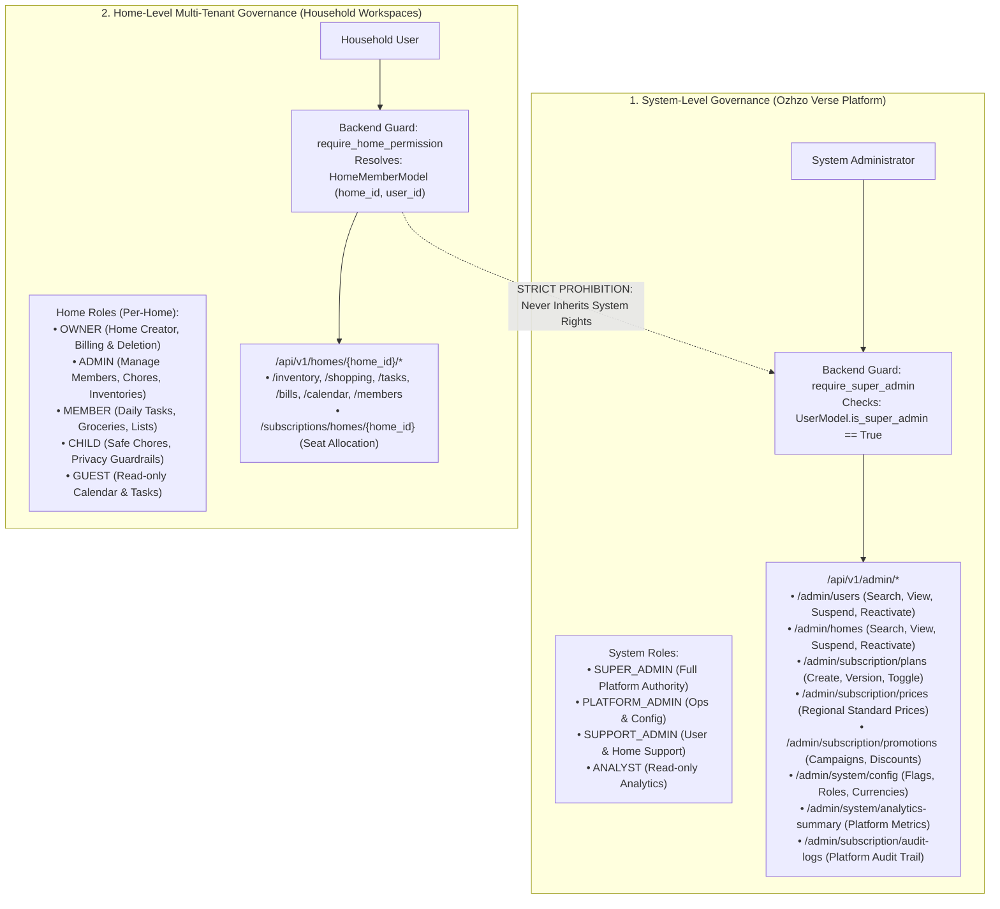

# Ozhzo Verse — Platform Administration & Multi-Level Authorization (ADMINISTRATION.md)

**Document Version**: 1.0.0  
**Baseline Standard**: Strict Separation of System-Level vs. Home-Level Authorization  
**Routing Boundary**: `/admin/*` (System Administration Portal) vs. `/(dashboard)/*` (Household Operating System)  

---

## 1. System-Level vs. Home-Level Separation

Ozhzo Verse maintains an immutable, non-leaking boundary between **System-Level Administration** (Platform governance, global pricing, promotions, user/home lifecycle, audit) and **Home-Level Administration** (household task delegation, shopping, domestic inventory, chores).



---

## 2. System Roles (Future-Ready RBAC Architecture)

| System Role | Scope | Description | Capabilities |
|---|---|---|---|
| **`SUPER_ADMIN`** | Platform-Wide | Root platform governance | Full access to user management, home suspension, pricing versioning, promotion creation, feature flags, and full audit logs. |
| **`PLATFORM_ADMIN`** | Infrastructure & Config | Platform operations | Global system configuration, feature toggles, regional currencies, notification templates. |
| **`SUPPORT_ADMIN`** | User & Home Support | Customer service | Search users/homes, inspect status, view membership rosters, assist in account recovery. Cannot modify commercial pricing. |
| **`ANALYST`** | Platform Insights | BI & Telemetry | Read-only access to aggregate user growth, retention, regional adoption, and subscription metrics. |

---

## 3. Super Admin Dashboard UX Architecture

Conceptually, the Super Admin portal is accessed at `/admin` and operates independently of normal household workflows:

```
/admin
├── /dashboard       (Analytics summary, active users/homes, subscription revenue)
├── /users           (User directory, search, profile, memberships, suspend/reactivate)
├── /homes           (Household workspace directory, creator details, member count, suspend/reactivate)
├── /subscriptions   (Plan catalog, versioning, feature entitlement matrices)
├── /pricing         (Regional standard list price matrices and scheduled versions)
├── /promotions      (Campaign manager, percentage/fixed discounts, date bounds, redemption limits)
├── /system          (Feature flags, supported currencies, system health, security parameters)
└── /audit-logs      (Immutable audit trail of all platform administrative actions)
```

---

## 4. Immutable Administrative Audit Logging

All administrative actions that modify platform data record an append-only entry in `subscription_audit_logs`:
- **`performed_by`**: UUID of the Super Admin executing the mutation.
- **`entity_type`**: `USER`, `HOME`, `PLAN`, `PRICE`, `PROMOTION`, `FEATURE`, `SYSTEM_CONFIG`.
- **`entity_id`**: UUID of the target entity.
- **`action`**: `SUSPEND_USER`, `REACTIVATE_USER`, `SUSPEND_HOME`, `REACTIVATE_HOME`, `CREATE_PRICE_VERSION`, `CREATE_PROMOTION`, etc.
- **`old_values`**: Serialized JSON string of prior state.
- **`new_values`**: Serialized JSON string of updated state.
- **`reason`**: Mandatory or optional administrative rationale.
- **`created_at`**: UTC timestamp.

---

## 5. Security & Isolation Guarantees

1. **Explicit Backend Enforcement**:
   - Every `/api/v1/admin/*` route requires `Depends(require_super_admin)`.
   - `require_super_admin` asserts `UserModel.is_super_admin == True` and active status.
2. **Rejection of Household Roles on Admin Routes**:
   - A `HOME_ADMIN` or `OWNER` of a home workspace attempting to call any `/admin/*` route is immediately rejected with **`HTTP 403 Forbidden`** (`"Super Admin privileges required to perform this action."`).
3. **Multi-Home Isolation**:
   - An `ADMIN` of Home A has zero access to Home B's domestic data (`HTTP 403 Forbidden`).
   - A user belonging to multiple homes has permissions evaluated in strict isolation per `home_id`.
