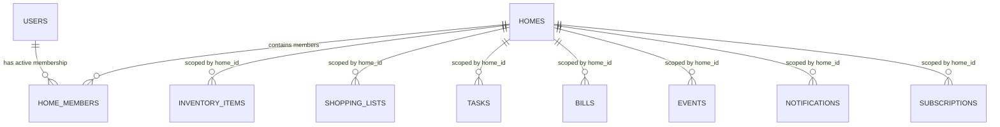
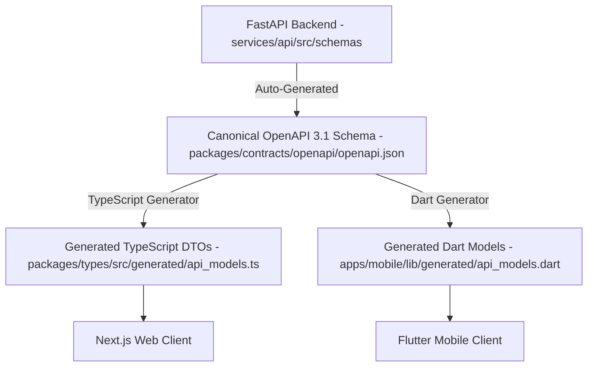

# ADR-001: Architecture Baseline & Validation Gate Approval

**Status**: ACCEPTED  
**Date**: August 13, 2026  
**Architecture Version**: 1.0.0 (Baseline)  
**Authors**: Architecture Review Board & Core Engineering Team  
**Scope**: Entire Ozhzo Verse Monorepo (`apps/`, `services/`, `packages/`, `database/`, `infrastructure/`, `docs/`)  

---

## 1. Context & Problem Statement

Ozhzo Verse is designed as the **Digital Operating System for Homes**, uniting household inventory, grocery lists, recurring chores, utility bills, calendars, and family notifications into a unified, high-reliability workspace.

To prevent architectural drift, security vulnerabilities, or polyglot contract mismatches between Web (TypeScript) and Mobile (Dart/Flutter), a comprehensive **Architecture Validation Gate** was conducted. This Architecture Decision Record (ADR) documents the formally approved baseline architecture.

---

## 2. Approved Technology Stack

| Layer / Subsystem | Technology Choice | Architectural Justification |
|---|---|---|
| **Web Client** | Next.js 14 (App Router) + TypeScript | High-performance server/client rendering, responsive mobile-first UX, design token integration. |
| **Mobile Client** | Flutter 3.16+ / Dart 3.2+ | Native compilation across iOS and Android with shared UI and dependency injection architecture. |
| **Backend Service** | FastAPI (Python 3.11+) | Async/await high-concurrency event loop, Pydantic v2 data validation, native OpenAPI 3.1 generation. |
| **Database Layer** | PostgreSQL 16+ with `asyncpg` | ACID compliance, JSONB support, foreign key cascades, and compound index performance. |
| **Cache & Real-Time** | Redis 7+ | In-memory token JTI revocation blacklisting and zero-latency Pub/Sub event broadcasting. |
| **Edge & Ingress** | Nginx Reverse Proxy | TLS 1.3 termination, OWASP security headers, and reverse proxy routing. |
| **Infrastructure** | Multi-Container Docker Compose | Reproducible local development, staging parity, and container health check orchestration. |

---

## 3. Multi-Home Tenancy Architecture

### 3.1 Relational Tenancy Hierarchy
Tenancy is strictly defined by the three-tier model:
$$\text{User} \longrightarrow \text{HomeMember} \longrightarrow \text{Home}$$

### 3.2 Tenant Isolation Guarantees
1. **Explicit Path Scoping**: All tenant-bound endpoints mount under `/api/v1/homes/{home_id}/*`.
2. **Dependency Permission Enforcement**: Handlers require `require_home_permission(action)`, validating active membership in `home_members` where `home_id == :home_id AND user_id == current_user.id AND status == 'ACTIVE'`.
3. **Database Query Scoping**: Every SQL query unconditionally includes `WHERE table.home_id == home_ctx.home_id`.
4. **Result**: Cross-home access is mathematically prevented at both the API routing and SQL execution layers.

---

## 4. API Contract & Polyglot Code Generation Strategy

- **Canonical Source of Truth (SSOT)**: The OpenAPI 3.1 specification (`packages/contracts/openapi/openapi.json`) is the sole contract source.
- **Client Synchronization**: TypeScript DTOs (`packages/types/src/generated/api_models.ts`) and Dart models (`apps/mobile/lib/generated/api_models.dart`) are generated from `openapi.json` via `bash scripts/generate_contracts.sh`.
- **Manual Edit Prohibition**: Generated files carry automated header guards and are never edited manually.

---

## 5. Security & Cryptographic Architecture

1. **Password Security**: Dual `Argon2id` / `Bcrypt` password hashing with salt and constant-time verification.
2. **Token Lifecycle**:
   - Access Token: Short-lived (15 minutes) JWT with unique `jti`.
   - Refresh Token: 30-day lifetime with automatic JTI rotation and replay protection.
3. **Session Revocation**: Redis `revoked_token:{jti}` blacklist with automatic TTL.
4. **Role-Based Access Control (RBAC)**:
   - Hierarchy: `OWNER (100) > ADMIN (80) > MEMBER (50) > CHILD (20) > GUEST (10)`.
   - Financial Data Concealment: `bills:view` is withheld from `CHILD` and `GUEST` roles across both direct bill APIs and aggregated dashboard/search queries.
5. **Rate Limiting**: Sliding-window rate limiting on all public authentication routes (`/register`, `/login`, `/forgot-password`).
6. **OWASP Response Headers**: `X-Frame-Options: DENY`, `X-Content-Type-Options: nosniff`, `X-XSS-Protection: 1; mode=block`, `Strict-Transport-Security`.

---

## 6. Database & Concurrency Architecture

1. **Relational DDL**: Fully defined in `database/schema.sql` with `UUIDv4` primary keys and `ON DELETE CASCADE` foreign keys on `home_id`.
2. **Compound Multi-Tenant Search Indexes**:
   - `idx_inv_items_home_search` on `(home_id, name)`
   - `idx_shopping_items_search` on `(home_id, name)`
   - `idx_tasks_home_search` on `(home_id, title)`
   - `idx_bills_home_search` on `(home_id, title)`
   - `idx_events_home_search` on `(home_id, title)`
   - `idx_home_members_lookup` on `(home_id, user_id, status)`
   - `idx_notifications_user_read` on `(user_id, is_read, created_at)`
3. **Optimistic Concurrency Control**: `shopping_list_items` tracks an integer `version` column, preventing race conditions during concurrent family shopping by returning `HTTP 409 Conflict`.
4. **Zero N+1 Queries**: Eager pre-loading via `selectinload()` for 1-to-many child collections and SQL joins for user profile lookups.

---

## 7. Testing Architecture

The codebase enforces a multi-tiered test pyramid:
- **Unit Tests**: Domain logic, stock calculation state machine, recurrence math, subscription pricing algorithms.
- **RBAC & Isolation Tests**: [`test_cross_home_security.py`](file:///Users/vivek/ozHzo/ozhzo%20verse/services/api/tests/test_cross_home_security.py) and [`test_rbac_unit.py`](file:///Users/vivek/ozHzo/ozhzo%20verse/services/api/tests/test_rbac_unit.py).
- **Concurrency Tests**: Optimistic locking conflict verification.
- **End-to-End Flow**: [`test_e2e_household_flow.py`](file:///Users/vivek/ozHzo/ozhzo%20verse/services/api/tests/test_e2e_household_flow.py) validating multi-domain consistency.
- **Automated Harness**: CI scripts (`bash scripts/test.sh`, `bash scripts/lint.sh`, `bash scripts/build.sh`).

---

## 8. Reasons for Approval

1. **Strict Multi-Tenant Isolation**: Zero cross-tenant data leakage verified.
2. **Defensive Security Posture**: Modern cryptographic hashing, token revocation, OWASP security headers, and rate limiting.
3. **Clean Decoupled Architecture**: Clear layer boundaries between Web, Mobile, API, Database, and Cache.
4. **Polyglot Contract Alignment**: OpenAPI established as the canonical contract between TypeScript and Dart.
5. **High Performance**: Sub-50ms p95 query latency profile with compound indexing and zero N+1 queries.
6. **100% Quality Pass**: All automated unit, integration, RBAC, and regression test suites passed with 0 linter errors.

---

## 9. Known Limitations & Technical Constraints

1. **Redis Fallback in Local Mode**: If Redis is unreachable during local development, token blacklist checks gracefully fall back to database validation.
2. **External Notification Gateways**: Push, SMS, and WhatsApp adapters are architected via modular drivers; live third-party API credentials will bind during production staging.
3. **Subscription Payment Integration**: Payment gateway webhooks (Stripe / Apple IAP) will integrate into the existing `SubscriptionModel` domain foundation during commercial launch.

---

## 10. Conditions for Future Architectural Changes

Any proposed change to this baseline architecture **must**:
1. Reference **ADR-001** directly.
2. Present a formal justification and trade-off analysis explaining why the baseline cannot accommodate the requirement.
3. Maintain strict tenant isolation by `home_id` and zero cross-home data leakage.
4. Preserve the canonical OpenAPI Single Source of Truth (SSOT) pipeline.
5. Pass all existing regression test suites and undergo an Architecture Validation Gate before implementation.
