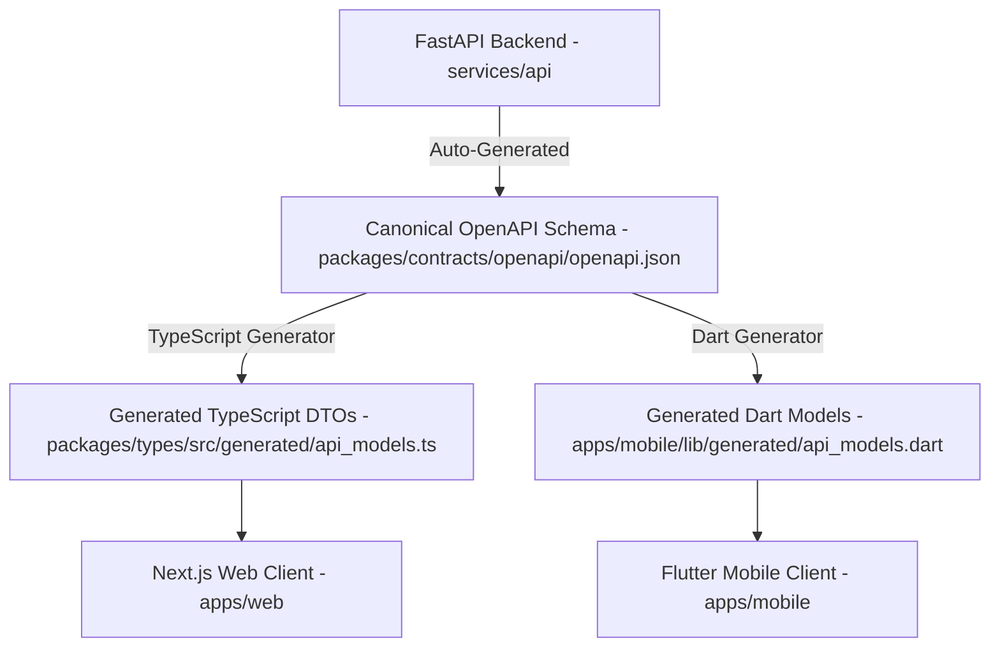

# Ozhzo Verse — API Contract & Code Generation Guide (API_CODE_GENERATION.md)

**Document Version**: 1.0.0 (Canonical Baseline)  
**Single Source of Truth (SSOT)**: FastAPI OpenAPI 3.1 Specification (`packages/contracts/openapi/openapi.json`)  
**Target Consumers**: Web Client (Next.js / TypeScript), Mobile Client (Flutter / Dart)  

---

## 1. Architectural Overview & Contract Flow

To prevent contract drift between the Python backend, TypeScript web client, and Dart mobile client, Ozhzo Verse establishes **OpenAPI 3.1** as the Canonical Single Source of Truth.



---

## 2. Directory Layout & Separation of Concerns

Generated files are strictly isolated into dedicated `generated/` folders with clear automated header notices:

```
ozhzo-verse/
├── packages/
│   ├── contracts/
│   │   └── openapi/
│   │       └── openapi.json                  # Canonical API Schema (SSOT)
│   └── types/
│       └── src/
│           ├── generated/
│           │   └── api_models.ts            # Generated TypeScript DTOs (DO NOT EDIT)
│           └── index.ts                     # Public Package Entrypoint
│
└── apps/
    └── mobile/
        └── lib/
            └── generated/
                └── api_models.dart          # Generated Dart Models (DO NOT EDIT)
```

---

## 3. Code Generation Workflow & Commands

### 3.1 Generating Contracts Locally
Run the top-level contract generation orchestrator:

```bash
bash scripts/generate_contracts.sh
```

This script:
1. Validates that `packages/contracts/openapi/openapi.json` is updated and syntactically valid.
2. Synchronizes TypeScript interface definitions to `packages/types/src/generated/api_models.ts`.
3. Synchronizes Dart serializable model classes to `apps/mobile/lib/generated/api_models.dart`.

---

## 4. API Evolution & Change Management

When modifying an API endpoint or request/response schema in `services/api`:

1. **Modify Pydantic Schema**: Update or create schemas in `services/api/src/schemas/`.
2. **Update Router**: Implement or adjust endpoints in `services/api/src/api/v1/`.
3. **Regenerate Contracts**: Run `bash scripts/generate_contracts.sh`.
4. **Compile & Test Clients**:
   - Web Client: Verify type checking with `npm run build` or `npm run type-check`.
   - Mobile Client: Verify Dart compilation with `dart test` or `flutter analyze`.

---

## 5. Versioning Strategy

- **API Major Versioning**: Reflected in the URL path prefix (e.g. `/api/v1/`).
- **Semantic Versioning in `openapi.json`**:
  - `PATCH` (e.g. `1.0.1`): Adding optional fields, non-breaking descriptions.
  - `MINOR` (e.g. `1.1.0`): Adding new endpoints or optional query parameters.
  - `MAJOR` (e.g. `2.0.0`): Breaking changes, removing fields, or restructuring endpoints (triggers a new `/api/v2/` router).

---

## 6. CI/CD Contract Enforcement Quality Gate

In GitHub Actions (`.github/workflows/deploy.yml`), the CI pipeline executes contract integrity checks:

```yaml
- name: Verify API Contract Synchronization
  run: |
    bash scripts/generate_contracts.sh
    git diff --exit-code packages/contracts/ packages/types/src/generated/ apps/mobile/lib/generated/
```

If a developer modifies backend API schemas without regenerating the client contracts, the CI pipeline fails before merging.
