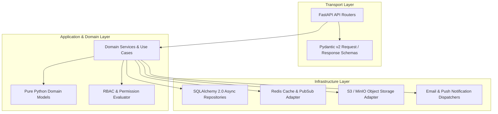
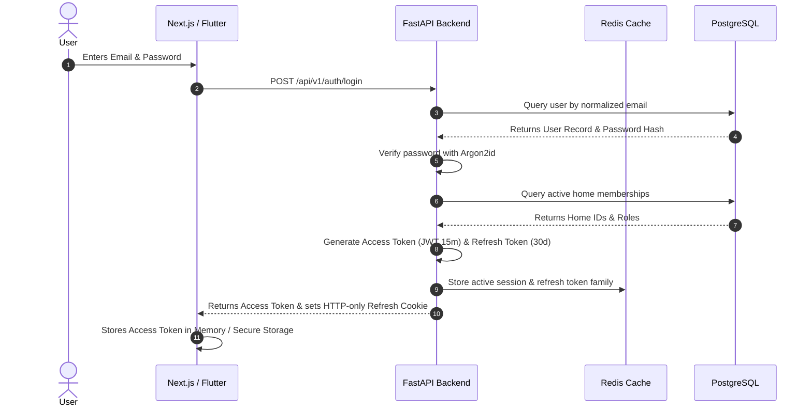
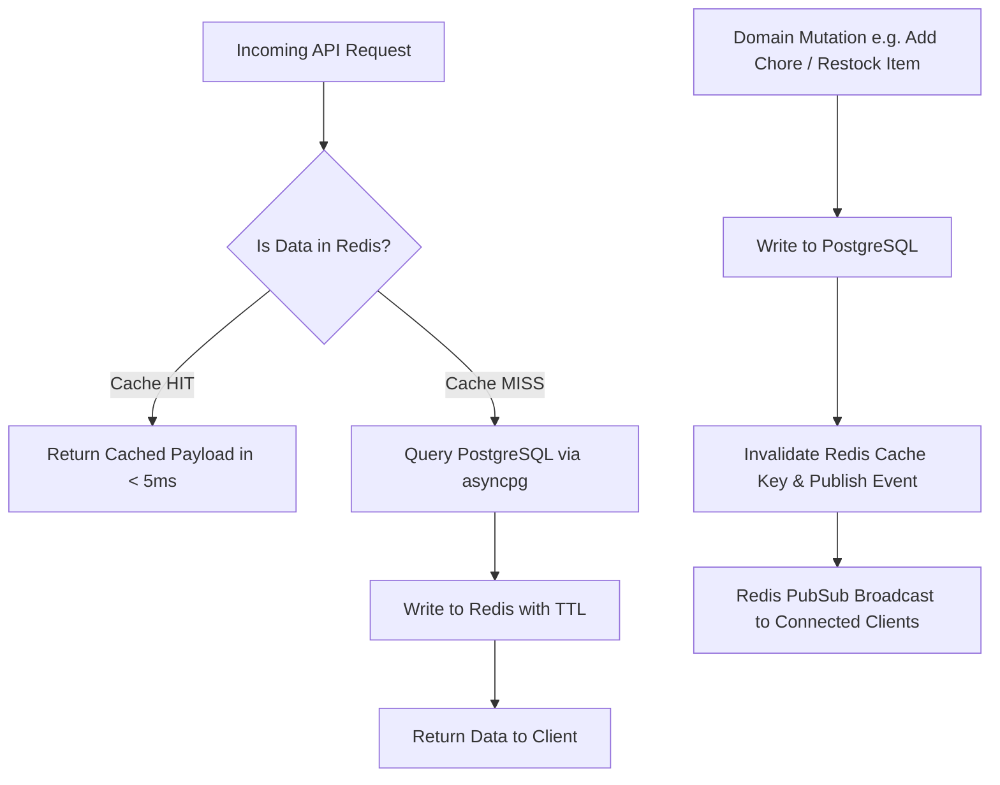
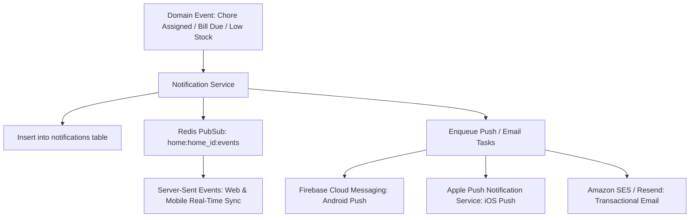
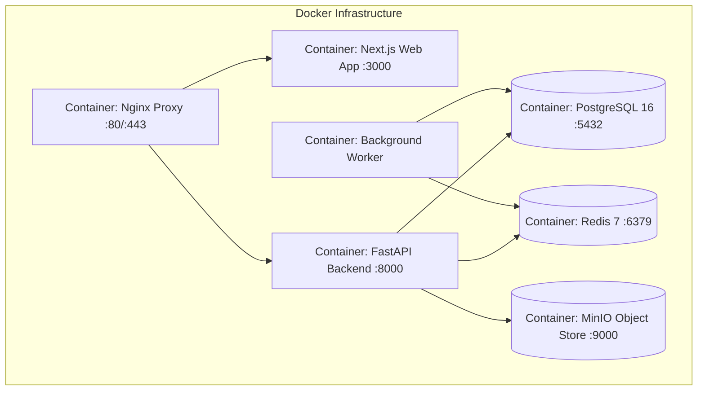

# System Architecture & Technical Design — Ozhzo Verse

*Document Classification: Definitive Source of Truth*  
*Target Audience: Principal Engineers, DevOps Architects, Backend/Frontend/Mobile Leads, Security Auditors*

---

## 1. System Architecture Overview

Ozhzo Verse is engineered as a cloud-native, modular, multi-tenant platform designed for high availability, sub-300ms response times, and cryptographic data isolation between households.

```mermaid
graph TD
    subgraph Client Layer
        Web[Next.js 14+ TypeScript Web App]
        Mobile[Flutter 3.x Cross-Platform iOS/Android]
    end

    subgraph Edge / Ingress Layer
        Nginx[Nginx Reverse Proxy / SSL Termination]
        RateLimiter[Redis-backed Rate Limiter]
    end

    subgraph Backend Service Layer (Python 3.12 + FastAPI)
        API[FastAPI Gateway & Routers]
        AuthGuard[JWT & Tenant Context Middleware]
        SysAdminGuard[Super Admin Authorization Guard - is_super_admin]
        RBAC[Home-Scoped RBAC Policy Engine]
        
        subgraph System Administration Layer
            AdminUserSvc[User Directory & Suspension Service]
            AdminHomeSvc[Home Roster & Suspension Service]
            AdminPricingSvc[Dynamic Standard Pricing Engine]
            AdminPromoSvc[Promotions & Campaign Engine]
            AdminAuditSvc[Platform Audit Logger]
            AdminSysSvc[Global Config & Telemetry]
        end

        subgraph Household Domain Services
            AuthSvc[Auth & Profile Service]
            HomeSvc[Home & Membership Service]
            InvSvc[Inventory & Expiry Service]
            ShopSvc[Shopping List Service]
            TaskSvc[Task & Chore Engine]
            BillSvc[Bill & Reminder Ledger]
            CalSvc[Calendar & Event Service]
            NotifSvc[Notification Dispatcher]
            SubSvc[Subscription Guard]
        end
    end

    subgraph Background Processing Layer
        Worker[Celery / Asyncio Worker Fleet]
        Scheduler[Cron Job & Reminder Scheduler]
    end

    subgraph Persistence & In-Memory Layer
        Postgres[(PostgreSQL 16 Multi-Tenant DB)]
        RedisCache[(Redis 7 Cluster: Cache / PubSub / Sessions)]
        S3Storage[(Object Storage: S3 / MinIO / Cloud Storage)]
    end

    Web -->|HTTPS / REST & SSE| Nginx
    Mobile -->|HTTPS / REST & SSE| Nginx
    
    Nginx --> RateLimiter
    RateLimiter --> API
    
    API --> AuthGuard
    AuthGuard --> RBAC
    RBAC --> DomainServices
    
    DomainServices -->|SQLAlchemy 2.0 Async| Postgres
    DomainServices -->|redis.asyncio| RedisCache
    DomainServices -->|boto3 / aioboto3| S3Storage
    DomainServices -->|Push Events| Worker
    
    Scheduler -->|Trigger Periodic Tasks| Worker
    Worker -->|Read/Write State| Postgres
    Worker -->|Publish Live Sync| RedisCache
    Worker -->|FCM / APNs / SES| Client Layer
```

---

## 2. Application Layers & Clean Architecture

The backend follows **Clean / Hexagonal Architecture**, isolating business logic from external frameworks, databases, and UI interfaces:



### Layer Responsibilities:
1. **Transport Layer (`api/`)**: Validates HTTP requests using Pydantic DTOs, extracts JWT credentials and `home_id` context, invokes domain services, and serializes responses. **No database queries or business rules are permitted here.**
2. **Domain Service Layer (`services/`)**: Orchestrates business transactions (e.g. chore completion, grocery restocking, bill advancing). Enforces business invariants and state transitions.
3. **Repository / Infrastructure Layer (`infrastructure/`)**: Implements data access interfaces with SQLAlchemy 2.0 async sessions, handles Redis caching, and communicates with external cloud APIs.

---

## 3. Backend Directory Structure

```
services/api/
├── src/
│   ├── api/                      # Transport Layer (FastAPI Routers & Endpoints)
│   │   ├── v1/
│   │   │   ├── auth.py
│   │   │   ├── users.py
│   │   │   ├── homes.py
│   │   │   ├── members.py
│   │   │   ├── dashboard.py
│   │   │   ├── inventory.py
│   │   │   ├── shopping.py
│   │   │   ├── tasks.py
│   │   │   ├── bills.py
│   │   │   ├── calendar.py
│   │   │   ├── notifications.py
│   │   │   └── subscriptions.py
│   │   ├── dependencies.py       # Auth, Tenant Context, RBAC injection
│   │   └── router.py             # Master API Router v1 mounting
│   ├── core/                     # Core Foundations
│   │   ├── config.py             # Pydantic Settings (.env validation)
│   │   ├── security.py           # Password hashing & JWT cryptography
│   │   ├── logging.py            # Structured JSON logger with Correlation IDs
│   │   └── exceptions.py         # Base Domain Exceptions
│   ├── domain/                   # Business Models & Domain Invariants
│   │   ├── entities/             # Pure Python dataclasses/models
│   │   └── permissions.py        # RBAC capabilities & role matrices
│   ├── schemas/                  # Pydantic DTOs (Request / Response validation)
│   │   ├── auth.py
│   │   ├── user.py
│   │   ├── home.py
│   │   ├── inventory.py
│   │   ├── shopping.py
│   │   ├── task.py
│   │   ├── bill.py
│   │   ├── calendar.py
│   │   └── subscription.py
│   ├── services/                 # Application Use Cases & Orchestration
│   │   ├── auth_service.py
│   │   ├── user_service.py
│   │   ├── home_service.py
│   │   ├── inventory_service.py
│   │   ├── shopping_service.py
│   │   ├── task_service.py
│   │   ├── bill_service.py
│   │   ├── calendar_service.py
│   │   ├── notification_service.py
│   │   └── subscription_service.py
│   ├── infrastructure/           # External Adapters
│   │   ├── database/             # SQLAlchemy ORM Models, Session Factory
│   │   │   ├── models/           # Declarative Base ORM classes
│   │   │   ├── repositories/     # Domain data access implementations
│   │   │   └── session.py        # Async session engine & pool
│   │   ├── cache/                # Redis connection, cache decorators, pub/sub
│   │   ├── storage/              # S3 / MinIO upload adapter
│   │   └── notification/         # FCM / APNs / SES adapters
│   ├── workers/                  # Background jobs & scheduled tasks
│   │   ├── tasks.py              # Celery / Asyncio task definitions
│   │   └── scheduler.py          # Daily cron runner (bills, expiry)
│   └── main.py                   # FastAPI application factory & lifecycle hooks
├── alembic/                      # Database Migrations
│   ├── versions/                 # Versioned DDL migration scripts
│   └── env.py                    # Alembic async migration environment
├── tests/                        # Comprehensive Test Suites
│   ├── unit/                     # Domain & Service unit tests
│   ├── integration/              # Multi-tenant DB & API integration tests
│   └── conftest.py               # Pytest fixtures, test DB containers
├── Dockerfile                    # Multi-stage production container
├── pyproject.toml                # Poetry / Pip dependency configuration
└── alembic.ini                   # Alembic configuration file
```

---

## 4. Authentication Architecture



### Key Security Invariants:
1. **Access Token Lifespan**: 15 minutes. Contains `user_id`, `email`, and active `home_id`.
2. **Refresh Token Rotation**: 30-day lifespan. Exchanging a refresh token automatically invalidates the previous token and issues a new pair. If an invalidated refresh token is reused, the entire token family is immediately revoked (anti-theft defense).
3. **Session Revocation**: Redis maintains an active session registry `session:{user_id}:{device_id}`. Logging out instantly blacklists the session.

---

## 5. Authorization & RBAC Policy Engine

Authorization is enforced via FastAPI dependency injection before any domain service is reached:

```python
# Authorization Pipeline Dependency
async def require_home_permission(required_permission: str):
    async def permission_dependency(
        home_id: UUID = Path(...),
        current_user: User = Depends(get_current_user),
        db: AsyncSession = Depends(get_db),
        redis: Redis = Depends(get_redis),
    ) -> HomeMemberContext:
        # 1. Resolve role from Redis cache or database
        member_role = await get_user_home_role(current_user.id, home_id, db, redis)
        if not member_role:
            raise HTTPException(status_code=403, detail="Not a member of this home")
        
        # 2. Assert role satisfies permission
        if not has_permission(member_role, required_permission):
            raise HTTPException(status_code=403, detail=f"Permission denied: {required_permission}")
            
        return HomeMemberContext(user=current_user, home_id=home_id, role=member_role)
    return permission_dependency
```

---

## 6. Multi-Home Tenancy & Data Isolation Model

Ozhzo Verse enforces **Discriminator Column Multi-Tenancy** backed by compound indexing:

```sql
-- Architectural invariant: Every domain table is partitioned by home_id
ALTER TABLE inventory_items ADD CONSTRAINT fk_inv_home FOREIGN KEY (home_id) REFERENCES homes(id) ON DELETE CASCADE;
ALTER TABLE shopping_lists ADD CONSTRAINT fk_shop_home FOREIGN KEY (home_id) REFERENCES homes(id) ON DELETE CASCADE;
ALTER TABLE tasks ADD CONSTRAINT fk_tasks_home FOREIGN KEY (home_id) REFERENCES homes(id) ON DELETE CASCADE;
ALTER TABLE bills ADD CONSTRAINT fk_bills_home FOREIGN KEY (home_id) REFERENCES homes(id) ON DELETE CASCADE;
ALTER TABLE calendar_events ADD CONSTRAINT fk_cal_home FOREIGN KEY (home_id) REFERENCES homes(id) ON DELETE CASCADE;
```

### Tenancy Defense-in-Depth:
1. **API Layer**: `home_id` path parameter validated against user's membership.
2. **Service Layer**: Method signatures explicitly require `home_id: UUID` as the first argument.
3. **Repository Layer**: All SQL queries append `WHERE home_id = :home_id`.
4. **Database Layer**: Compound indexes prefix `(home_id, ...)` ensuring sub-millisecond multi-tenant isolation.

---

## 7. Database Access Layer (PostgreSQL + SQLAlchemy 2.0 Async)

- **Driver**: `asyncpg` (ultra-high-performance asynchronous PostgreSQL driver).
- **ORM Mode**: SQLAlchemy 2.0 Declarative 2.0 style with `AsyncSession`.
- **Connection Pooling**:
  - `pool_size`: 20 connections per API container instance.
  - `max_overflow`: 10 connections.
  - `pool_recycle`: 1800 seconds (prevents stale TCP connections).
  - `pool_pre_ping`: True (validates connection health before issuing queries).
- **Migration Framework**: Alembic in fully asynchronous mode (`env.py` using `run_migrations_online`).

---

## 8. Caching Strategy (Redis)



### Cache Key Namespaces:
- `user:{user_id}:homes`: Set of homes user belongs to (TTL: 15m; invalidated on invite accept/removal).
- `home:{home_id}:members`: Active member roster and roles (TTL: 15m; invalidated on role edit).
- `home:{home_id}:dashboard`: Aggregated daily pulse JSON (TTL: 5m; invalidated on chore/bill updates).
- `rate_limit:{ip}:{endpoint}`: Sliding window rate limit counters.

---

## 9. Notification Dispatcher & Live Sync

Notifications follow a **Multi-Channel Dispatch Pipeline**:



---

## 10. Background Jobs & Cron Scheduling

- **Engine**: Celery with Redis broker (or lightweight Asyncio worker fleet for MVP).
- **Scheduled Tasks**:
  - `daily_bill_reminder_job`: Runs at 08:00 AM daily. Scans for bills due in 3 days and dispatches alerts.
  - `daily_inventory_expiry_job`: Runs at 07:00 AM daily. Flags items expiring in 3 days and marks expired goods.
  - `weekly_recurring_chore_generator`: Ensures future chore instances exist for active recurring rules.
  - `cleanup_expired_invites`: Runs hourly; marks pending invites older than 7 days as `EXPIRED`.

---

## 11. File Storage Architecture

- **Supported Assets**: User avatars, Home profile images, Bill payment receipts (P2).
- **Storage Target**: S3-Compatible Object Store (AWS S3 in production; MinIO for local Docker development).
- **Upload Flow**: Secure Direct Upload via Pre-Signed S3 URLs (Client uploads directly to S3; backend saves verified URI).
- **Security Constraints**: Strict MIME type checking (`image/jpeg`, `image/png`, `image/webp`), max 5MB size limit.

---

## 12. Structured Logging & Observability

- **Format**: Structured JSON logging matching ELK / Datadog / CloudWatch standards.
- **Correlation IDs**: `X-Request-ID` generated at Nginx gateway, propagated through FastAPI middleware, attached to every log record, and returned in HTTP headers.

```json
{
  "timestamp": "2026-08-13T14:15:30.123Z",
  "level": "INFO",
  "correlation_id": "req-838cd80b-99f2",
  "user_id": "usr_a1b2c3d4",
  "home_id": "hme_e5f6g7h8",
  "method": "POST",
  "path": "/api/v1/homes/hme_e5f6g7h8/tasks",
  "status_code": 201,
  "duration_ms": 42.6
}
```

---

## 13. Health Checks & Monitoring

- **Liveness Probe**: `GET /health/live` (Asserts FastAPI server process is alive; returns 200 OK).
- **Readiness Probe**: `GET /health/ready` (Asserts PostgreSQL database connection and Redis connection are responsive; returns 200 OK or 503 Service Unavailable).
- **Telemetry**: OpenTelemetry middleware for distributed tracing across routers, database queries, and cache lookups.

---

## 14. Centralized Error Handling

All domain errors inherit from `BaseDomainException` and are mapped to standard error envelopes by global FastAPI exception handlers:

```json
{
  "success": false,
  "error": {
    "code": "INVENTORY_ITEM_NOT_FOUND",
    "message": "The requested inventory item does not exist in this home.",
    "details": { "item_id": "inv_12345" },
    "correlation_id": "req-838cd80b-99f2"
  }
}
```

---

## 15. Security Architecture

1. **Transport Security**: Enforced HTTPS with TLS 1.3, HSTS headers, secure cookies (`SameSite=Lax`, `Secure`, `HttpOnly`).
2. **Credential Security**: Passwords hashed with Argon2id (memory cost: 64MB, time cost: 3 iterations).
3. **CORS Policy**: Whitelisted origin domains only (Next.js web client domain).
4. **SQL Injection Defense**: 100% parameterized queries via SQLAlchemy ORM (zero raw string interpolation).
5. **Rate Limiting**: Sliding window limits (100 req/min for standard endpoints; 5 req/min for `/auth/login`).

---

## 16. Docker Containerization & Infrastructure



### Multi-Stage Docker Architecture:
- **`Dockerfile.api`**: Python 3.12-slim builder $\rightarrow$ minimal non-root runtime container (<150MB).
- **`Dockerfile.web`**: Node 20-alpine builder $\rightarrow$ standalone Next.js production output container (<120MB).

---

## 17. Database Backup & Disaster Recovery

1. **Automated Backups**: Daily automated full database snapshots using `pg_dump` with gzip compression, encrypted and shipped to an isolated off-site backup S3 bucket.
2. **Write-Ahead Logging (WAL)**: Continuous WAL archiving enabling **Point-in-Time Recovery (PITR)** up to any minute in the last 14 days.
3. **Recovery Objectives**:
   - **RPO (Recovery Point Objective)**: $< 5$ minutes of data loss.
   - **RTO (Recovery Time Objective)**: $< 30$ minutes to restore full service.

---

## 18. Horizontal Scalability & Performance Benchmarks

```
┌─────────────────────────┬─────────────────────────┬─────────────────────────┐
│ STATISTIC               │ TARGET BENCHMARK        │ ARCHITECTURAL ENABLER   │
├─────────────────────────┼─────────────────────────┼─────────────────────────┤
│ API Response (p95)      │ < 150 ms                │ Async SQLAlchemy + Pool │
│ Dashboard Response (p95)│ < 250 ms                │ Single-Trip Aggregator  │
│ Live Sync Latency (p99) │ < 500 ms                │ Redis Pub/Sub + SSE     │
│ Concurrent Connections  │ 10,000+                 │ Uvicorn Async Workers   │
└─────────────────────────┴─────────────────────────┴─────────────────────────┘
```

1. **Stateless API Tier**: FastAPI instances are 100% stateless; horizontal scaling is achieved simply by spawning additional container instances behind the load balancer.
2. **Read Scalability**: Read-heavy workloads (inventory browsing, calendar views) can utilize PostgreSQL Read Replicas with zero application changes.
