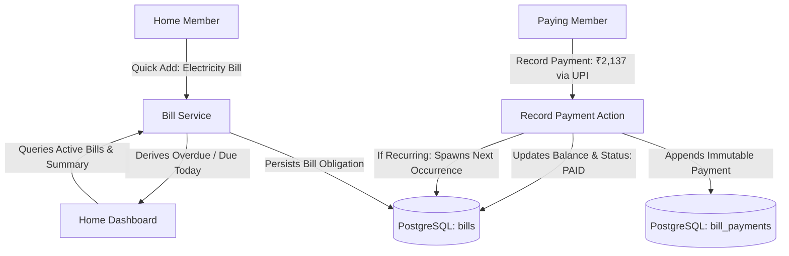

# Ozhzo Verse — Phase 5: Bills & Recurring Household Expenses Architecture

## 1. Architectural Philosophy & The Core Home Loop
In Ozhzo Verse, the Bills module serves as the domestic financial obligation ledger answering **"WHAT DO WE HAVE TO PAY FOR OUR HOME, HOW MUCH, WHEN, AND WHO IS RESPONSIBLE?"**.

It is strictly **household-focused**, eliminating commercial accounting overhead (invoicing, accounts payable aging, balance sheets, payroll) in favor of clear, collaborative household financial tracking.

```
┌─────────────────────────────────────────────────────────────────────────┐
│                       THE OZHZO DIGITAL HOME OS                         │
│                                                                         │
│  1. WHAT DO WE HAVE?        ──►  Inventory & Durable Assets (Phase 3A)  │
│  2. WHERE IS IT?            ──►  Hierarchical Location Memory (Phase 3A)│
│  3. WHO HAS IT?             ──►  Asset Lending Ledger (Phase 3A)        │
│  4. WHAT DO WE NEED?        ──►  Home Purchase List (Phase 3B)          │
│  5. WHAT NEEDS TO BE DONE?  ──►  Tasks & Household Routines (Phase 4)   │
│  6. WHO IS RESPONSIBLE?     ──►  Assigned Member (Optional)             │
│  7. WHEN IS IT DUE?         ──►  Due Date & Recurrence Schedule         │
│  8. WHAT DO WE HAVE TO PAY? ──►  Bills & Recurring Expenses (Phase 5)   │
│  9. HOW MUCH & WAS IT PAID? ──►  Expected vs Actual Payment Ledger      │
└─────────────────────────────────────────────────────────────────────────┘
```

---

## 2. Core Architectural Pillars

1. **Home-Level Tenant Ownership**:
   - Every bill and payment record belongs to the `Home` tenant (`home_id`).
   - A bill represents a shared household obligation (e.g. *Madhavan Home Electricity Bill*).
2. **Clear Separation: Bill vs. Payment / Expense**:
   - **Bill (`bills`)**: The recurring or expected financial obligation (e.g. *Internet — Due 10th of every month, Expected ₹999*).
   - **Payment / Expense (`bill_payments`)**: The immutable transaction record of an actual financial settlement (e.g. *Paid ₹999 on 10 Aug by Vivek via UPI*).
3. **Fixed Expected vs. Variable Actual Amounts**:
   - Supports fixed obligations (Internet: ₹999) and variable utilities (Electricity: Expected ₹2,000, Actual Paid ₹2,137). Both values are preserved without overwriting.
4. **Partial Payment & Balance Tracking**:
   - A bill of ₹10,000 can receive an initial payment of ₹6,000 (`PARTIALLY_PAID`, balance ₹4,000) followed by a final payment of ₹4,000 (`PAID`).
5. **Decoupled Responsible Member vs. Payer**:
   - `responsible_member_id`: Family member responsible for managing/monitoring the bill.
   - `paid_by`: Family member who physically paid the funds.
6. **Recurrence Engine Reuse & Alignment**:
   - Reuses the Phase 4 recurrence model (`SCHEDULED_DATE` vs `COMPLETION_DATE` / `PAYMENT_DATE`).
   - Calendar obligations (Rent, Internet, School Fees) anchor to `SCHEDULED_DATE` (e.g. 1st or 10th of next month).
   - Interval obligations anchor to payment date $+ N$ days/months.
7. **Monetary Precision & Multi-Currency Boundary**:
   - Strict decimal arithmetic via PostgreSQL `NUMERIC(12, 2)` and Python `Decimal`. Floating-point arithmetic is strictly prohibited.
   - Currency defaults to Home currency (`homes.currency`) with per-bill override capability.
8. **Permanent, Immutable Payment History**:
   - Payment entries in `bill_payments` are immutable audit records.

---

## 3. High-Level System Interaction Diagram


