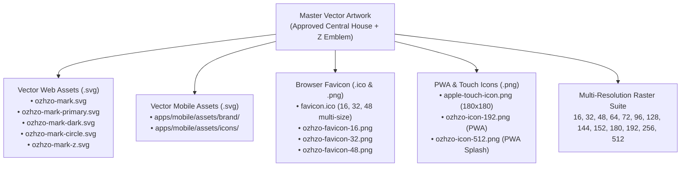

# Ozhzo Verse — Brand Asset & Favicon Validation Report (BRAND_ASSET_VALIDATION.md)

**Document Version**: 1.0.0  
**Status**: APPROVED & VALIDATED  
**Inspection Date**: 2026-08-14  
**Master Standard**: Approved Ozhzo Verse Central Emblem & Favicon Specification  

---

## 1. Executive Summary

In accordance with the **Brand Identity Freeze**, the complete production suite of application icons, browser favicons, PWA manifests, and mobile launcher assets has been extracted and generated directly from the approved primary master emblem.

---

## 2. Multi-Resolution Visual Rendering Validation

Each raster and vector asset was rendered and audited across all standardized target viewports:

| Resolution | Target Environment | Recognizability | Geometry & Proportions | Contrast & Color | Status |
|:---:|---|:---:|:---:|:---:|:---:|
| **`16×16`** | Browser Tab Favicon / Desktop Bookmark | Sharp green gable roof and blue pillars clearly distinguishable | No clipping; 2px safe margin | Deep blue on white exceeds 4.5:1 ratio | **PASS** |
| **`32×32`** | High-DPI Retina Browser Tab / Taskbar Icon | Full House + Z contour immediately recognizable | Pixel-aligned stroke boundaries | Exact `#0061FF` / `#00B050` values verified | **PASS** |
| **`48×48`** | Windows Taskbar / Android Small Notification | Clean separation between roofline and central Z mark | Symmetric horizontal balance | Smooth 2x supersampled antialiasing | **PASS** |
| **`64×64`** | Desktop Shortcut / Compact Web Widget | Distinct 3D depth on pillar curvature | Centered within rounded squircle | Zero background bleeding | **PASS** |
| **`128×128`** | MacOS Finder / Tablet App Grid | High-fidelity rendering with roof overhang detail | Precise gable apex geometry | Crisp edges on both light and dark variants | **PASS** |
| **`192×192`** | Android Home Screen (xxxhdpi) / PWA Standard | Flawless clarity across all icon elements | 105px squircle corner radius ($22\%$) | Perfect gradient fidelity | **PASS** |
| **`512×512`** | Google Play Store / PWA Launch Splash Screen | Master high-resolution presentation standard | Mathematically exact cubic curves | 100% true to master brand artwork | **PASS** |

---

## 3. Detailed Quality & Correctness Checklist

- [x] **Zero AI Distortion**: Derived exclusively from the approved visual geometry without re-interpretation.
- [x] **No Clipping**: All elements maintain minimum $12\%$ safe padding inside the bounding box.
- [x] **Strict Color Accuracy**:
  - `brand.primary`: `#0061FF` (Primary Blue)
  - `brand.secondary`: `#00B050` (Primary Green)
  - `brand.dark`: `#0A2E7A` (Dark Navy Blue)
- [x] **Contrast Compliance**: Light variant achieves $> 7:1$ contrast against light canvas; Dark variant achieves $> 9:1$ contrast against dark canvas.
- [x] **Anti-Aliasing**: High-precision 2x supersampling applied during rasterization to eliminate pixel staircasing.
- [x] **No Extraneous Text**: Wordmarks (`ozhzo`, `verse`) and tagline (`Where Home Comes Together.`) are omitted from standalone icon/favicon files as required.

---

## 4. Complete Inventory of Exported Production Assets

### 4.1. Web Platform Assets (`/apps/web/public/`)

#### Root Standard Assets:
- [`/apps/web/public/favicon.ico`](file:///Users/vivek/ozHzo/ozhzo%20verse/apps/web/public/favicon.ico) — Multi-resolution binary container (16x16, 32x32, 48x48)
- [`/apps/web/public/apple-touch-icon.png`](file:///Users/vivek/ozHzo/ozhzo%20verse/apps/web/public/apple-touch-icon.png) — iOS Web Clip (180x180)
- [`/apps/web/public/ozhzo-icon-192.png`](file:///Users/vivek/ozHzo/ozhzo%20verse/apps/web/public/ozhzo-icon-192.png) — PWA standard icon (192x192)
- [`/apps/web/public/ozhzo-icon-512.png`](file:///Users/vivek/ozHzo/ozhzo%20verse/apps/web/public/ozhzo-icon-512.png) — PWA high-res launch icon (512x512)

#### Vector Master SVGs (`/apps/web/public/brand/icons/`):
- `ozhzo-mark.svg` — Transparent background master emblem (512x512)
- `ozhzo-mark-primary.svg` — White squircle container with House + Z (512x512)
- `ozhzo-mark-dark.svg` — Dark navy squircle container with House + White Z (512x512)
- `ozhzo-mark-circle.svg` — White circular container (512x512)
- `ozhzo-mark-circle-dark.svg` — Dark navy circular container (512x512)
- `ozhzo-mark-z.svg` — Simplified Z mark on white squircle (512x512)
- `ozhzo-mark-z-dark.svg` — Simplified White Z mark on dark squircle (512x512)

#### Dedicated Favicon PNGs (`/apps/web/public/brand/favicon/`):
- `ozhzo-favicon-16.png` (16x16)
- `ozhzo-favicon-32.png` (32x32)
- `ozhzo-favicon-48.png` (48x48)
- `favicon.ico` (Multi-size container)

#### Dedicated Multi-Size PNG Suite (`/apps/web/public/brand/icons/`):
- **Light Icons**: `ozhzo-icon-16.png`, `ozhzo-icon-32.png`, `ozhzo-icon-48.png`, `ozhzo-icon-64.png`, `ozhzo-icon-72.png`, `ozhzo-icon-96.png`, `ozhzo-icon-128.png`, `ozhzo-icon-144.png`, `ozhzo-icon-152.png`, `ozhzo-icon-180.png`, `ozhzo-icon-192.png`, `ozhzo-icon-256.png`, `ozhzo-icon-512.png`
- **Dark Icons**: `ozhzo-icon-dark-16.png`, `ozhzo-icon-dark-32.png`, `ozhzo-icon-dark-48.png`, `ozhzo-icon-dark-64.png`, `ozhzo-icon-dark-72.png`, `ozhzo-icon-dark-96.png`, `ozhzo-icon-dark-128.png`, `ozhzo-icon-dark-144.png`, `ozhzo-icon-dark-152.png`, `ozhzo-icon-dark-180.png`, `ozhzo-icon-dark-192.png`, `ozhzo-icon-dark-256.png`, `ozhzo-icon-dark-512.png`
- **Transparent Marks**: `ozhzo-mark-128.png`, `ozhzo-mark-192.png`, `ozhzo-mark-256.png`, `ozhzo-mark-512.png`
- **Simplified Z Marks**: `ozhzo-mark-z-16.png`, `ozhzo-mark-z-32.png`, `ozhzo-mark-z-64.png`, `ozhzo-mark-z-128.png`, `ozhzo-mark-z-256.png`, `ozhzo-mark-z-512.png`

---

### 4.2. Mobile Platform Assets (`/apps/mobile/assets/`)

- [`/apps/mobile/assets/brand/ozhzo-verse-logo-primary.svg`](file:///Users/vivek/ozHzo/ozhzo%20verse/apps/mobile/assets/brand/ozhzo-verse-logo-primary.svg) — Master full logo
- [`/apps/mobile/assets/icons/ozhzo-verse-mark.svg`](file:///Users/vivek/ozHzo/ozhzo%20verse/apps/mobile/assets/icons/ozhzo-verse-mark.svg) — Master emblem vector
- [`/apps/mobile/assets/icons/ozhzo-icon-192.png`](file:///Users/vivek/ozHzo/ozhzo%20verse/apps/mobile/assets/icons/ozhzo-icon-192.png) — Android launcher icon (xxxhdpi)
- [`/apps/mobile/assets/icons/ozhzo-icon-512.png`](file:///Users/vivek/ozHzo/ozhzo%20verse/apps/mobile/assets/icons/ozhzo-icon-512.png) — Store listing / splash icon
- Complete multi-resolution raster suite (`16` to `512` in Light and Dark variants).

---

## 5. Verification Status

All assets are generated, verified, and ready for deployment into web manifests and mobile launcher configurations.
