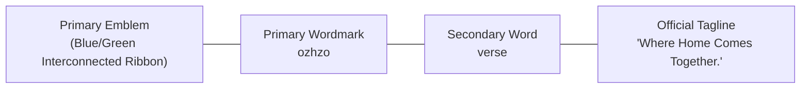

# Ozhzo Verse — Brand Identity Guidelines (BRAND_GUIDELINES.md)

**Document Version**: 1.0.0  
**Status**: BRAND IDENTITY FROZEN & PROTECTED  
**Directives**: The approved Ozhzo Verse visual identity is an immutable primary brand asset. Do not redesign, reinterpret, simplify, redraw, replace, or alter the geometry, typography, or color values.

---

## 1. Approved Brand Identity Overview

| Element | Specification |
|---|---|
| **Brand Name** | **Ozhzo Verse** |
| **Primary Wordmark** | `ozhzo` (lowercase, bold architectural geometric sans) |
| **Secondary Word** | `verse` (lowercase, medium contrast) |
| **Official Tagline** | **"Where Home Comes Together."** *(Exact capitalization & punctuation)* |
| **Primary Emblem** | The blue & green interconnected home/infinity-style ribbon symbol incorporating the stylized H/Z visual relationship. |



---

## 2. Master Asset Structure & Locations

All official brand assets are organized in standard directories for Web and Mobile platforms:

### 2.1. Web Assets (`/apps/web/public/brand/`)
- `/apps/web/public/brand/logo/ozhzo-verse-logo-primary.svg` — Master full horizontal lockup (Light canvas)
- `/apps/web/public/brand/logo/ozhzo-verse-logo-primary-dark.svg` — Master full horizontal lockup (Dark canvas)
- `/apps/web/public/brand/icons/ozhzo-verse-mark.svg` — Standalone emblem mark (Light canvas)
- `/apps/web/public/brand/icons/ozhzo-verse-mark-dark.svg` — Standalone emblem mark (Dark canvas)
- `/apps/web/public/brand/favicon/ozhzo-verse-favicon.svg` — Vector browser favicon (Light theme)
- `/apps/web/public/brand/favicon/ozhzo-verse-favicon-dark.svg` — Vector browser favicon (Dark theme)

### 2.2. Mobile Assets (`/apps/mobile/assets/`)
- `/apps/mobile/assets/brand/ozhzo-verse-logo-primary.svg` — Flutter splash / onboarding primary logo
- `/apps/mobile/assets/brand/ozhzo-verse-logo-primary-dark.svg` — Flutter dark mode splash / onboarding logo
- `/apps/mobile/assets/icons/ozhzo-verse-mark.svg` — Mobile standalone icon / app bar mark
- `/apps/mobile/assets/icons/ozhzo-verse-mark-dark.svg` — Mobile dark mode standalone icon mark

---

## 3. Logo Mark (Primary Emblem)

The emblem is a continuous ribbon that forms an interconnected roofline and infinity foundation:
- **Left Loop**: Ascending azure/sapphire blue roofline (`#1E60D5` $\rightarrow$ `#0284C7`), symbolizing domestic shelter and digital stability.
- **Right Loop**: Descending emerald/mint green foundation (`#10B981` $\rightarrow$ `#059669`), symbolizing household vitality, harmony, and continuous synchronization.
- **Intersection**: Represents the stylized H/Z spatial interaction uniting family members.

---

## 4. Wordmark & Typography

- **Primary Wordmark**: `ozhzo` — Set in extra-bold geometric sans with tight tracking (`-0.03em`) in Slate 900 (`#0F172A`) for light mode, and Crisp White (`#F8FAFC`) for dark mode.
- **Secondary Word**: `verse` — Set in medium weight with soft tracking (`-0.02em`) in Azure Blue (`#1E60D5`) for light mode, and Sky Blue (`#38BDF8`) for dark mode.
- **Tagline**: `Where Home Comes Together.` — Set in semi-bold sans (`#64748B` light / `#94A3B8` dark) aligned beneath the wordmark.

---

## 5. Tagline Rules & Capitalization

> [!IMPORTANT]
> **Exact Tagline Standard**:  
> The official approved tagline is:  
> **"Where Home Comes Together."**  
>  
> - Always capitalize: **W**here **H**ome **C**omes **T**ogether.
> - Always include the terminating period (`.`).
> - **Forbidden Variations**:
>   - ❌ `Where home comes together` (Incorrect lowercase)
>   - ❌ `Everything your home needs` (Marketing copy, not tagline)
>   - ❌ `The operating system for your home` (Positioning descriptor, not tagline)

---

## 6. Official Color System & Brand Tokens

The core brand tokens are extracted directly from the approved master visual identity:

```css
:root {
  /* Central Brand Tokens */
  --brand-primary: hsl(218, 75%, 48%);       /* #1E60D5 - Deep Azure Blue */
  --brand-primary-light: hsl(199, 89%, 48%); /* #0284C7 - Cerulean Cyan Accent */
  --brand-secondary: hsl(158, 64%, 40%);     /* #10B981 - Vibrant Emerald Green */
  --brand-secondary-dark: hsl(160, 84%, 39%);/* #059669 - Deep Forest Green */
  
  --brand-dark: hsl(222, 47%, 11%);          /* #0F172A - Slate Charcoal Primary Text */
  --brand-light: hsl(0, 0%, 100%);           /* #FFFFFF - Pure White */
  --brand-background: hsl(210, 40%, 98%);    /* #F8FAFC - Main Canvas Surface */
  --brand-muted: hsl(215, 16%, 47%);         /* #64748B - Secondary Text & Tagline */
}

[data-theme='dark'] {
  --brand-primary: hsl(199, 89%, 60%);       /* #38BDF8 - Sky Blue on Dark */
  --brand-secondary: hsl(158, 64%, 52%);     /* #34D399 - Mint Green on Dark */
  --brand-dark: hsl(210, 40%, 98%);          /* #F8FAFC - Light Text on Dark */
  --brand-background: hsl(222, 47%, 7%);     /* #090D16 - Deep Midnight Canvas */
  --brand-muted: hsl(215, 20%, 65%);         /* #94A3B8 - Muted Subtitle on Dark */
}
```

---

## 7. Clear Space & Proportions

```
        ┌────────────────────────────────────────────────────────┐
        │                        X (Clear Space)                 │
        │    ┌──────────────┬───────────────────────────────┐    │
        │    │              │                               │    │
        │  X │   [EMBLEM]   │   ozhzo verse                 │ X  │
        │    │              │   Where Home Comes Together.  │    │
        │    └──────────────┴───────────────────────────────┘    │
        │                        X (Clear Space)                 │
        └────────────────────────────────────────────────────────┘
```
- **Clear Space ($X$)**: The minimum margin around the logo equals the height of the lowercase letter `o` in `ozhzo`. No text, graphics, or container borders may intrude into this zone.

---

## 8. Minimum Sizing Guidelines

| Asset Variant | Minimum Digital Display Width | Minimum Print Width |
|---|:---:|:---:|
| **Full Primary Logo** (Emblem + Wordmark + Tagline) | `160px` | `38mm` (1.5 in) |
| **Compact Lockup** (Emblem + Wordmark) | `110px` | `25mm` (1.0 in) |
| **Standalone Mark** (Emblem only) | `24px` | `8mm` (0.3 in) |
| **Favicon** | `16px` / `32px` | N/A |

---

## 9. Background Usage

### 9.1. Light Backgrounds ($\ge 80\%$ Luminance)
- Use `ozhzo-verse-logo-primary.svg`.
- Canvas: White (`#FFFFFF`), Slate 50 (`#F8FAFC`), or Off-White cards.

### 9.2. Dark Backgrounds ($\le 25\%$ Luminance)
- Use `ozhzo-verse-logo-primary-dark.svg`.
- Canvas: Slate 900 (`#0F172A`), Midnight Navy (`#090D16`), or Charcoal overlays.

### 9.3. Photographic / Textured Backgrounds
- Do not place the full color logo directly over busy photos or noisy backgrounds without a solid or backdrop-blurred container pill.

---

## 10. Favicon & App Icon Usage

- **Web Browser Favicon**: Use `ozhzo-verse-favicon.svg` (with 8px rounded container background) for standard browser tabs, PWA manifests, and bookmark bars.
- **Mobile App Icon**: Use `ozhzo-verse-mark.svg` centered within a 1:1 squircle canvas with safe padding.

---

## 11. Forbidden & Incorrect Usage

> [!CAUTION]
> **Strictly Prohibited Modifications**:
> 1. ❌ **Do NOT stretch, skew, or disproportionately scale** the logo or mark.
> 2. ❌ **Do NOT alter or rotate** the angle of the interconnected emblem.
> 3. ❌ **Do NOT change the gradient colors** of the blue or green loops.
> 4. ❌ **Do NOT substitute arbitrary fonts** for the `ozhzo` or `verse` wordmarks.
> 5. ❌ **Do NOT reword or re-capitalize the tagline** (e.g. no "Where home comes together").
> 6. ❌ **Do NOT use raster screenshots** of the logo in production UI; always reference the official vector assets.
> 7. ❌ **Do NOT use AI generators or generic icon packages** (e.g. generic Lucide/FontAwesome home icons) to represent the Ozhzo Verse brand identity.

---

## 12. Current Codebase Branding Inventory

An audit of the codebase reveals where brand elements are currently referenced:

| Location | Current Content | Required Brand Asset Alignment |
|---|---|---|
| [`apps/web/app/layout.tsx`](file:///Users/vivek/ozHzo/ozhzo%20verse/apps/web/app/layout.tsx) | Metadata title: `'Ozhzo Verse — The Digital Operating System for Homes'` | Update favicon link to `/brand/favicon/ozhzo-verse-favicon.svg` |
| [`apps/web/app/page.tsx`](file:///Users/vivek/ozHzo/ozhzo%20verse/apps/web/app/page.tsx) | Plain text headline: `Ozhzo Verse MVP Foundation` | In future UI integration, embed `/brand/logo/ozhzo-verse-logo-primary.svg` |
| [`apps/web/app/(auth)/login/page.tsx`](file:///Users/vivek/ozHzo/ozhzo%20verse/apps/web/app/(auth)/login/page.tsx) | Text subtitle: `'Sign in to your Ozhzo Verse home'` | In future UI integration, embed brand logo header |
| [`apps/web/app/(dashboard)/layout.tsx`](file:///Users/vivek/ozHzo/ozhzo%20verse/apps/web/app/(dashboard)/layout.tsx) | Plain text sidebar header: `'Ozhzo Verse'` | In future UI integration, render `/brand/logo/ozhzo-verse-logo-primary.svg` |
| [`apps/mobile/lib/main.dart`](file:///Users/vivek/ozHzo/ozhzo%20verse/apps/mobile/lib/main.dart) | Plain text splash: `'Ozhzo Verse — The Digital Operating System for Homes'` | In future UI integration, render `assets/brand/ozhzo-verse-logo-primary.svg` |
