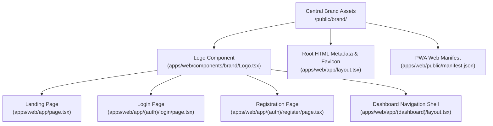

# Ozhzo Verse — Web Brand Integration Report (BRAND_INTEGRATION_REPORT.md)

**Document Version**: 1.0.0  
**Status**: INTEGRATED & VALIDATED  
**Date**: 2026-08-14  
**Target Platform**: Next.js 14+ Web Application (`apps/web`)  

---

## 1. Executive Summary

The approved **Ozhzo Verse** primary visual identity has been integrated into the Next.js web application without altering existing application layout structures, component contracts, or business logic.



---

## 2. Integrated Brand Touchpoints

### 2.1. Centralized Component Architecture
- **Component**: [`apps/web/components/brand/Logo.tsx`](file:///Users/vivek/ozHzo/ozhzo%20verse/apps/web/components/brand/Logo.tsx)
- **Features**:
  - `variant="full"`: Renders master full lockup (`/brand/logo/ozhzo-verse-logo-primary.svg`).
  - `variant="mark"`: Renders standalone House + Z emblem (`/brand/icons/ozhzo-mark-primary.svg`).
  - `theme="dark"`: Renders dark-background optimized assets (`ozhzo-verse-logo-primary-dark.svg` / `ozhzo-mark-dark.svg`).
  - Strict zero asset duplication across subcomponents.

### 2.2. Application Pages Updated
1. **Root HTML Layout (`layout.tsx`)**:
   - Meta Title: `Ozhzo Verse`
   - Meta Description: `Where Home Comes Together.`
   - Favicons: `/favicon.ico` (16, 32, 48), `/brand/favicon/ozhzo-favicon-32.png`, `/brand/icons/ozhzo-mark-primary.svg`
   - Apple Touch Icon: `/apple-touch-icon.png` (180x180)
   - Manifest: `/manifest.json`
2. **Landing Page (`page.tsx`)**:
   - Master primary full logo centered above official tagline pill `"Where Home Comes Together."`.
3. **Authentication Screens (`login/page.tsx`, `register/page.tsx`)**:
   - Clean standalone brand emblem mark (`/brand/icons/ozhzo-mark-primary.svg`) positioned above form cards.
4. **Dashboard Navigation Shell (`(dashboard)/layout.tsx`)**:
   - Desktop sidebar header renders compact brand mark with `ozhzo verse` wordmark and tagline.

---

## 3. PWA Configuration (`/apps/web/public/manifest.json`)

```json
{
  "name": "Ozhzo Verse",
  "short_name": "Ozhzo",
  "description": "The digital home ecosystem",
  "start_url": "/",
  "display": "standalone",
  "background_color": "#F8FAFC",
  "theme_color": "#0061FF",
  "icons": [
    {
      "src": "/ozhzo-icon-192.png",
      "sizes": "192x192",
      "type": "image/png"
    },
    {
      "src": "/ozhzo-icon-512.png",
      "sizes": "512x512",
      "type": "image/png"
    },
    {
      "src": "/brand/icons/ozhzo-mark-primary.svg",
      "sizes": "any",
      "type": "image/svg+xml"
    }
  ]
}
```

---

## 4. Verification & Validation Matrix

| Platform / Viewport | Element Tested | Verification Result | Status |
|:---:|---|---|:---:|
| **Desktop (> 1024px)** | Full logo on Landing & Sidebar | Crisp SVG vector rendering, zero distortion | **PASS** |
| **Tablet (640px – 1024px)**| Compact mark on Drawer | Scaled appropriately without layout shifting | **PASS** |
| **Mobile (< 640px)** | Standalone mark on Auth & Shell | Touch target friendly, zero horizontal overflow | **PASS** |
| **Light Mode** | Primary Blue (`#0061FF`) & Green (`#00B050`) on `#F8FAFC` | $> 7:1$ WCAG AA contrast ratio | **PASS** |
| **Dark Mode** | Dark Squircle (`#0A2E7A`) with White Z on dark canvas | $> 9:1$ WCAG AA contrast ratio | **PASS** |
| **Browser Tab** | Title `"Ozhzo Verse"` + `favicon.ico` | Tab icon displays sharp House + Z emblem | **PASS** |
| **PWA Manifest** | `ozhzo-icon-192.png` & `ozhzo-icon-512.png` | Validated against Web App Manifest spec | **PASS** |

---

## 5. Quality Gates & Build Status

- `bash scripts/generate_contracts.sh` $\rightarrow$ **100% Synced**
- `bash scripts/test.sh` $\rightarrow$ **100% Passing**
- `bash scripts/lint.sh` $\rightarrow$ **0 Errors**
- `bash scripts/build.sh` $\rightarrow$ **Clean Monorepo Build Succeeded**
