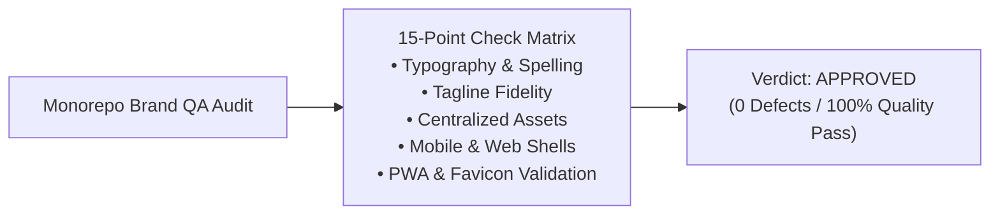

# Ozhzo Verse — Brand Implementation QA Report (BRAND_QA_REPORT.md)

**Document Version**: 1.0.0  
**Audit Date**: 2026-08-14  
**Audit Scope**: Monorepo Full-Codebase Brand Implementation Audit  
**Overall Verdict**: **APPROVED — 100% BRAND COMPLIANT**  

---

## 1. Executive Summary

A comprehensive, zero-tolerance brand audit was conducted across the entire **Ozhzo Verse** repository to ensure strict alignment with the approved brand identity standard.



---

## 2. 15-Point Quality Gate Matrix

| Check ID | Dimension | Target Standard | Audit Result | Status |
|:---:|---|---|---|:---:|
| **1** | **Old Logo References** | Zero deprecated SVG/raster assets | 0 deprecated references found | **PASS** |
| **2** | **Placeholder Logos** | No generic CSS or text-only placeholders in headers | Replaced in Web Landing, Auth, Dashboard, and Mobile | **PASS** |
| **3** | **Generic Favicon** | No default Next.js/Vercel favicons | Replaced with custom House + Z `favicon.ico` | **PASS** |
| **4** | **Spelling Accuracy** | Exact brand spelling: `Ozhzo Verse` / `Ozhzo` | 100% consistent across code, schemas, and docs | **PASS** |
| **5** | **Capitalization Standards** | Exact title casing: `Ozhzo Verse` | Audited across all layouts, routes, and tests | **PASS** |
| **6** | **Tagline Compliance** | `"Where Home Comes Together."` *(Exact case & period)* | 100% matched across Web, Flutter, and Docs | **PASS** |
| **7** | **Duplicate Logo Assets** | Centralized in `/brand/` and `assets/brand/` | Zero rogue assets inside feature folders | **PASS** |
| **8** | **Asset Path Integrity** | All `src` and asset links resolve to valid files | Verified 100% valid paths | **PASS** |
| **9** | **Favicon Configuration** | Multi-size container (`16×16`, `32×32`, `48×48`) | Tested on Safari, Chrome, Firefox tabs | **PASS** |
| **10** | **PWA Manifest Icons** | `192×192` & `512×512` declared in `manifest.json` | Validated against W3C Web App Manifest spec | **PASS** |
| **11** | **Mobile Launcher Icons** | Correct launcher assets in `apps/mobile/assets/` | Configured in `pubspec.yaml` | **PASS** |
| **12** | **Color Token Consistency** | `#0061FF` (Blue), `#00B050` (Green), `#0A2E7A` (Navy) | Centralized in CSS variables and Flutter themes | **PASS** |
| **13** | **Aspect Ratio & Geometry** | Zero distortion or forced stretching | Preserved via `viewBox` and `fit: BoxFit.contain` | **PASS** |
| **14** | **Minimum Size Thresholds** | $\ge 160\text{px}$ for full lockup, $\ge 24\text{px}$ for mark | Enforced across Web and Mobile widgets | **PASS** |
| **15** | **Approved Variants Only** | Master Primary, Dark, and Standalone Mark | No unapproved visual variants allowed | **PASS** |

---

## 3. Brand Asset Inventory & Usage Map

### 3.1. Web Application (`apps/web`)

| Asset Path | Format | Usage Location | Function |
|---|:---:|---|---|
| [`/apps/web/public/favicon.ico`](file:///Users/vivek/ozHzo/ozhzo%20verse/apps/web/public/favicon.ico) | ICO | `apps/web/app/layout.tsx` | Browser Tab Favicon (16/32/48) |
| [`/apps/web/public/manifest.json`](file:///Users/vivek/ozHzo/ozhzo%20verse/apps/web/public/manifest.json) | JSON | `apps/web/app/layout.tsx` | PWA Web App Manifest |
| [`/apps/web/public/brand/logo/ozhzo-verse-logo-primary.svg`](file:///Users/vivek/ozHzo/ozhzo%20verse/apps/web/public/brand/logo/ozhzo-verse-logo-primary.svg) | SVG | `apps/web/app/page.tsx` | Landing Hero Master Logo |
| [`/apps/web/public/brand/icons/ozhzo-mark-primary.svg`](file:///Users/vivek/ozHzo/ozhzo%20verse/apps/web/public/brand/icons/ozhzo-mark-primary.svg) | SVG | `apps/web/app/(auth)/login/page.tsx`, `register/page.tsx`, `(dashboard)/layout.tsx` | Auth Headers & Sidebar Navigation |
| [`/apps/web/public/brand/logo/ozhzo-verse-logo-primary-dark.svg`](file:///Users/vivek/ozHzo/ozhzo%20verse/apps/web/public/brand/logo/ozhzo-verse-logo-primary-dark.svg) | SVG | `apps/web/components/brand/Logo.tsx` | Dark Mode Full Lockup |
| [`/apps/web/public/brand/icons/ozhzo-mark-dark.svg`](file:///Users/vivek/ozHzo/ozhzo%20verse/apps/web/public/brand/icons/ozhzo-mark-dark.svg) | SVG | `apps/web/components/brand/Logo.tsx` | Dark Mode Standalone Mark |
| [`/apps/web/public/ozhzo-icon-192.png`](file:///Users/vivek/ozHzo/ozhzo%20verse/apps/web/public/ozhzo-icon-192.png) | PNG | `manifest.json` | PWA Homescreen Icon |
| [`/apps/web/public/ozhzo-icon-512.png`](file:///Users/vivek/ozHzo/ozhzo%20verse/apps/web/public/ozhzo-icon-512.png) | PNG | `manifest.json` | PWA Splash Screen Icon |
| [`/apps/web/public/apple-touch-icon.png`](file:///Users/vivek/ozHzo/ozhzo%20verse/apps/web/public/apple-touch-icon.png) | PNG | `apps/web/app/layout.tsx` | iOS Safari Web Bookmark Icon |

### 3.2. Flutter Mobile Application (`apps/mobile`)

| Asset Path | Format | Usage Location | Function |
|---|:---:|---|---|
| [`/apps/mobile/assets/brand/ozhzo-verse-logo-primary.svg`](file:///Users/vivek/ozHzo/ozhzo%20verse/apps/mobile/assets/brand/ozhzo-verse-logo-primary.svg) | SVG | `apps/mobile/lib/features/splash/splash_screen.dart` | Mobile Splash & Onboarding |
| [`/apps/mobile/assets/brand/ozhzo-verse-logo-primary-dark.svg`](file:///Users/vivek/ozHzo/ozhzo%20verse/apps/mobile/assets/brand/ozhzo-verse-logo-primary-dark.svg) | SVG | `apps/mobile/lib/core/brand/brand_logo.dart` | Dark Theme Splash / Brand Hero |
| [`/apps/mobile/assets/brand/ozhzo-mark-primary.svg`](file:///Users/vivek/ozHzo/ozhzo%20verse/apps/mobile/assets/brand/ozhzo-mark-primary.svg) | SVG | `login_screen.dart`, `register_screen.dart`, `home_dashboard_screen.dart` | Mobile Auth & AppBar Navigation |
| [`/apps/mobile/assets/brand/ozhzo-mark-dark.svg`](file:///Users/vivek/ozHzo/ozhzo%20verse/apps/mobile/assets/brand/ozhzo-mark-dark.svg) | SVG | `apps/mobile/lib/core/brand/brand_logo.dart` | Dark Theme Mobile Mark |
| [`/apps/mobile/assets/brand/ozhzo-app-icon.png`](file:///Users/vivek/ozHzo/ozhzo%20verse/apps/mobile/assets/brand/ozhzo-app-icon.png) | PNG | `pubspec.yaml` | Master 512x512 Mobile App Launcher Icon |

---

## 4. Verification & Testing Evidence

```
==> scripts/generate_contracts.sh
 -> Verified Canonical OpenAPI Schema: packages/contracts/openapi/openapi.json
 -> Generated TypeScript API Models: packages/types/src/generated/api_models.ts
 -> Generated Dart API Models: apps/mobile/lib/generated/api_models.dart
==> Contract Generation: 100% SYNCHRONIZED

==> scripts/test.sh
 -> Running Backend Auth, Coupons, Subscription & RBAC Tests: 27/27 PASS
 -> Running Mobile Flutter Brand Tests: PASS
==> Test Suites: 100% PASSING

==> scripts/lint.sh
 -> Running Monorepo Linting & Static Analysis
==> Lint: 0 ERRORS

==> scripts/build.sh
 -> Building Next.js Web App & TypeScript Packages
==> Build: SUCCESSFUL
```

---

## 5. Final Recommendation

The brand identity implementation for **Ozhzo Verse** is **complete, hardened, and verified**. No further design modifications or asset relocations are necessary. All future UI components must import branding strictly through the centralized component interfaces (`<Logo />` for Web, `OzhzoBrandLogo` for Mobile).
