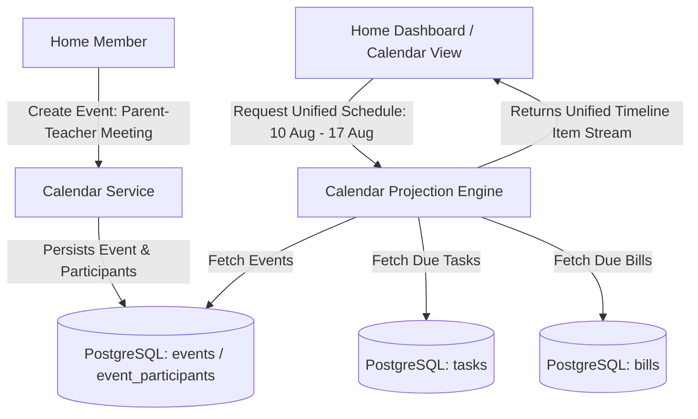

# Ozhzo Verse — Phase 6: Shared Calendar & Household Events Architecture

## 1. Architectural Philosophy & The Core Home Loop
In Ozhzo Verse, the Shared Calendar serves as the temporal coordination layer answering:
- **WHAT IS HAPPENING?**
- **WHEN?**
- **WHERE?**
- **WHO IS INVOLVED?**
- **WHO NEEDS TO KNOW?**

It is **strictly household-focused**, avoiding commercial enterprise calendar complexity (busy/free negotiation, Exchange protocol synchronization, zoom meeting bot integrations) in favor of clear family schedule visibility, visitor logging, holiday tracking, and unified temporal projection.

```
┌─────────────────────────────────────────────────────────────────────────┐
│                       THE OZHZO DIGITAL HOME OS                         │
│                                                                         │
│  1. WHAT DO WE HAVE?        ──►  Inventory & Durable Assets (Phase 3A)  │
│  2. WHERE IS IT?            ──►  Hierarchical Location Memory (Phase 3A)│
│  3. WHO HAS IT?             ──►  Asset Lending Ledger (Phase 3A)        │
│  4. WHAT DO WE NEED?        ──►  Home Purchase List (Phase 3B)          │
│  5. WHAT NEEDS TO BE DONE?  ──►  Tasks & Household Routines (Phase 4)   │
│  6. WHO IS RESPONSIBLE?     ──►  Assigned Member (Optional)             │
│  7. WHEN IS IT DUE?         ──►  Due Date & Recurrence Schedule         │
│  8. WHAT DO WE HAVE TO PAY? ──►  Bills & Recurring Expenses (Phase 5)   │
│  9. HOW MUCH & WAS IT PAID? ──►  Expected vs Actual Payment Ledger      │
│ 10. WHAT IS HAPPENING & WHEN──►  Shared Calendar & Projection (Phase 6) │
└─────────────────────────────────────────────────────────────────────────┘
```

---

## 2. Core Architectural Pillars

1. **Home-Level Tenant Ownership**:
   - The Home is the primary tenant (`home_id`).
   - Every event, category, and participant mapping is Home-scoped.
   - Multi-Home users have completely independent calendars per Home context.
2. **First-Class Household Events (`events`)**:
   - Manages domestic gatherings, birthdays, anniversaries, school functions, doctor appointments, trips, and visitor arrivals.
   - Supports both timed events (with start and end timestamps) and all-day events (00:00:00 to 23:59:59 in Home timezone).
3. **Optional In-Home Participants (`event_participants`)**:
   - Events can link multiple family members (`user_id`).
   - Participants must be active members of the same Home; cross-home assignment is strictly rejected.
4. **Recurrence Engine Reuse**:
   - Reuses the recurrence architecture established in Phase 4 & Phase 5 (`SCHEDULED_DATE` strategy for calendar cadences: `DAILY`, `WEEKLY`, `MONTHLY`, `YEARLY`, `CUSTOM_DAYS`).
5. **Unified Calendar Projection (Zero Data Duplication)**:
   - **Crucial Architectural Principle**: We do NOT copy or sync Tasks and Bills into the `events` table!
   - Instead, the Calendar module provides a dynamic **Temporal Projection Service** that aggregates:
     - Calendar Events (`EventModel`)
     - Due Tasks (`TaskModel`)
     - Due Bills (`BillModel`)
   - Returns a unified chronological timeline for family visibility while keeping underlying data models clean and decoupled.
6. **Timezone Correctness**:
   - All timestamps stored in UTC (`TIMESTAMPTZ`).
   - Home timezone (`homes.timezone`) defines the authoritative local day boundaries for all-day events and daily agenda views.
7. **Optimistic Concurrency & Audit Integrity**:
   - Event updates protected by `version` column.
   - Soft deletes preserve cancellation audit trails (`deleted_at`, `status = 'CANCELLED'`).

---

## 3. High-Level System Diagram


