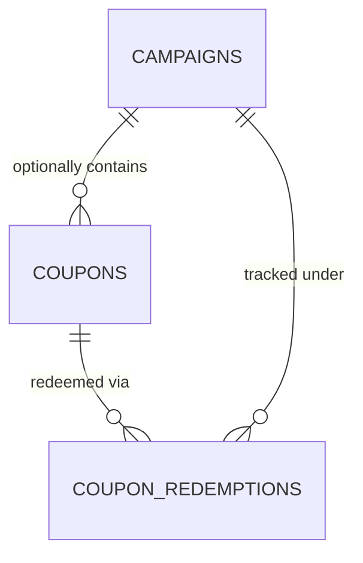

# Ozhzo Verse — Relationship Between Coupons & Campaigns (COUPONS_AND_CAMPAIGNS.md)

**Document Version**: 1.0.0  
**Baseline Standard**: Independent Coupons with Optional Campaign Grouping  

---

## 1. Architectural Distinction

In Ozhzo Verse, **Coupons** and **Campaigns** are distinct, decoupled entities:

1. **Coupons (`coupons`)**:
   - The primary commercial unit representing a benefit (Free Period, Percentage Discount, Fixed Amount).
   - Validated independently by the backend calculation engine.
   - May exist **with or without** a campaign.
2. **Campaigns (`campaigns`)**:
   - An optional administrative and marketing grouping mechanism.
   - Aggregates multiple coupons, budgets, and regional distribution channels (e.g. `KERALA_LAUNCH_2026`).
   - Tracks overall campaign-level budget caps and redemption analytics across its constituent coupons.

---

## 2. Examples

- **Independent Coupon (No Campaign)**:
  - Code: `VIVEK2026`
  - Benefit: 1 Year Free
  - `campaign_id`: `NULL`
- **Campaign-Grouped Coupons**:
  - Campaign: `KERALA LAUNCH` (`code: KERALA_LAUNCH`)
  - Coupons:
    - `KERALA6` (6 Months Free)
    - `KERALA3` (3 Months Free)
    - `KERALA50` (50% OFF)
