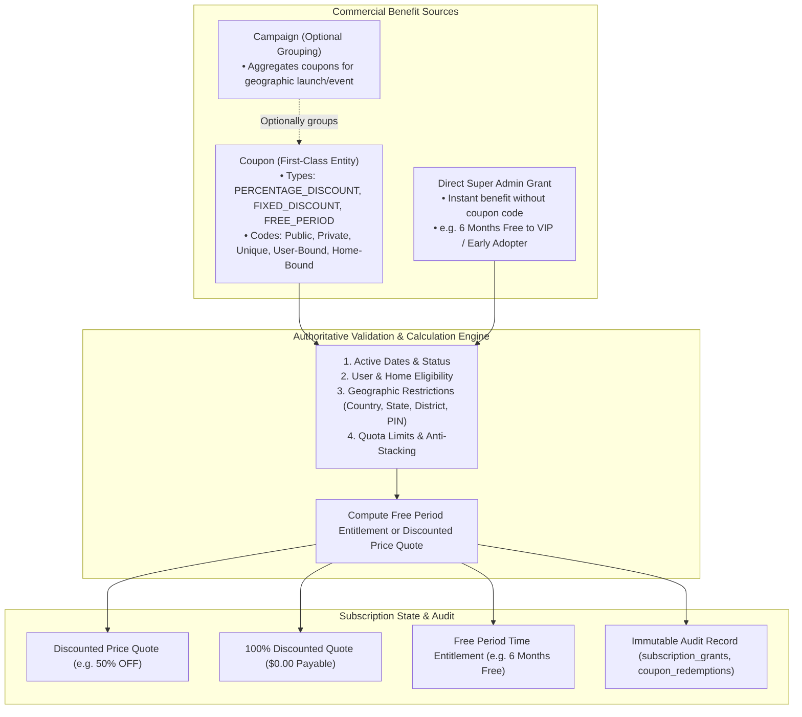

# Ozhzo Verse — Coupon Management & Direct Grant Architecture (COUPON_MANAGEMENT.md)

**Document Version**: 1.0.0  
**Baseline Standard**: Coupons as First-Class Entities with Dynamic Free Periods & Direct Grants  
**Commercial Rule**: 100% Data-Driven Governance by `SUPER_ADMIN`  

---

## 1. Core Principles & Architecture

Coupons in Ozhzo Verse are **first-class independent entities** that can exist with or without an overarching marketing campaign.

---

## 2. Coupon Types & Free Period Mechanics

| Coupon Type | Formula / Benefit | Payable Outcome | Example |
|---|---|---|---|
| **`FREE_PERIOD`** | Entitlement duration added to subscription (`free_period_ends_at = now + duration`). At expiry $\rightarrow$ status becomes `RENEWAL_REQUIRED`. | **$0.00 Payment** (No fake payment records) | `WELCOME6` (6 Months Free), `EARLYUSER` (1 Year Free) |
| **`100% DISCOUNT`** | List Price $\times (1 - 1.00) = \$0.00$. Distinguishable from `FREE_PERIOD` for financial reporting. | **$0.00 Payment** | `FREELAUNCH` (100% OFF List Price) |
| **`PERCENTAGE_DISCOUNT`**| $\text{List Price} \times (1 - \text{Percentage} / 100)$ | Discounted Price | `SAVE50` (50% OFF List Price) |
| **`FIXED_DISCOUNT`** | $\max(0, \text{List Price} - \text{Fixed Amount})$ | Discounted Price | `FLAT500` (₹500 OFF List Price) |

---

## 3. Direct Super Admin Grants

Super Admins have direct authority to grant subscription benefits directly to any household workspace or user without a coupon code:
- **Grant Types**: `FREE_PERIOD`, `PERCENTAGE_DISCOUNT`, `FIXED_DISCOUNT`, `EXTENDED_TRIAL`.
- **Audit Requirement**: Every grant creates an immutable record in `subscription_grants` storing `granted_user_id`, `home_id`, `plan_id`, `grant_type`, `duration_value`, `duration_unit`, `start_date`, `expiry_date`, `reason`, `granted_by`, and timestamp.

---

## 4. Dynamic Eligibility & Geographic Restrictions

- **Eligibility Types**: `ANY_USER`, `NEW_USER`, `EXISTING_USER`, `NEW_HOME`, `EXISTING_HOME`, `INVITED_USER`, `SPECIFIC_USER`, `SPECIFIC_HOME`.
- **Geographic Restrictions**: Hierarchical filtering by `country` (e.g. `IN`), `state` (e.g. `Kerala`), `district` (e.g. `Ernakulam`), and `postal_code` (e.g. `682001`).
- **Quota Enforcements**: `maximum_total_redemptions`, `maximum_redemptions_per_user`, `maximum_redemptions_per_home`.
- **Anti-Stacking**: Multiple discount coupons cannot be stacked by default (`allow_stacking = False`).
