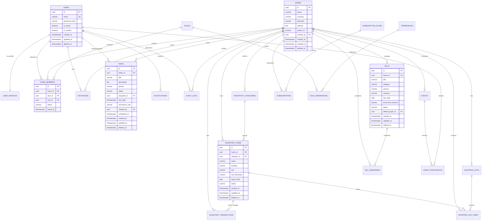

# Database Design & Relational Schema Specification — Ozhzo Verse

*Document Classification: Definitive Source of Truth*  
*Target Database: PostgreSQL 16+*  
*Target Audience: Database Administrators, Backend Engineers, Security Architects*

---

## 1. Entity-Relationship Diagram (ERD)

---

## 2. Multi-Home Architecture & Tenancy Strategy

1. **Discriminator Column Tenancy**:
   - Every domain entity (inventory, shopping lists, tasks, bills, events, reminders, audit logs) contains `home_id UUID NOT NULL REFERENCES homes(id) ON DELETE CASCADE`.
2. **Tenant Boundary Enforcement**:
   - Primary database operations require `home_id` parameter binding.
   - Cross-home joins are architecturally forbidden in the domain layer.
3. **Compound Multi-Tenant Indexing**:
   - Compound indexes strictly prefix `(home_id, ...)` to ensure PostgreSQL query plans immediately filter by tenant before scanning predicates.

---

## 3. Comprehensive Table Specifications (22 Tables)

---

### 3.1. User Identity & Profiles

#### Table: `users`
*System-level user credentials and authentication status.*
- **Primary Key**: `id` (`UUID`, `DEFAULT gen_random_uuid()`)
- **Columns**:
  - `email` (`VARCHAR(255)`, `NOT NULL`, `UNIQUE`, Indexed)
  - `password_hash` (`VARCHAR(255)`, `NOT NULL`)
  - `is_active` (`BOOLEAN`, `NOT NULL`, `DEFAULT TRUE`)
  - `is_verified` (`BOOLEAN`, `NOT NULL`, `DEFAULT FALSE`)
  - `created_at` (`TIMESTAMPTZ`, `NOT NULL`, `DEFAULT NOW()`)
  - `updated_at` (`TIMESTAMPTZ`, `NOT NULL`, `DEFAULT NOW()`)
  - `deleted_at` (`TIMESTAMPTZ`, `NULL`, Soft Delete)
- **Indexes**: `CREATE UNIQUE INDEX uidx_users_email ON users(LOWER(email)) WHERE deleted_at IS NULL;`

#### Table: `user_profiles`
*User personal display information, avatar, and timezone.*
- **Primary Key**: `user_id` (`UUID`, `REFERENCES users(id) ON DELETE CASCADE`)
- **Columns**:
  - `display_name` (`VARCHAR(100)`, `NOT NULL`)
  - `phone_number` (`VARCHAR(32)`, `NULL`)
  - `avatar_url` (`VARCHAR(512)`, `NULL`)
  - `timezone` (`VARCHAR(64)`, `NOT NULL`, `DEFAULT 'UTC'`)
  - `preferred_language` (`VARCHAR(10)`, `NOT NULL`, `DEFAULT 'en'`)
  - `updated_at` (`TIMESTAMPTZ`, `NOT NULL`, `DEFAULT NOW()`)

---

### 3.2. Homes, Members & Roles

#### Table: `homes`
*The primary multi-tenant household workspace.*
- **Primary Key**: `id` (`UUID`, `DEFAULT gen_random_uuid()`)
- **Columns**:
  - `name` (`VARCHAR(120)`, `NOT NULL`)
  - `currency` (`VARCHAR(3)`, `NOT NULL`, `DEFAULT 'USD'`)
  - `timezone` (`VARCHAR(64)`, `NOT NULL`, `DEFAULT 'UTC'`)
  - `address` (`TEXT`, `NULL`)
  - `avatar_url` (`VARCHAR(512)`, `NULL`)
  - `created_by` (`UUID`, `NOT NULL`, `REFERENCES users(id) ON DELETE RESTRICT`)
  - `created_at` (`TIMESTAMPTZ`, `NOT NULL`, `DEFAULT NOW()`)
  - `updated_at` (`TIMESTAMPTZ`, `NOT NULL`, `DEFAULT NOW()`)
  - `deleted_at` (`TIMESTAMPTZ`, `NULL`, Soft Delete)
- **Indexes**: `CREATE INDEX idx_homes_created_by ON homes(created_by) WHERE deleted_at IS NULL;`

#### Table: `roles`
*System-defined role personas.*
- **Primary Key**: `id` (`UUID`, `DEFAULT gen_random_uuid()`)
- **Columns**:
  - `name` (`VARCHAR(32)`, `NOT NULL`, `UNIQUE`) — `OWNER`, `ADMIN`, `MEMBER`, `CHILD`, `GUEST`
  - `description` (`VARCHAR(255)`, `NOT NULL`)
  - `hierarchy_level` (`INT`, `NOT NULL`) — `100 (Owner)`, `80 (Admin)`, `50 (Member)`, `20 (Child)`, `10 (Guest)`

#### Table: `permissions`
*Granular capability flags.*
- **Primary Key**: `id` (`UUID`, `DEFAULT gen_random_uuid()`)
- **Columns**:
  - `code` (`VARCHAR(64)`, `NOT NULL`, `UNIQUE`) — e.g. `tasks:create`, `bills:view`, `home:delete`
  - `module` (`VARCHAR(32)`, `NOT NULL`) — `tasks`, `inventory`, `bills`, `members`
  - `description` (`VARCHAR(255)`, `NOT NULL`)

#### Table: `role_permissions`
*Join table mapping roles to granular permission codes.*
- **Primary Key**: `(role_id, permission_id)`
- **Columns**:
  - `role_id` (`UUID`, `NOT NULL`, `REFERENCES roles(id) ON DELETE CASCADE`)
  - `permission_id` (`UUID`, `NOT NULL`, `REFERENCES permissions(id) ON DELETE CASCADE`)

#### Table: `home_members`
*Relational membership connecting Users to Homes with specific Roles.*
- **Primary Key**: `id` (`UUID`, `DEFAULT gen_random_uuid()`)
- **Columns**:
  - `home_id` (`UUID`, `NOT NULL`, `REFERENCES homes(id) ON DELETE CASCADE`)
  - `user_id` (`UUID`, `NOT NULL`, `REFERENCES users(id) ON DELETE CASCADE`)
  - `role_id` (`UUID`, `NOT NULL`, `REFERENCES roles(id) ON DELETE RESTRICT`)
  - `status` (`VARCHAR(32)`, `NOT NULL`, `DEFAULT 'ACTIVE'`) — `ACTIVE`, `SUSPENDED`, `LEFT`
  - `joined_at` (`TIMESTAMPTZ`, `NOT NULL`, `DEFAULT NOW()`)
  - `updated_at` (`TIMESTAMPTZ`, `NOT NULL`, `DEFAULT NOW()`)
- **Constraints & Indexes**:
  - `UNIQUE(home_id, user_id)`
  - `CREATE INDEX idx_home_members_lookup ON home_members(home_id, user_id, status);`
  - `CREATE INDEX idx_user_homes ON home_members(user_id, status);`

#### Table: `invitations`
*Expiring cryptographic tokens for onboarding members.*
- **Primary Key**: `id` (`UUID`, `DEFAULT gen_random_uuid()`)
- **Columns**:
  - `home_id` (`UUID`, `NOT NULL`, `REFERENCES homes(id) ON DELETE CASCADE`)
  - `email` (`VARCHAR(255)`, `NULL`)
  - `invite_token` (`VARCHAR(128)`, `NOT NULL`, `UNIQUE`)
  - `role_id` (`UUID`, `NOT NULL`, `REFERENCES roles(id) ON DELETE RESTRICT`)
  - `invited_by` (`UUID`, `NOT NULL`, `REFERENCES users(id) ON DELETE CASCADE`)
  - `status` (`VARCHAR(32)`, `NOT NULL`, `DEFAULT 'PENDING'`) — `PENDING`, `ACCEPTED`, `EXPIRED`, `REVOKED`
  - `expires_at` (`TIMESTAMPTZ`, `NOT NULL`)
  - `created_at` (`TIMESTAMPTZ`, `NOT NULL`, `DEFAULT NOW()`)
- **Indexes**: `CREATE INDEX idx_invites_token ON invitations(invite_token) WHERE status = 'PENDING';`

---

### 3.3. Household Inventory, Assets, Locations & Lending

#### Table: `inventory_categories`
*Custom or default categories for household items and assets.*
- **Primary Key**: `id` (`UUID`, `DEFAULT gen_random_uuid()`)
- **Columns**:
  - `home_id` (`UUID`, `NOT NULL`, `REFERENCES homes(id) ON DELETE CASCADE`)
  - `name` (`VARCHAR(100)`, `NOT NULL`)
  - `icon` (`VARCHAR(50)`, `NULL`)
  - `color` (`VARCHAR(20)`, `NULL`)
  - `sort_order` (`INT`, `NOT NULL`, `DEFAULT 0`)
  - `created_at` (`TIMESTAMPTZ`, `NOT NULL`, `DEFAULT NOW()`)
  - `updated_at` (`TIMESTAMPTZ`, `NOT NULL`, `DEFAULT NOW()`)
- **Indexes**: `CREATE UNIQUE INDEX uidx_inv_cat_home_name ON inventory_categories(home_id, LOWER(name));`

#### Table: `locations`
*Hierarchical physical location tree for the Home.*
- **Primary Key**: `id` (`UUID`, `DEFAULT gen_random_uuid()`)
- **Columns**:
  - `home_id` (`UUID`, `NOT NULL`, `REFERENCES homes(id) ON DELETE CASCADE`)
  - `parent_id` (`UUID`, `NULL`, `REFERENCES locations(id) ON DELETE CASCADE`)
  - `name` (`VARCHAR(120)`, `NOT NULL`)
  - `location_type` (`VARCHAR(32)`, `NOT NULL`, `DEFAULT 'ZONE'`)
  - `description` (`TEXT`, `NULL`)
  - `icon` (`VARCHAR(50)`, `NULL`)
  - `sort_order` (`INT`, `NOT NULL`, `DEFAULT 0`)
  - `is_active` (`BOOLEAN`, `NOT NULL`, `DEFAULT TRUE`)
  - `created_by` (`UUID`, `NULL`, `REFERENCES users(id) ON DELETE SET NULL`)
  - `created_at` / `updated_at` (`TIMESTAMPTZ`, `NOT NULL`, `DEFAULT NOW()`)
  - `deleted_at` (`TIMESTAMPTZ`, `NULL`, Soft Delete)

#### Table: `inventory_items`
*Unified pantry consumables and durable household assets.*
- **Primary Key**: `id` (`UUID`, `DEFAULT gen_random_uuid()`)
- **Columns**:
  - `home_id` (`UUID`, `NOT NULL`, `REFERENCES homes(id) ON DELETE CASCADE`)
  - `category_id` (`UUID`, `NULL`, `REFERENCES inventory_categories(id) ON DELETE SET NULL`)
  - `location_id` (`UUID`, `NULL`, `REFERENCES locations(id) ON DELETE SET NULL`)
  - `item_type` (`VARCHAR(32)`, `NOT NULL`, `DEFAULT 'CONSUMABLE'`) — `CONSUMABLE`, `ASSET`
  - `name` (`VARCHAR(150)`, `NOT NULL`)
  - `description` (`TEXT`, `NULL`)
  - `quantity` (`NUMERIC(10, 3)`, `NOT NULL`, `DEFAULT 1.000`)
  - `unit` (`VARCHAR(32)`, `NOT NULL`, `DEFAULT 'pcs'`)
  - `min_threshold` (`NUMERIC(10, 3)`, `NOT NULL`, `DEFAULT 1.000`)
  - `preferred_quantity` (`NUMERIC(10, 3)`, `NULL`)
  - `max_quantity` (`NUMERIC(10, 3)`, `NULL`)
  - `location_path` (`TEXT`, `NULL`)
  - `condition` (`VARCHAR(32)`, `NULL`)
  - `asset_status` (`VARCHAR(32)`, `NOT NULL`, `DEFAULT 'AVAILABLE'`) — `AVAILABLE`, `BORROWED`, `MISSING`, `ARCHIVED`
  - `current_holder_name` (`VARCHAR(120)`, `NULL`)
  - `current_holder_user_id` (`UUID`, `NULL`, `REFERENCES users(id) ON DELETE SET NULL`)
  - `last_seen_at` (`TIMESTAMPTZ`, `NULL`)
  - `last_seen_by` (`UUID`, `NULL`, `REFERENCES users(id) ON DELETE SET NULL`)
  - `last_seen_location_id` (`UUID`, `NULL`, `REFERENCES locations(id) ON DELETE SET NULL`)
  - `expiry_date` (`DATE`, `NULL`)
  - `status` (`VARCHAR(32)`, `NOT NULL`, `DEFAULT 'GOOD'`) — `GOOD`, `LOW`, `OUT_OF_STOCK`
  - `expiry_status` (`VARCHAR(32)`, `NOT NULL`, `DEFAULT 'NORMAL'`) — `NORMAL`, `EXPIRING_SOON`, `EXPIRED`
  - `notes` (`TEXT`, `NULL`)
  - `created_by` (`UUID`, `NULL`, `REFERENCES users(id) ON DELETE SET NULL`)
  - `created_at` / `updated_at` (`TIMESTAMPTZ`, `NOT NULL`, `DEFAULT NOW()`)
  - `deleted_at` (`TIMESTAMPTZ`, `NULL`, Soft Delete)

#### Table: `stock_movements`
*Immutable historical stock consumption and replenishment ledger.*
- **Primary Key**: `id` (`UUID`, `DEFAULT gen_random_uuid()`)
- **Columns**:
  - `home_id` (`UUID`, `NOT NULL`, `REFERENCES homes(id) ON DELETE CASCADE`)
  - `item_id` (`UUID`, `NOT NULL`, `REFERENCES inventory_items(id) ON DELETE CASCADE`)
  - `movement_type` (`VARCHAR(32)`, `NOT NULL`) — `ADD`, `CONSUME`, `ADJUST`, `PURCHASE`, `WASTE`, `RETURN`
  - `quantity_delta` (`NUMERIC(10, 3)`, `NOT NULL`)
  - `previous_quantity` (`NUMERIC(10, 3)`, `NOT NULL`)
  - `resulting_quantity` (`NUMERIC(10, 3)`, `NOT NULL`)
  - `reason` (`TEXT`, `NULL`)
  - `performed_by` (`UUID`, `NULL`, `REFERENCES users(id) ON DELETE SET NULL`)
  - `created_at` (`TIMESTAMPTZ`, `NOT NULL`, `DEFAULT NOW()`)

#### Table: `location_movements`
*Immutable physical relocation ledger and location audit trail.*
- **Primary Key**: `id` (`UUID`, `DEFAULT gen_random_uuid()`)
- **Columns**:
  - `home_id` (`UUID`, `NOT NULL`, `REFERENCES homes(id) ON DELETE CASCADE`)
  - `item_id` (`UUID`, `NOT NULL`, `REFERENCES inventory_items(id) ON DELETE CASCADE`)
  - `from_location_id` (`UUID`, `NULL`, `REFERENCES locations(id) ON DELETE SET NULL`)
  - `to_location_id` (`UUID`, `NOT NULL`, `REFERENCES locations(id) ON DELETE RESTRICT`)
  - `from_location_path` (`TEXT`, `NULL`)
  - `to_location_path` (`TEXT`, `NOT NULL`)
  - `reason` (`TEXT`, `NULL`)
  - `moved_by` (`UUID`, `NULL`, `REFERENCES users(id) ON DELETE SET NULL`)
  - `moved_at` (`TIMESTAMPTZ`, `NOT NULL`, `DEFAULT NOW()`)

#### Table: `asset_loans`
*Immutable asset borrowing, lending, and custody ledger.*
- **Primary Key**: `id` (`UUID`, `DEFAULT gen_random_uuid()`)
- **Columns**:
  - `home_id` (`UUID`, `NOT NULL`, `REFERENCES homes(id) ON DELETE CASCADE`)
  - `item_id` (`UUID`, `NOT NULL`, `REFERENCES inventory_items(id) ON DELETE CASCADE`)
  - `borrower_type` (`VARCHAR(32)`, `NOT NULL`, `DEFAULT 'MEMBER'`) — `MEMBER`, `EXTERNAL_PERSON`, `CONNECTED_HOME`
  - `borrower_user_id` (`UUID`, `NULL`, `REFERENCES users(id) ON DELETE SET NULL`)
  - `borrower_name` (`VARCHAR(120)`, `NOT NULL`)
  - `borrower_contact` (`VARCHAR(100)`, `NULL`)
  - `loan_status` (`VARCHAR(32)`, `NOT NULL`, `DEFAULT 'ACTIVE'`) — `ACTIVE`, `RETURNED`, `OVERDUE`, `LOST`
  - `borrowed_at` (`TIMESTAMPTZ`, `NOT NULL`, `DEFAULT NOW()`)
  - `expected_return_at` (`TIMESTAMPTZ`, `NULL`)
  - `returned_at` (`TIMESTAMPTZ`, `NULL`)
  - `return_location_id` (`UUID`, `NULL`, `REFERENCES locations(id) ON DELETE SET NULL`)
  - `return_location_path` (`TEXT`, `NULL`)
  - `issued_by` (`UUID`, `NULL`, `REFERENCES users(id) ON DELETE SET NULL`)
  - `received_by` (`UUID`, `NULL`, `REFERENCES users(id) ON DELETE SET NULL`)
  - `notes` (`TEXT`, `NULL`)
  - `created_at` / `updated_at` (`TIMESTAMPTZ`, `NOT NULL`, `DEFAULT NOW()`)

---

### 3.4. Shopping Lists

#### Table: `shopping_lists`
*Named shopping lists.*
- **Primary Key**: `id` (`UUID`, `DEFAULT gen_random_uuid()`)
- **Columns**:
  - `home_id` (`UUID`, `NOT NULL`, `REFERENCES homes(id) ON DELETE CASCADE`)
  - `title` (`VARCHAR(120)`, `NOT NULL`)
  - `is_default` (`BOOLEAN`, `NOT NULL`, `DEFAULT FALSE`)
  - `created_at` (`TIMESTAMPTZ`, `NOT NULL`, `DEFAULT NOW()`)
  - `updated_at` (`TIMESTAMPTZ`, `NOT NULL`, `DEFAULT NOW()`)
  - `deleted_at` (`TIMESTAMPTZ`, `NULL`, Soft Delete)
- **Indexes**: `CREATE INDEX idx_shop_lists_home ON shopping_lists(home_id) WHERE deleted_at IS NULL;`

#### Table: `shopping_list_items`
*Items on a shopping checklist.*
- **Primary Key**: `id` (`UUID`, `DEFAULT gen_random_uuid()`)
- **Columns**:
  - `list_id` (`UUID`, `NOT NULL`, `REFERENCES shopping_lists(id) ON DELETE CASCADE`)
  - `home_id` (`UUID`, `NOT NULL`, `REFERENCES homes(id) ON DELETE CASCADE`)
  - `inventory_item_id` (`UUID`, `NULL`, `REFERENCES inventory_items(id) ON DELETE SET NULL`)
  - `name` (`VARCHAR(120)`, `NOT NULL`)
  - `quantity` (`NUMERIC(10,2)`, `NOT NULL`, `DEFAULT 1.0`)
  - `unit` (`VARCHAR(32)`, `NOT NULL`, `DEFAULT 'pcs'`)
  - `category_name` (`VARCHAR(64)`, `NULL`)
  - `is_checked` (`BOOLEAN`, `NOT NULL`, `DEFAULT FALSE`)
  - `checked_by` (`UUID`, `NULL`, `REFERENCES users(id) ON DELETE SET NULL`)
  - `checked_at` (`TIMESTAMPTZ`, `NULL`)
  - `sort_order` (`INT`, `NOT NULL`, `DEFAULT 0`)
  - `created_at` (`TIMESTAMPTZ`, `NOT NULL`, `DEFAULT NOW()`)
- **Indexes**: `CREATE INDEX idx_shop_items_lookup ON shopping_list_items(list_id, home_id, is_checked);`

---

### 3.5. Tasks & Household Responsibilities

#### Table: `task_categories`
*Configurable household categories (e.g. Cleaning, Maintenance, Vehicle).*
- **Primary Key**: `id` (`UUID`, `DEFAULT gen_random_uuid()`)
- **Columns**:
  - `home_id` (`UUID`, `NOT NULL`, `REFERENCES homes(id) ON DELETE CASCADE`)
  - `name` (`VARCHAR(100)`, `NOT NULL`)
  - `icon` (`VARCHAR(50)`, `NULL`)
  - `color` (`VARCHAR(20)`, `NULL`)
  - `sort_order` (`INT`, `NOT NULL`, `DEFAULT 0`)
  - `created_at` / `updated_at` (`TIMESTAMPTZ`, `NOT NULL`, `DEFAULT NOW()`)
- **Indexes**: `CREATE UNIQUE INDEX uidx_task_cat_home_name ON task_categories(home_id, LOWER(name));`

#### Table: `task_templates`
*Ready-to-use common household task templates catalog.*
- **Primary Key**: `id` (`UUID`, `DEFAULT gen_random_uuid()`)
- **Columns**:
  - `name` (`VARCHAR(150)`, `NOT NULL`, `UNIQUE`)
  - `default_category_name` (`VARCHAR(100)`, `NOT NULL`, `DEFAULT 'Maintenance'`)
  - `default_priority` (`VARCHAR(16)`, `NOT NULL`, `DEFAULT 'NORMAL'`)
  - `default_recurrence_type` (`VARCHAR(32)`, `NOT NULL`, `DEFAULT 'NONE'`)
  - `default_interval_days` (`INT`, `NULL`)
  - `description` (`TEXT`, `NULL`)
  - `is_active` (`BOOLEAN`, `NOT NULL`, `DEFAULT TRUE`)
  - `sort_order` (`INT`, `NOT NULL`, `DEFAULT 0`)
  - `created_at` / `updated_at` (`TIMESTAMPTZ`, `NOT NULL`, `DEFAULT NOW()`)

#### Table: `tasks`
*Household chores, maintenance responsibilities, and assignments.*
- **Primary Key**: `id` (`UUID`, `DEFAULT gen_random_uuid()`)
- **Columns**:
  - `home_id` (`UUID`, `NOT NULL`, `REFERENCES homes(id) ON DELETE CASCADE`)
  - `template_id` (`UUID`, `NULL`, `REFERENCES task_templates(id) ON DELETE SET NULL`)
  - `category_id` (`UUID`, `NULL`, `REFERENCES task_categories(id) ON DELETE SET NULL`)
  - `title` (`VARCHAR(200)`, `NOT NULL`)
  - `description` (`TEXT`, `NULL`)
  - `priority` (`VARCHAR(16)`, `NOT NULL`, `DEFAULT 'NORMAL'`) — `LOW`, `NORMAL`, `HIGH`, `URGENT`
  - `status` (`VARCHAR(32)`, `NOT NULL`, `DEFAULT 'TODO'`) — `TODO`, `IN_PROGRESS`, `COMPLETED`, `CANCELLED`
  - `due_date` (`TIMESTAMPTZ`, `NULL`)
  - `recurrence_type` (`VARCHAR(32)`, `NOT NULL`, `DEFAULT 'NONE'`) — `NONE`, `DAILY`, `WEEKLY`, `MONTHLY`, `YEARLY`, `CUSTOM_DAYS`
  - `recurrence_interval_days` (`INT`, `NULL`)
  - `recurrence_strategy` (`VARCHAR(32)`, `NOT NULL`, `DEFAULT 'SCHEDULED_DATE'`) — `SCHEDULED_DATE`, `COMPLETION_DATE`
  - `parent_recurring_task_id` (`UUID`, `NULL`, `REFERENCES tasks(id) ON DELETE SET NULL`)
  - `assigned_to` (`UUID`, `NULL`, `REFERENCES users(id) ON DELETE SET NULL`)
  - `created_by` (`UUID`, `NOT NULL`, `REFERENCES users(id) ON DELETE RESTRICT`)
  - `completed_by` (`UUID`, `NULL`, `REFERENCES users(id) ON DELETE SET NULL`)
  - `completed_at` (`TIMESTAMPTZ`, `NULL`)
  - `version` (`INT`, `NOT NULL`, `DEFAULT 1`)
  - `created_at` / `updated_at` (`TIMESTAMPTZ`, `NOT NULL`, `DEFAULT NOW()`)
  - `deleted_at` (`TIMESTAMPTZ`, `NULL`, Soft Delete)
- **Indexes**:
  - `CREATE INDEX idx_tasks_home_due ON tasks(home_id, status, due_date) WHERE deleted_at IS NULL;`
  - `CREATE INDEX idx_tasks_assigned ON tasks(home_id, assigned_to, status) WHERE deleted_at IS NULL;`
  - `CREATE INDEX idx_tasks_completed_time ON tasks(home_id, completed_at DESC) WHERE status = 'COMPLETED';`

---

### 3.6. Bills & Recurring Household Expenses

#### Table: `bill_categories`
*Dynamic household bill categories (e.g. Utilities, Housing, Education, Insurance).*
- **Primary Key**: `id` (`UUID`, `DEFAULT gen_random_uuid()`)
- **Columns**:
  - `home_id` (`UUID`, `NOT NULL`, `REFERENCES homes(id) ON DELETE CASCADE`)
  - `name` (`VARCHAR(100)`, `NOT NULL`)
  - `icon` (`VARCHAR(50)`, `NULL`)
  - `color` (`VARCHAR(20)`, `NULL`)
  - `sort_order` (`INT`, `NOT NULL`, `DEFAULT 0`)
  - `created_at` / `updated_at` (`TIMESTAMPTZ`, `NOT NULL`, `DEFAULT NOW()`)
- **Indexes**: `CREATE UNIQUE INDEX uidx_bill_cat_home_name ON bill_categories(home_id, LOWER(name));`

#### Table: `bill_templates`
*Global common household bill templates catalog.*
- **Primary Key**: `id` (`UUID`, `DEFAULT gen_random_uuid()`)
- **Columns**:
  - `name` (`VARCHAR(150)`, `NOT NULL`, `UNIQUE`)
  - `default_category_name` (`VARCHAR(100)`, `NOT NULL`, `DEFAULT 'Utilities'`)
  - `default_recurrence_type` (`VARCHAR(32)`, `NOT NULL`, `DEFAULT 'MONTHLY'`)
  - `default_interval_days` (`INT`, `NULL`)
  - `description` (`TEXT`, `NULL`)
  - `is_active` (`BOOLEAN`, `NOT NULL`, `DEFAULT TRUE`)
  - `sort_order` (`INT`, `NOT NULL`, `DEFAULT 0`)
  - `created_at` / `updated_at` (`TIMESTAMPTZ`, `NOT NULL`, `DEFAULT NOW()`)

#### Table: `bills`
*Recurring or expected domestic financial obligations.*
- **Primary Key**: `id` (`UUID`, `DEFAULT gen_random_uuid()`)
- **Columns**:
  - `home_id` (`UUID`, `NOT NULL`, `REFERENCES homes(id) ON DELETE CASCADE`)
  - `template_id` (`UUID`, `NULL`, `REFERENCES bill_templates(id) ON DELETE SET NULL`)
  - `category_id` (`UUID`, `NULL`, `REFERENCES bill_categories(id) ON DELETE SET NULL`)
  - `title` (`VARCHAR(160)`, `NOT NULL`)
  - `expected_amount` (`NUMERIC(12,2)`, `NOT NULL`)
  - `currency` (`VARCHAR(3)`, `NOT NULL`, `DEFAULT 'INR'`)
  - `due_date` (`DATE`, `NOT NULL`)
  - `recurrence_type` (`VARCHAR(32)`, `NOT NULL`, `DEFAULT 'NONE'`) — `NONE`, `MONTHLY`, `QUARTERLY`, `HALF_YEARLY`, `YEARLY`, `CUSTOM_DAYS`
  - `recurrence_interval_days` (`INT`, `NULL`)
  - `recurrence_strategy` (`VARCHAR(32)`, `NOT NULL`, `DEFAULT 'SCHEDULED_DATE'`) — `SCHEDULED_DATE`, `PAYMENT_DATE`
  - `parent_recurring_bill_id` (`UUID`, `NULL`, `REFERENCES bills(id) ON DELETE SET NULL`)
  - `status` (`VARCHAR(32)`, `NOT NULL`, `DEFAULT 'UNPAID'`) — `UNPAID`, `PARTIALLY_PAID`, `PAID`, `CANCELLED`
  - `amount_paid` (`NUMERIC(12,2)`, `NOT NULL`, `DEFAULT 0.00`)
  - `responsible_member_id` (`UUID`, `NULL`, `REFERENCES users(id) ON DELETE SET NULL`)
  - `notes` (`TEXT`, `NULL`)
  - `version` (`INT`, `NOT NULL`, `DEFAULT 1`)
  - `created_by` (`UUID`, `NOT NULL`, `REFERENCES users(id) ON DELETE RESTRICT`)
  - `created_at` / `updated_at` (`TIMESTAMPTZ`, `NOT NULL`, `DEFAULT NOW()`)
  - `deleted_at` (`TIMESTAMPTZ`, `NULL`, Soft Delete)
- **Indexes**:
  - `CREATE INDEX idx_bills_home_due ON bills(home_id, status, due_date) WHERE deleted_at IS NULL;`
  - `CREATE INDEX idx_bills_home_responsible ON bills(home_id, responsible_member_id, status) WHERE deleted_at IS NULL;`

#### Table: `bill_payments`
*Immutable ledger of actual financial payments made against bills.*
- **Primary Key**: `id` (`UUID`, `DEFAULT gen_random_uuid()`)
- **Columns**:
  - `home_id` (`UUID`, `NOT NULL`, `REFERENCES homes(id) ON DELETE CASCADE`)
  - `bill_id` (`UUID`, `NOT NULL`, `REFERENCES bills(id) ON DELETE CASCADE`)
  - `amount_paid` (`NUMERIC(12,2)`, `NOT NULL`)
  - `currency` (`VARCHAR(3)`, `NOT NULL`, `DEFAULT 'INR'`)
  - `paid_date` (`DATE`, `NOT NULL`)
  - `paid_by` (`UUID`, `NOT NULL`, `REFERENCES users(id) ON DELETE RESTRICT`)
  - `payment_method` (`VARCHAR(32)`, `NOT NULL`, `DEFAULT 'UPI'`) — `CASH`, `BANK_TRANSFER`, `UPI`, `CARD`, `ONLINE`, `OTHER`
  - `receipt_url` (`TEXT`, `NULL`)
  - `notes` (`TEXT`, `NULL`)
  - `created_at` (`TIMESTAMPTZ`, `NOT NULL`, `DEFAULT NOW()`)
- **Indexes**: `CREATE INDEX idx_bill_payments_home_bill ON bill_payments(home_id, bill_id, paid_date DESC);`

---

### 3.7. Shared Calendar & Household Events

#### Table: `event_categories`
*Dynamic household event categories (e.g. Family, Birthday, Anniversary, School, Appointment, Travel, Holiday, Visitors, Maintenance).*
- **Primary Key**: `id` (`UUID`, `DEFAULT gen_random_uuid()`)
- **Columns**:
  - `home_id` (`UUID`, `NOT NULL`, `REFERENCES homes(id) ON DELETE CASCADE`)
  - `name` (`VARCHAR(100)`, `NOT NULL`)
  - `icon` (`VARCHAR(50)`, `NULL`)
  - `color` (`VARCHAR(20)`, `NULL`)
  - `sort_order` (`INT`, `NOT NULL`, `DEFAULT 0`)
  - `created_at` / `updated_at` (`TIMESTAMPTZ`, `NOT NULL`, `DEFAULT NOW()`)
- **Indexes**: `CREATE UNIQUE INDEX uidx_event_cat_home_name ON event_categories(home_id, LOWER(name));`

#### Table: `events`
*Shared household calendar entries, appointments, trips, routines, and milestones.*
- **Primary Key**: `id` (`UUID`, `DEFAULT gen_random_uuid()`)
- **Columns**:
  - `home_id` (`UUID`, `NOT NULL`, `REFERENCES homes(id) ON DELETE CASCADE`)
  - `category_id` (`UUID`, `NULL`, `REFERENCES event_categories(id) ON DELETE SET NULL`)
  - `title` (`VARCHAR(200)`, `NOT NULL`)
  - `description` (`TEXT`, `NULL`)
  - `location` (`VARCHAR(255)`, `NULL`)
  - `start_time` (`TIMESTAMPTZ`, `NOT NULL`)
  - `end_time` (`TIMESTAMPTZ`, `NOT NULL`)
  - `is_all_day` (`BOOLEAN`, `NOT NULL`, `DEFAULT FALSE`)
  - `recurrence_type` (`VARCHAR(32)`, `NOT NULL`, `DEFAULT 'NONE'`) — `NONE`, `DAILY`, `WEEKLY`, `MONTHLY`, `YEARLY`, `CUSTOM_DAYS`
  - `recurrence_interval_days` (`INT`, `NULL`)
  - `parent_recurring_event_id` (`UUID`, `NULL`, `REFERENCES events(id) ON DELETE SET NULL`)
  - `status` (`VARCHAR(32)`, `NOT NULL`, `DEFAULT 'CONFIRMED'`) — `CONFIRMED`, `TENTATIVE`, `CANCELLED`
  - `reminder_minutes_before` (`INT`, `NULL`, `DEFAULT 30`)
  - `version` (`INT`, `NOT NULL`, `DEFAULT 1`)
  - `created_by` (`UUID`, `NOT NULL`, `REFERENCES users(id) ON DELETE RESTRICT`)
  - `created_at` / `updated_at` (`TIMESTAMPTZ`, `NOT NULL`, `DEFAULT NOW()`)
  - `deleted_at` (`TIMESTAMPTZ`, `NULL`, Soft Delete)
- **Indexes**:
  - `CREATE INDEX idx_events_home_timerange ON events(home_id, start_time, end_time) WHERE deleted_at IS NULL;`
  - `CREATE INDEX idx_events_home_parent ON events(home_id, parent_recurring_event_id) WHERE deleted_at IS NULL;`

#### Table: `event_participants`
*Household member participant tracking and RSVP statuses.*
- **Primary Key**: `id` (`UUID`, `DEFAULT gen_random_uuid()`)
- **Columns**:
  - `event_id` (`UUID`, `NOT NULL`, `REFERENCES events(id) ON DELETE CASCADE`)
  - `user_id` (`UUID`, `NOT NULL`, `REFERENCES users(id) ON DELETE CASCADE`)
  - `status` (`VARCHAR(20)`, `NOT NULL`, `DEFAULT 'INVITED'`) — `INVITED`, `ACCEPTED`, `DECLINED`
  - `created_at` (`TIMESTAMPTZ`, `NOT NULL`, `DEFAULT NOW()`)
- **Indexes**:
  - `CREATE UNIQUE INDEX uq_event_participants ON event_participants(event_id, user_id);`
  - `CREATE INDEX idx_event_participants_user ON event_participants(user_id, event_id);`

---

### 3.8. Notifications

#### Table: `notifications`
*Push and in-app alert inbox.*
- **Primary Key**: `id` (`UUID`, `DEFAULT gen_random_uuid()`)
- **Columns**:
  - `user_id` (`UUID`, `NOT NULL`, `REFERENCES users(id) ON DELETE CASCADE`)
  - `home_id` (`UUID`, `NULL`, `REFERENCES homes(id) ON DELETE CASCADE`)
  - `title` (`VARCHAR(160)`, `NOT NULL`)
  - `message` (`TEXT`, `NOT NULL`)
  - `type` (`VARCHAR(32)`, `NOT NULL`) — `TASK_DUE`, `BILL_REMINDER`, `INVENTORY_EXPIRY`, `HOME_INVITE`
  - `target_entity_type` (`VARCHAR(32)`, `NULL`) — `task`, `bill`, `inventory`, `home`
  - `target_entity_id` (`UUID`, `NULL`)
  - `is_read` (`BOOLEAN`, `NOT NULL`, `DEFAULT FALSE`)
  - `read_at` (`TIMESTAMPTZ`, `NULL`)
  - `created_at` (`TIMESTAMPTZ`, `NOT NULL`, `DEFAULT NOW()`)
- **Indexes**: `CREATE INDEX idx_notifs_user_unread ON notifications(user_id, is_read, created_at DESC);`

---

### 3.9. Dynamic Subscriptions, Standard Pricing, Promotions & Feature Entitlements

#### Table: `subscription_plans`
*Configurable commercial plans.*
- **Primary Key**: `id` (`UUID`, `DEFAULT gen_random_uuid()`)
- **Columns**:
  - `name` (`VARCHAR(120)`, `NOT NULL`)
  - `code` (`VARCHAR(64)`, `NOT NULL`, `UNIQUE`) — e.g. `OZHZO_HOME`
  - `description` (`TEXT`, `NULL`)
  - `plan_type` (`VARCHAR(32)`, `NOT NULL`, `DEFAULT 'HOME'`)
  - `status` (`VARCHAR(32)`, `NOT NULL`, `DEFAULT 'ACTIVE'`)
  - `included_members` (`INT`, `NOT NULL`, `DEFAULT 1`)
  - `maximum_members` (`INT`, `NULL`, `DEFAULT 10`)
  - `additional_member_allowed` (`BOOLEAN`, `NOT NULL`, `DEFAULT TRUE`)
  - `introductory_enabled` (`BOOLEAN`, `NOT NULL`, `DEFAULT TRUE`)
  - `introductory_duration_days` (`INT`, `NOT NULL`, `DEFAULT 365`)
  - `introductory_price` (`NUMERIC(10, 2)`, `NOT NULL`, `DEFAULT 0.00`)
  - `effective_from` (`TIMESTAMPTZ`, `NOT NULL`, `DEFAULT NOW()`)
  - `effective_until` (`TIMESTAMPTZ`, `NULL`)
  - `created_at`, `updated_at`, `created_by`, `updated_by`

#### Table: `subscription_prices`
*Regional standard published list prices with historical versioning.*
- **Primary Key**: `id` (`UUID`, `DEFAULT gen_random_uuid()`)
- **Columns**:
  - `plan_id` (`UUID`, `NOT NULL`, `REFERENCES subscription_plans(id) ON DELETE CASCADE`)
  - `country` (`VARCHAR(8)`, `NOT NULL`, `DEFAULT 'GLOBAL'`) — `US`, `IN`, `AE`, `GB`, `GLOBAL`
  - `region` (`VARCHAR(32)`, `NOT NULL`, `DEFAULT 'GLOBAL'`)
  - `currency` (`VARCHAR(3)`, `NOT NULL`, `DEFAULT 'USD'`)
  - `billing_period` (`VARCHAR(32)`, `NOT NULL`, `DEFAULT 'ANNUAL'`)
  - `list_price` (`NUMERIC(10, 2)`, `NOT NULL`, `DEFAULT 0.00`)
  - `additional_member_list_price` (`NUMERIC(10, 2)`, `NOT NULL`, `DEFAULT 20.00`)
  - `version` (`INT`, `NOT NULL`, `DEFAULT 1`)
  - `is_active` (`BOOLEAN`, `NOT NULL`, `DEFAULT TRUE`)
  - `effective_from` (`TIMESTAMPTZ`, `NOT NULL`, `DEFAULT NOW()`)
  - `effective_until` (`TIMESTAMPTZ`, `NULL`)
  - `created_at`, `updated_at`, `created_by`
- **Constraints & Indexes**: `UNIQUE(plan_id, country, billing_period, version)`, `CREATE INDEX idx_sub_prices_lookup ON subscription_prices(plan_id, country, currency, is_active);`

#### Table: `campaigns`
*Optional marketing and distribution campaigns.*
- **Primary Key**: `id` (`UUID`, `DEFAULT gen_random_uuid()`)
- **Columns**:
  - `name` (`VARCHAR(120)`, `NOT NULL`)
  - `code` (`VARCHAR(64)`, `NOT NULL`, `UNIQUE`) — e.g. `KERALA_LAUNCH`
  - `description` (`TEXT`, `NULL`)
  - `status` (`VARCHAR(32)`, `NOT NULL`, `DEFAULT 'ACTIVE'`) — `ACTIVE`, `INACTIVE`, `SCHEDULED`, `EXPIRED`
  - `start_date` (`TIMESTAMPTZ`, `NOT NULL`, `DEFAULT NOW()`)
  - `end_date` (`TIMESTAMPTZ`, `NULL`)
  - `budget_limit` (`NUMERIC(12, 2)`, `NULL`)
  - `maximum_redemptions` (`INT`, `NULL`)
  - `redemptions_count` (`INT`, `NOT NULL`, `DEFAULT 0`)
  - `country` (`VARCHAR(8)`, `NULL`)
  - `state` (`VARCHAR(64)`, `NULL`)
  - `created_at`, `updated_at`, `created_by`

#### Table: `coupons`
*First-class independent coupon entities with dynamic free periods and discounts.*
- **Primary Key**: `id` (`UUID`, `DEFAULT gen_random_uuid()`)
- **Columns**:
  - `campaign_id` (`UUID`, `NULL`, `REFERENCES campaigns(id) ON DELETE SET NULL`)
  - `name` (`VARCHAR(120)`, `NOT NULL`)
  - `code` (`VARCHAR(64)`, `NOT NULL`, `UNIQUE`) — e.g. `WELCOME6`, `SAVE50`, `EARLYUSER`
  - `description` (`TEXT`, `NULL`)
  - `coupon_type` (`VARCHAR(32)`, `NOT NULL`, `DEFAULT 'PERCENTAGE_DISCOUNT'`) — `PERCENTAGE_DISCOUNT`, `FIXED_DISCOUNT`, `FREE_PERIOD`
  - `discount_value` (`NUMERIC(10, 2)`, `NOT NULL`, `DEFAULT 0.00`)
  - `free_period_value` (`INT`, `NOT NULL`, `DEFAULT 0`)
  - `free_period_unit` (`VARCHAR(16)`, `NOT NULL`, `DEFAULT 'MONTHS'`) — `DAYS`, `MONTHS`, `YEARS`
  - `eligibility_type` (`VARCHAR(32)`, `NOT NULL`, `DEFAULT 'ANY_USER'`) — `ANY_USER`, `NEW_USER`, `EXISTING_USER`, `NEW_HOME`, `EXISTING_HOME`, `INVITED_USER`, `SPECIFIC_USER`, `SPECIFIC_HOME`
  - `target_user_id` (`UUID`, `NULL`, `REFERENCES users(id) ON DELETE SET NULL`)
  - `target_home_id` (`UUID`, `NULL`, `REFERENCES homes(id) ON DELETE SET NULL`)
  - `country` (`VARCHAR(8)`, `NULL`)
  - `state` (`VARCHAR(64)`, `NULL`)
  - `district` (`VARCHAR(64)`, `NULL`)
  - `postal_code` (`VARCHAR(32)`, `NULL`)
  - `currency` (`VARCHAR(3)`, `NULL`)
  - `applicable_plan_id` (`UUID`, `NULL`, `REFERENCES subscription_plans(id) ON DELETE SET NULL`)
  - `start_date` (`TIMESTAMPTZ`, `NOT NULL`, `DEFAULT NOW()`)
  - `end_date` (`TIMESTAMPTZ`, `NULL`)
  - `maximum_total_redemptions` (`INT`, `NULL`)
  - `redemptions_count` (`INT`, `NOT NULL`, `DEFAULT 0`)
  - `maximum_redemptions_per_user` (`INT`, `NOT NULL`, `DEFAULT 1`)
  - `maximum_redemptions_per_home` (`INT`, `NOT NULL`, `DEFAULT 1`)
  - `allow_stacking` (`BOOLEAN`, `NOT NULL`, `DEFAULT FALSE`)
  - `status` (`VARCHAR(32)`, `NOT NULL`, `DEFAULT 'ACTIVE'`)
  - `notes`, `internal_reason`
  - `created_at`, `updated_at`, `created_by`
- **Indexes**: `CREATE INDEX idx_coupons_code_lookup ON coupons(code, status);`

#### Table: `coupon_redemptions`
*Immutable audit record of coupon redemptions.*
- **Primary Key**: `id` (`UUID`, `DEFAULT gen_random_uuid()`)
- **Columns**:
  - `coupon_id` (`UUID`, `NOT NULL`, `REFERENCES coupons(id) ON DELETE CASCADE`)
  - `campaign_id` (`UUID`, `NULL`, `REFERENCES campaigns(id) ON DELETE SET NULL`)
  - `user_id` (`UUID`, `NOT NULL`, `REFERENCES users(id) ON DELETE CASCADE`)
  - `home_id` (`UUID`, `NOT NULL`, `REFERENCES homes(id) ON DELETE CASCADE`)
  - `discount_amount_applied` (`NUMERIC(10, 2)`, `NOT NULL`, `DEFAULT 0.00`)
  - `free_days_granted` (`INT`, `NOT NULL`, `DEFAULT 0`)
  - `redeemed_at` (`TIMESTAMPTZ`, `NOT NULL`, `DEFAULT NOW()`)

#### Table: `subscription_grants`
*Direct Super Admin subscription benefit grants without coupon code.*
- **Primary Key**: `id` (`UUID`, `DEFAULT gen_random_uuid()`)
- **Columns**:
  - `user_id` (`UUID`, `NULL`, `REFERENCES users(id) ON DELETE SET NULL`)
  - `home_id` (`UUID`, `NOT NULL`, `REFERENCES homes(id) ON DELETE CASCADE`)
  - `plan_id` (`UUID`, `NOT NULL`, `REFERENCES subscription_plans(id) ON DELETE RESTRICT`)
  - `grant_type` (`VARCHAR(32)`, `NOT NULL`, `DEFAULT 'FREE_PERIOD'`) — `FREE_PERIOD`, `PERCENTAGE_DISCOUNT`, `FIXED_DISCOUNT`, `EXTENDED_TRIAL`
  - `duration_value` (`INT`, `NOT NULL`, `DEFAULT 0`)
  - `duration_unit` (`VARCHAR(16)`, `NOT NULL`, `DEFAULT 'MONTHS'`)
  - `discount_value` (`NUMERIC(10, 2)`, `NOT NULL`, `DEFAULT 0.00`)
  - `start_date` (`TIMESTAMPTZ`, `NOT NULL`, `DEFAULT NOW()`)
  - `expiry_date` (`TIMESTAMPTZ`, `NOT NULL`)
  - `status` (`VARCHAR(32)`, `NOT NULL`, `DEFAULT 'ACTIVE'`) — `ACTIVE`, `EXPIRED`, `REVOKED`
  - `reason` (`TEXT`, `NOT NULL`)
  - `granted_by` (`UUID`, `NOT NULL`, `REFERENCES users(id) ON DELETE RESTRICT`)
  - `created_at`, `updated_at`

#### Table: `subscription_features`
*Configurable system capabilities.*
- **Primary Key**: `id` (`UUID`, `DEFAULT gen_random_uuid()`)
- **Columns**:
  - `code` (`VARCHAR(64)`, `NOT NULL`, `UNIQUE`) — `INVENTORY`, `SHOPPING`, `TASKS`, `BILLS`, `CALENDAR`
  - `name` (`VARCHAR(120)`, `NOT NULL`)
  - `description` (`TEXT`, `NULL`)
  - `is_active` (`BOOLEAN`, `NOT NULL`, `DEFAULT TRUE`)

#### Table: `subscription_plan_features`
*Plan feature entitlement matrix.*
- **Primary Key**: `id` (`UUID`, `DEFAULT gen_random_uuid()`)
- **Columns**:
  - `plan_id` (`UUID`, `NOT NULL`, `REFERENCES subscription_plans(id) ON DELETE CASCADE`)
  - `feature_id` (`UUID`, `NOT NULL`, `REFERENCES subscription_features(id) ON DELETE CASCADE`)
  - `is_enabled` (`BOOLEAN`, `NOT NULL`, `DEFAULT TRUE`)
  - `entitlement_limit` (`TEXT`, `NULL`)
- **Constraints**: `UNIQUE(plan_id, feature_id)`

#### Table: `subscriptions`
*Active home subscription record locking immutable historical price snapshot.*
- **Primary Key**: `id` (`UUID`, `DEFAULT gen_random_uuid()`)
- **Columns**:
  - `home_id` (`UUID`, `NOT NULL`, `UNIQUE`, `REFERENCES homes(id) ON DELETE CASCADE`)
  - `plan_id` (`UUID`, `NOT NULL`, `REFERENCES subscription_plans(id) ON DELETE RESTRICT`)
  - `price_id` (`UUID`, `NULL`, `REFERENCES subscription_prices(id) ON DELETE RESTRICT`)
  - `status` (`VARCHAR(32)`, `NOT NULL`, `DEFAULT 'TRIALING'`) — `TRIALING`, `ACTIVE`, `PAST_DUE`, `CANCELED`
  - `introductory_period_starts_at` (`TIMESTAMPTZ`, `NOT NULL`, `DEFAULT NOW()`)
  - `introductory_period_ends_at` (`TIMESTAMPTZ`, `NOT NULL`)
  - `current_period_starts_at` (`TIMESTAMPTZ`, `NOT NULL`, `DEFAULT NOW()`)
  - `current_period_ends_at` (`TIMESTAMPTZ`, `NOT NULL`)
  - `paid_member_seats` (`INT`, `NOT NULL`, `DEFAULT 0`)
  - `list_price_snapshot` (`NUMERIC(10, 2)`, `NOT NULL`, `DEFAULT 0.00`)
  - `additional_member_list_price_snapshot` (`NUMERIC(10, 2)`, `NOT NULL`, `DEFAULT 20.00`)
  - `discount_type_snapshot` (`VARCHAR(32)`, `NOT NULL`, `DEFAULT 'PERCENTAGE'`)
  - `discount_value_snapshot` (`NUMERIC(10, 2)`, `NOT NULL`, `DEFAULT 50.00`)
  - `discount_amount_snapshot` (`NUMERIC(10, 2)`, `NOT NULL`, `DEFAULT 10.00`)
  - `effective_price_snapshot` (`NUMERIC(10, 2)`, `NOT NULL`, `DEFAULT 10.00`)
  - `promotion_code_snapshot` (`VARCHAR(64)`, `NULL`)
  - `currency_snapshot` (`VARCHAR(3)`, `NOT NULL`, `DEFAULT 'USD'`)
  - `pricing_date_snapshot` (`TIMESTAMPTZ`, `NOT NULL`, `DEFAULT NOW()`)
  - `renewal_policy` (`VARCHAR(32)`, `NOT NULL`, `DEFAULT 'KEEP_ORIGINAL_PRICE'`) — `KEEP_ORIGINAL_PRICE`, `CURRENT_LIST_PRICE`, `CURRENT_PROMOTIONAL_PRICE`
  - `cancel_at_period_end` (`BOOLEAN`, `NOT NULL`, `DEFAULT FALSE`)
  - `created_at`, `updated_at`

#### Table: `subscription_audit_logs`
*Immutable historical record of all pricing, promotion, and plan modifications.*
- **Primary Key**: `id` (`UUID`, `DEFAULT gen_random_uuid()`)
- **Columns**:
  - `entity_type` (`VARCHAR(64)`, `NOT NULL`, Indexed) — `PLAN`, `PRICE`, `PROMOTION`, `FEATURE`, `SUBSCRIPTION`
  - `entity_id` (`UUID`, `NOT NULL`, Indexed)
  - `action` (`VARCHAR(32)`, `NOT NULL`) — `CREATE`, `UPDATE`, `CREATE_PRICE_VERSION`, `UPDATE_PRICE`, `CREATE_PROMOTION`
  - `performed_by` (`UUID`, `NULL`, `REFERENCES users(id) ON DELETE SET NULL`)
  - `old_values` (`TEXT`, `NULL`, JSON string)
  - `new_values` (`TEXT`, `NULL`, JSON string)
  - `reason` (`TEXT`, `NULL`)
  - `created_at` (`TIMESTAMPTZ`, `NOT NULL`, `DEFAULT NOW()`, Indexed)

---

### 3.10. Audit Logging

#### Table: `audit_logs`
*Immutable security and domestic audit trail.*
- **Primary Key**: `id` (`UUID`, `DEFAULT gen_random_uuid()`)
- **Columns**:
  - `home_id` (`UUID`, `NULL`, `REFERENCES homes(id) ON DELETE CASCADE`)
  - `user_id` (`UUID`, `NULL`, `REFERENCES users(id) ON DELETE SET NULL`)
  - `action` (`VARCHAR(64)`, `NOT NULL`) — `MEMBER_INVITED`, `ROLE_CHANGED`, `BILL_PAID`, `HOME_DELETED`
  - `entity_type` (`VARCHAR(32)`, `NOT NULL`)
  - `entity_id` (`UUID`, `NOT NULL`)
  - `changes_json` (`JSONB`, `NULL`)
  - `ip_address` (`INET`, `NULL`)
  - `created_at` (`TIMESTAMPTZ`, `NOT NULL`, `DEFAULT NOW()`)
- **Indexes**: `CREATE INDEX idx_audit_home_time ON audit_logs(home_id, created_at DESC);`

---

## 4. Migration Strategy (Alembic)

1. **Async Migration Environment**: Alembic configured with `asyncpg` via `asyncio.run()`.
2. **Deterministic Versioning**: Sequential timestamps (`20260813_0001_initial_schema.py`).
3. **Reversible DDL Guarantee**: Every migration must implement both `upgrade()` and `downgrade()` methods.
4. **Zero-Downtime Migration Pattern**:
   - Step 1: Add new column as `NULLABLE`.
   - Step 2: Deploy code writing to new column.
   - Step 3: Backfill data asynchronously.
   - Step 4: Apply `NOT NULL` constraint via safe `CHECK` constraint pattern.
