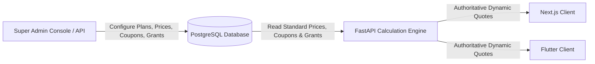

# Ozhzo Verse — Dynamic Configuration Guide (DYNAMIC_CONFIGURATION.md)

**Baseline Version**: 3.0.0  
**Directive**: Strict Separation of Code, Standard Pricing, Coupons, Campaigns, and Direct Grants.

> [!NOTE]
> **Development Environment Notice**:  
> All values listed below represent **Initial Development Seed Values** for testing and environment validation. They are strictly provisional and are not permanent Ozhzo Verse official pricing decisions.

---

## 1. Overview
All system parameters that represent business assumptions, standard published list prices, coupon rules, promotional campaigns, direct grants, member quotas, and regional tariffs are treated as **dynamic runtime data** rather than static application code.

---

## 2. Dynamic Configuration Catalog

| Configuration Category | Storage Entity | Configurable Properties | Initial Development Seed Value |
|---|---|---|---|
| **Subscription Plans** | `subscription_plans` | Code, Name, Max Members, Introductory Days, Introductory Price, Allowed Status | `OZHZO_HOME` (365d Intro Free) |
| **Standard / List Prices** | `subscription_prices` | Country, Region, Currency, Billing Period, `list_price`, `additional_member_list_price`, Version | US: $20/yr, IN: ₹1,799/yr, AE: AED 99/yr, GB: £16/yr |
| **Coupons** | `coupons` | Code, Type (`FREE_PERIOD`, `PERCENTAGE`, `FIXED`), Value, Unit, Eligibility, Geographic Bounds, Limits | `WELCOME6` (6m Free), `SAVE50` (50% OFF) |
| **Campaigns** | `campaigns` | Code, Name, Budget Limit, Max Redemptions, Geographic Bounds, Start/End Dates | `KERALA_LAUNCH` |
| **Direct Grants** | `subscription_grants` | Grant Type (`FREE_PERIOD`), Target Home/User, Duration Value/Unit, Reason | Direct early adopter grants |
| **Feature Entitlements** | `subscription_features`, `subscription_plan_features` | Feature Code, Enabled Status, Entitlement Quota Limit | `INVENTORY`, `SHOPPING`, `TASKS`, `BILLS`, `CALENDAR` |
| **Household Membership Quotas** | `subscription_plans.maximum_members` | Max members allowed per home workspace | 10 members (modifiable up to unlimited) |

---

## 3. Immutability & Audit Trail
Every update to a pricing, coupon, campaign, or direct grant record triggers an append-only entry in `subscription_audit_logs` storing:
- `performed_by` (Super Admin User UUID)
- `entity_type` (`PLAN`, `PRICE`, `COUPON`, `CAMPAIGN`, `DIRECT_GRANT`, `FEATURE`, `SUBSCRIPTION`)
- `entity_id` (Target UUID)
- `old_values` (JSON snapshot of prior configuration)
- `new_values` (JSON snapshot of new configuration)
- `reason` (Business justification)
- `created_at` (UTC timestamp)
