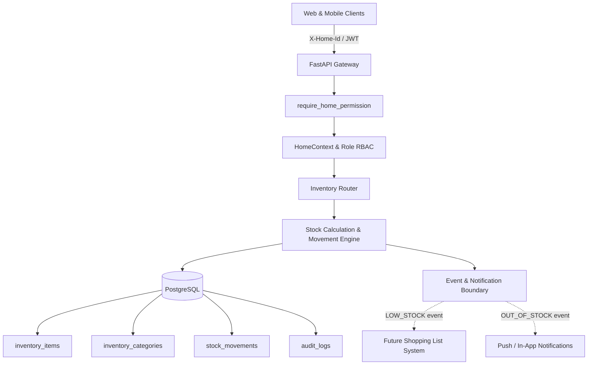

# Ozhzo Verse — Phase 3A: Inventory & Pantry Architecture

## 1. Architectural Philosophy
In Ozhzo Verse, the Inventory module is not a standalone spreadsheet or simple CRUD list. It is the central sensory layer of the household operating system:

```
┌─────────────────────────────────────────────────────────────────────────┐
│                       THE OZHZO HOUSEHOLD LOOP                          │
│                                                                         │
│  ┌──────────────────┐       ┌──────────────────┐       ┌─────────────┐  │
│  │ KNOW WHAT WE HAVE│ ───►  │  KNOW WHAT IS    │ ───►  │KNOW WHAT WE │  │
│  │  (Current Stock) │       │   RUNNING LOW    │       │    NEED     │  │
│  └──────────────────┘       │  (Min Threshold) │       │(Restock Target │
│          ▲                  └──────────────────┘       └──────┬──────┘  │
│          │                                                    │         │
│          │                                                    ▼         │
│  ┌───────┴──────────┐       ┌──────────────────┐       ┌──────┴──────┐  │
│  │   UPDATE HOME    │ ◄───  │     RESTOCK      │ ◄───  │    SHOP     │  │
│  │    INVENTORY     │       │ (Pantry/Shelves) │       │(Shopping List) │
│  └──────────────────┘       └──────────────────┘       └─────────────┘  │
└─────────────────────────────────────────────────────────────────────────┘
```

---

## 2. Core Entity Hierarchy

```
HOME (Tenant Domain)
 └── INVENTORY (Household Pantry & Essentials)
      └── CATEGORY (Configurable: Pantry, Fridge, Cleaning, Medicine, etc.)
           └── ITEM (Name, Unit, Min Threshold, Preferred Quantity)
                └── STOCK MOVEMENTS (ADD, CONSUME, ADJUST, PURCHASE, WASTE, RETURN)
```

### Key Structural Invariants:
1. **Strict Home Boundary**: An inventory item belongs to exactly one `Home`. No item or stock data is shared across Homes without an explicit future Connected Home sharing agreement.
2. **Immutable Stock Audit Trail**: Every stock change creates a discrete `stock_movements` record, ensuring historical traceability, consumption trend analysis, and prevention of unexplained quantity drift.
3. **Derived Deterministic Status**: Stock status (`GOOD`, `LOW_STOCK`, `OUT_OF_STOCK`, `EXPIRED`) is derived deterministically from quantities, thresholds, and expiry dates, rather than being manually set by users.

---

## 3. High-Level Component Interactions



---

## 4. Multi-Home Topology & Independence
- A user belonging to multiple Homes (e.g. Primary Residence vs. Vacation Home) experiences completely separate inventories.
- Modifying stock in Home A has zero effect on Home B.
- Roles and permissions are evaluated independently per Home (`HOME_ADMIN` vs `MEMBER`).
