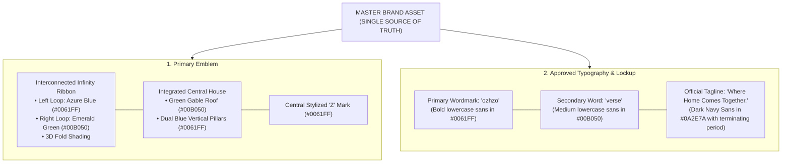

# Ozhzo Verse — Master Brand Asset Single Source of Truth (MASTER_BRAND_REFERENCE.md)

**Document Version**: 1.0.0  
**Status**: APPROVED MASTER VISUAL IDENTITY (SINGLE SOURCE OF TRUTH)  
**Effective Date**: 2026-08-14  
**Directives**: This uploaded master artwork is the **absolute, immutable single source of truth** for the Ozhzo Verse visual identity. No recreation, reinterpretation, redrawing, or geometric modification is permitted under any circumstances. All logo, favicon, PWA, and app icon assets across Web and Mobile derive directly and strictly from this master artwork.

---

## 1. Master Visual Standard & Anatomy

---

## 2. Definitive Color Reference (Extracted from Master Artwork)

| Brand Token | Hex Code | RGB | HSL | Function / Placement in Master Artwork |
|---|:---:|:---:|:---:|---|
| **`brand.primary`** | `#0061FF` | `rgb(0, 97, 255)` | `hsl(217, 100%, 50%)` | Left infinity loop, pillars, central "Z" mark, and primary "ozhzo" wordmark |
| **`brand.secondary`** | `#00B050` | `rgb(0, 176, 80)` | `hsl(147, 100%, 35%)` | Right infinity loop, gable roof, and secondary "verse" wordmark |
| **`brand.dark`** | `#0A2E7A` | `rgb(10, 46, 122)` | `hsl(221, 85%, 26%)` | Tagline text, 3D ribbon fold shadow, and dark container surfaces |
| **`brand.light`** | `#FFFFFF` | `rgb(255, 255, 255)`| `hsl(0, 0%, 100%)` | Canvas background and dark mode "Z" mark |
| **`brand.background`**| `#F8FAFC` | `rgb(248, 250, 252)`| `hsl(210, 40%, 98%)` | Application light canvas background |

---

## 3. Strict Derivation Rules

1. **Favicon & Application Icons**:
   - Derived exclusively from the central **House + Z** emblem (with wordmark and tagline omitted for clarity).
   - Light containers use the white squircle (`#FFFFFF`).
   - Dark containers use the dark navy squircle (`#0A2E7A`).
2. **Web & Mobile Headers**:
   - Use the full primary horizontal lockup with emblem, "ozhzo", "verse", and "Where Home Comes Together.".
3. **AppBars & Compact UI**:
   - Use the standalone House + Z emblem mark at minimum $24\text{px}$.

---

## 4. Master Asset Location Directory

- **Web Master Assets**: [`/apps/web/public/brand/`](file:///Users/vivek/ozHzo/ozhzo%20verse/apps/web/public/brand/)
- **Mobile Master Assets**: [`/apps/mobile/assets/brand/`](file:///Users/vivek/ozHzo/ozhzo%20verse/apps/mobile/assets/brand/)
- **Master Guidelines**: [`/docs/BRAND_GUIDELINES.md`](file:///Users/vivek/ozHzo/ozhzo%20verse/docs/BRAND_GUIDELINES.md)
- **Validation Report**: [`/docs/BRAND_ASSET_VALIDATION.md`](file:///Users/vivek/ozHzo/ozhzo%20verse/docs/BRAND_ASSET_VALIDATION.md)
- **Integration Report**: [`/docs/BRAND_INTEGRATION_REPORT.md`](file:///Users/vivek/ozHzo/ozhzo%20verse/docs/BRAND_INTEGRATION_REPORT.md)
- **Quality Audit Report**: [`/docs/BRAND_QA_REPORT.md`](file:///Users/vivek/ozHzo/ozhzo%20verse/docs/BRAND_QA_REPORT.md)
