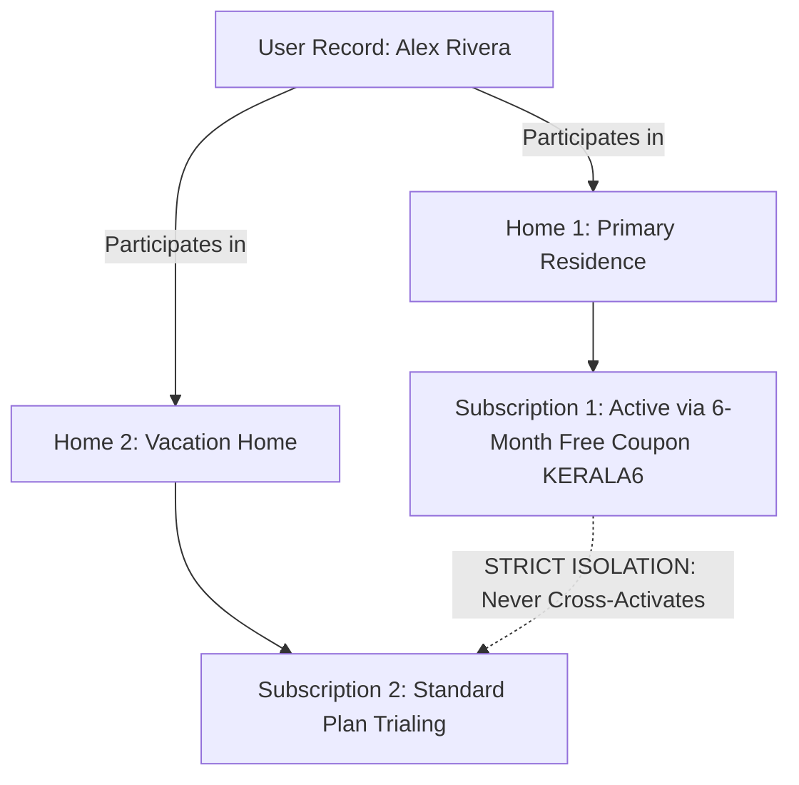

# Ozhzo Verse — Multi-Home Subscription & Coupon Isolation (MULTI_HOME_SUBSCRIPTIONS.md)

**Document Version**: 1.0.0  
**Baseline Standard**: Independent Multi-Tenant Subscription Governance  

---

## 1. Multi-Home Subscription Isolation

In Ozhzo Verse, subscriptions, coupons, and direct grants are strictly scoped to individual `Home` entities (`home_id`):

1. **Independent Entitlements**: Applying a coupon (or direct grant) to Home 1 activates benefits exclusively for Home 1. Home 2 remains on its own independent subscription terms.
2. **Cross-Home Protection**: A coupon redeemed in Home A cannot be used to activate or subsidize seats in Home B unless explicitly permitted by per-home redemption quotas.
