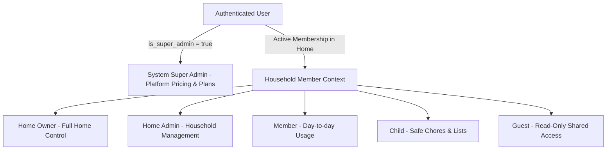

# Permission Model & RBAC Matrix — Ozhzo Verse

## 1. Architectural Strategy: System & Home-Scoped Roles

Ozhzo Verse enforces two distinct authorization dimensions:
1. **System-Level Roles (`SUPER_ADMIN`)**: Governs platform-wide commercial configuration, subscription plans, pricing versions, currencies, regional tariffs, and feature entitlements.
2. **Household-Scoped Roles (`OWNER`, `ADMIN`, `MEMBER`, `CHILD`, `GUEST`)**: Governs operations strictly within a specific `home_id`.

---

## 2. System-Level Roles: `SUPER_ADMIN`, `PLATFORM_ADMIN`, `SUPPORT_ADMIN`, `ANALYST`

System-level authorization is validated at the platform level (via `UserModel.is_super_admin` and `UserModel.system_role`).

### System Admin Capabilities:
- `admin:users:search`, `admin:users:view`, `admin:users:suspend`, `admin:users:reactivate`
- `admin:homes:search`, `admin:homes:view`, `admin:homes:suspend`, `admin:homes:reactivate`
- `admin:plans:create`, `admin:plans:edit`, `admin:plans:activate`, `admin:plans:deactivate`
- `admin:prices:create`, `admin:prices:version`, `admin:prices:schedule`
- `admin:promotions:create`, `admin:promotions:edit`, `admin:promotions:schedule`
- `admin:features:create`, `admin:features:configure`
- `admin:system:config`, `admin:system:analytics`
- `admin:audit:view`

> [!IMPORTANT]
> Household users (including Home `OWNER` and `ADMIN`) **cannot** perform system administrative actions. Requests from non-super-admins to `/api/v1/admin/*` are strictly rejected with `HTTP 403 Forbidden`.

---

## 3. Household-Scoped Granular Permissions

Permissions are structured as `<domain_resource>:<action>`:

| Domain | Permissions |
|---|---|
| **Home / Settings** | `home:view`, `home:edit`, `home:delete`, `home:transfer_owner` |
| **Members** | `members:view`, `members:invite`, `members:edit`, `members:remove` |
| **Inventory** | `inventory:view`, `inventory:create`, `inventory:edit`, `inventory:delete` |
| **Shopping Lists** | `shopping:view`, `shopping:create`, `shopping:edit`, `shopping:check`, `shopping:delete` |
| **Tasks & Chores** | `tasks:view`, `tasks:create`, `tasks:edit`, `tasks:assign`, `tasks:complete`, `tasks:delete` |
| **Bills & Finance** | `bills:view`, `bills:create`, `bills:edit`, `bills:pay`, `bills:delete` |
| **Calendar** | `calendar:view`, `calendar:create`, `calendar:edit`, `calendar:rsvp`, `calendar:delete` |
| **Dashboard** | `dashboard:view` |
| **Subscriptions** | `subscription:view`, `subscription:manage` |

---

## 4. Comprehensive RBAC Matrix

| Permission Key | SUPER_ADMIN (System) | OWNER (Home) | ADMIN (Home) | MEMBER (Home) | CHILD (Home) | GUEST (Home) |
| :--- | :---: | :---: | :---: | :---: | :---: | :---: |
| **`admin:users:*`** | ✅ | ❌ | ❌ | ❌ | ❌ | ❌ |
| **`admin:homes:*`** | ✅ | ❌ | ❌ | ❌ | ❌ | ❌ |
| **`admin:plans:*`** | ✅ | ❌ | ❌ | ❌ | ❌ | ❌ |
| **`admin:prices:*`** | ✅ | ❌ | ❌ | ❌ | ❌ | ❌ |
| **`admin:promotions:*`** | ✅ | ❌ | ❌ | ❌ | ❌ | ❌ |
| **`admin:system:*`** | ✅ | ❌ | ❌ | ❌ | ❌ | ❌ |
| **`admin:features:*`**| ✅ | ❌ | ❌ | ❌ | ❌ | ❌ |
| **`home:view`** | ✅ | ✅ | ✅ | ✅ | ✅ | ✅ |
| **`home:edit`** |  |  |  | ❌ | ❌ | ❌ |
| **`home:delete`** |  |  | ❌ | ❌ | ❌ | ❌ |
| **`home:transfer_owner`**| |  | ❌ | ❌ | ❌ | ❌ |
| **`members:view`** |  |  |  |  |  |  |
| **`members:invite`** |  |  |  | ❌ | ❌ | ❌ |
| **`members:edit`** |  |  |  | ❌ | ❌ | ❌ |
| **`members:remove`** |  |  |  (Non-owners) | ❌ | ❌ | ❌ |
| **`inventory:view`** |  |  |  |  | ❌ | ❌ |
| **`inventory:create`**|  |  |  |  | ❌ | ❌ |
| **`inventory:edit`** |  |  |  |  | ❌ | ❌ |
| **`inventory:delete`**|  |  |  | ❌ | ❌ | ❌ |
| **`shopping:view`** |  |  |  |  |  |  |
| **`shopping:create`** |  |  |  |  | ❌ | ❌ |
| **`shopping:check`** |  |  |  |  |  |  |
| **`tasks:view`** |  |  |  |  |  |  |
| **`tasks:create`** |  |  |  |  | ❌ | ❌ |
| **`tasks:complete`** |  |  |  |  |  |  |
| **`bills:view`** |  |  |  |  | ❌ (Hidden) | ❌ (Hidden) |
| **`bills:pay`** |  |  |  |  | ❌ | ❌ |
| **`bills:delete`** |  |  |  | ❌ | ❌ | ❌ |
| **`calendar:view`** |  |  |  |  |  |  |
| **`calendar:rsvp`** |  |  |  |  |  |  |
| **`subscription:view`**| |  |  | ❌ | ❌ | ❌ |
| **`subscription:manage`**||  | ❌ | ❌ | ❌ | ❌ |
