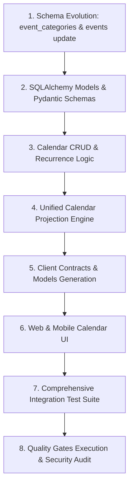

# Ozhzo Verse — Phase 6: Implementation Plan

## 1. Step-by-Step Implementation Sequence

---

## 2. Detailed Steps Breakdown

1. **Step 1: Database Migration**:
   - Add `event_categories` table in `database/schema.sql`.
   - Update `events` table with `category_id`, `recurrence_type`, `recurrence_interval_days`, `parent_recurring_event_id`, `status`, `reminder_minutes_before`, `version`, `deleted_at`.
   - Add indexes for fast date-range lookups.

2. **Step 2: SQLAlchemy Models & Pydantic Schemas**:
   - Update `EventCategoryModel`, `EventModel`, `EventParticipantModel` in `src/infrastructure/database/models.py`.
   - Implement `EventDTO`, `CreateEventRequest`, `UpdateEventRequest`, `EventCategoryDTO`, `TimelineItemDTO`, `CalendarProjectionResponse` in `src/schemas/calendar.py`.

3. **Step 3: Calendar Service & API Router**:
   - Refactor `src/api/v1/calendar.py` with full CRUD, optimistic locking, and participant membership validation.
   - Implement recurring event generation.

4. **Step 4: Calendar Projection Engine**:
   - Implement `GET /api/v1/homes/{home_id}/calendar/projection` to dynamically combine Events, Tasks, and Bills in chronological order.

5. **Step 5: Client Contracts**:
   - Update TypeScript contracts in `packages/types/src/generated/api_models.ts`.
   - Update Dart contracts in `apps/mobile/lib/generated/api_models.dart`.

6. **Step 6: UI Enhancements**:
   - Web Calendar View in `apps/web/app/(dashboard)/calendar/page.tsx` with Agenda, Month View, and Unified Projection.
   - Mobile synchronization.

7. **Step 7: Automated Tests**:
   - Comprehensive pytest suite in `services/api/tests/test_phase6_calendar.py` covering all 22 test vectors.

8. **Step 8: Quality Gates & Audit**:
   - Execute all 4 quality gates (`generate_contracts.sh`, `test.sh`, `lint.sh`, `build.sh`).
   - Publish `/docs/PHASE6_CALENDAR_SECURITY_GATE.md` and `/docs/PHASE6_IMPLEMENTATION_REPORT.md`.
