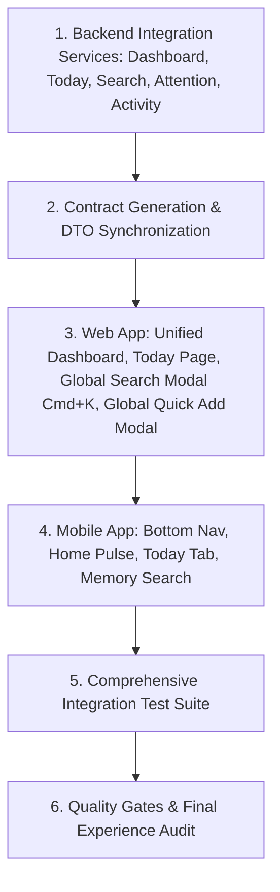

# Ozhzo Verse — Phase 7: MVP Integration Implementation Plan

## 1. Step-by-Step Implementation Sequence

---

## 2. Detailed Work Breakdown

1. **Step 1: Backend Endpoints Implementation**:
   - `GET /api/v1/homes/{home_id}/dashboard`: Coordinated aggregation of greeting, attention items, today timeline, health metrics, and activity.
   - `GET /api/v1/homes/{home_id}/today`: Unified daily agenda combining events, chores, bills, and high-priority shopping items.
   - `GET /api/v1/homes/{home_id}/search`: Multi-domain Home Memory search across inventory, assets, locations, tasks, bills, events, and members.
   - `GET /api/v1/homes/{home_id}/attention`: Severity-ranked attention alerts (`CRITICAL`, `HIGH`, `NORMAL`, `INFO`).
   - `GET /api/v1/homes/{home_id}/activity`: Human-readable activity feed from stock moves, task completions, payments, and loans.
2. **Step 2: Contracts & Client SDKs**:
   - Generate TypeScript contracts in `packages/types/src/generated/api_models.ts`.
   - Generate Dart models in `apps/mobile/lib/generated/api_models.dart`.
3. **Step 3: Web Experience Enhancements**:
   - Refactor `apps/web/app/(dashboard)/page.tsx` with full Attention Banner, Today Pulse, Quick Add Bar, Health KPIs, and Activity Feed.
   - Build Global Search Modal (`Cmd+K`) with instant keyboard navigation.
   - Build Global Quick Add Modal.
4. **Step 4: Integration Verification & Tests**:
   - Implement `services/api/tests/test_phase7_integration.py`.
   - Run all 4 quality gates (`generate_contracts.sh`, `test.sh`, `lint.sh`, `build.sh`).
5. **Step 5: Audit & Delivery**:
   - Create `/docs/PHASE7_SECURITY_EXPERIENCE_GATE.md` and `/docs/PHASE7_IMPLEMENTATION_REPORT.md`.
