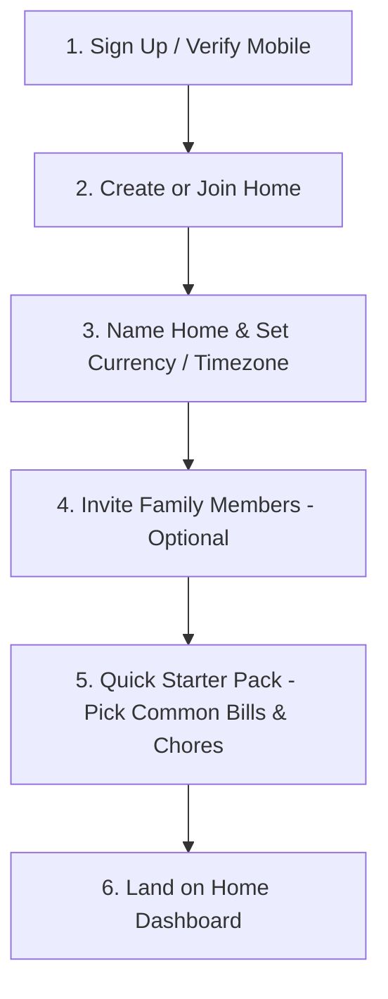

# Ozhzo Verse — Phase 7: Progressive Household Onboarding Specification

## 1. Onboarding Principles
- **Time-to-Value in < 60 Seconds**: A new user must reach an active, functioning home workspace in under a minute.
- **Progressive Disclosure**: Never force the user to fill out exhaustive inventory forms during signup.
- **Template Acceleration**: Allow users to bootstrap their home using global common templates (Pantry, Bills, Chores).

---

## 2. Step-by-Step User Journey

1. **Step 1: Sign Up**: Quick registration with Email, Name, and Password.
2. **Step 2: Create / Join Home**: User names their workspace (e.g. *"Madhavan Home"*), selects currency (`INR`, `USD`, `AED`), and timezone (`Asia/Kolkata`).
3. **Step 3: Family Invitations**: Simple prompt to invite spouse, parents, or roommates via email with default role `MEMBER`.
4. **Step 4: Starter Pack (One-Click Seeding)**:
   - Select common bills: `[✔] Electricity`, `[✔] High-Speed Internet`, `[✔] Water`.
   - Select common chores: `[✔] Clean Water Filter`, `[✔] Service AC`.
   - Select pantry staples: `[✔] Milk`, `[✔] Rice`, `[✔] Cooking Oil`.
5. **Step 5: Dashboard Reveal**: User lands on their populated dashboard with clear, actionable items.
