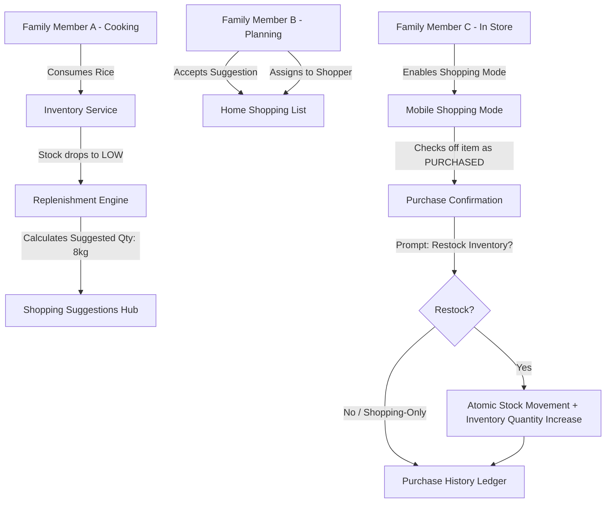

# Ozhzo Verse — Phase 3B: Shopping & Auto-Replenishment Architecture

## 1. Architectural Philosophy & The Household Operating Loop
In Ozhzo Verse, Shopping is not an isolated personal checklist. It is the execution arm of the household operating loop that connects inventory depletion to physical restocking:

```
┌─────────────────────────────────────────────────────────────────────────┐
│                    THE OZHZO HOUSEHOLD REPLENISHMENT LOOP               │
│                                                                         │
│  ┌──────────────────────┐       ┌──────────────────────┐                │
│  │    HOME INVENTORY    │ ───►  │     STOCK LEVEL      │                │
│  │  (Current On-Hand)   │       │  (Depletion Triggers)│                │
│  └──────────────────────┘       └──────────┬───────────┘                │
│             ▲                              │                            │
│             │                              ▼                            │
│  ┌──────────┴───────────┐       ┌──────────────────────┐                │
│  │    STOCK UPDATED     │       │ LOW / OUT OF STOCK   │                │
│  │  (Deterministic Calc)│       │  (Threshold Breach)  │                │
│  └──────────────────────┘       └──────────┬───────────┘                │
│             ▲                              │                            │
│             │                              ▼                            │
│  ┌──────────┴───────────┐       ┌──────────────────────┐                │
│  │  INVENTORY RESTOCK   │       │SUGGESTED REPLENISHMENT│               │
│  │(stock_movements:PURCH│       │(Preferred - Current) │                │
│  └──────────────────────┘       └──────────┬───────────┘                │
│             ▲                              │                            │
│             │                              ▼                            │
│  ┌──────────┴───────────┐       ┌──────────────────────┐                │
│  │       PURCHASE       │ ◄───  │  HOME SHOPPING LIST  │                │
│  │ (Confirm Restock Qty)│       │ (Collaborative Board)│                │
│  └──────────────────────┘       └──────────────────────┘                │
└─────────────────────────────────────────────────────────────────────────┘
```

---

## 2. Core Architectural Principles

1. **Home-Level Tenant Ownership**: The Home owns the shopping list. Every member of the household contributes to and shops from the same shared list.
2. **Authoritative Replenishment Intelligence**:
   - Backend derives suggested purchase quantities from inventory settings:
     $$\text{Suggested Replenishment} = \text{Preferred Quantity} - \text{Current Quantity}$$
   - Fallback (when preferred is undefined):
     $$\text{Suggested Replenishment} = \max\left(1, (\text{Min Threshold} \times 2) - \text{Current Quantity}\right)$$
3. **Explicit User Gatekeeping**: Low-stock triggers **never** automatically purchase items or inject unapproved items into the cart. They generate structured suggestions that family members can review and add with a single tap.
4. **Two-Way Inventory Synchronization**:
   - Purchasing an item linked to `inventory_item_id` prompts: *"Add purchased quantity to Home inventory?"*
   - When confirmed, an atomic transaction:
     - Updates `inventory_items.quantity`
     - Recalculates deterministic stock status (`GOOD`)
     - Logs an immutable `stock_movements` record of type `PURCHASE`
     - Appends an immutable `purchase_records` entry.
5. **Decoupled Shopping-Only Items**: Items like birthday gifts, hardware parts, or one-off event party snacks can exist purely as shopping items with `inventory_item_id = NULL`.
6. **Optimistic Concurrency Protection**: Multi-member simultaneous shopping is guarded by item versioning, preventing duplicate checkout or inventory over-crediting.

---

## 3. High-Level Component Interactions



---

## 4. Multi-Home Independence & RBAC
- Shopping lists and purchase histories are strictly scoped by `home_id`.
- Roles:
  - `shopping:view`: All active home members (`HOME_ADMIN`, `MEMBER`, `CHILD`, `GUEST`).
  - `shopping:create`: `HOME_ADMIN`, `MEMBER`, `CHILD`.
  - `shopping:edit`, `shopping:check`, `shopping:purchase`: `HOME_ADMIN`, `MEMBER`.
  - `shopping:delete`: `HOME_ADMIN`, `MEMBER`.
