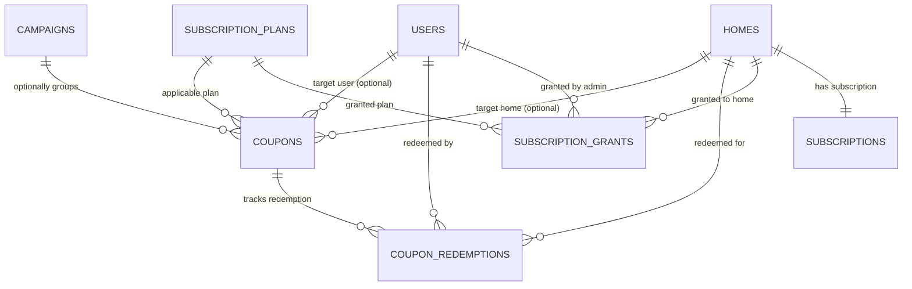

# Ozhzo Verse — Dynamic Subscription & Pricing Architecture (SUBSCRIPTION_PRICING.md)

**Document Version**: 3.0.0 (Standard Price + Coupons & Direct Grants Baseline)  
**Core Commercial Formula**:  
$$\text{STANDARD / LIST PRICE} - \text{COUPON / DISCOUNT / PROMOTION} = \text{EFFECTIVE CUSTOMER PRICE}$$  
**Source of Truth**: PostgreSQL Normalized Pricing & Coupon Entities (`subscription_plans`, `subscription_prices`, `campaigns`, `coupons`, `coupon_redemptions`, `subscription_grants`, `subscriptions`, `subscription_audit_logs`).  

> [!IMPORTANT]
> **Initial Development Seed Pricing Notice**:  
> All monetary values in seed configurations, demonstrations, and test environments (e.g. US $20 List $\rightarrow$ $10 Effective, India ₹1,799 List $\rightarrow$ ₹899.50 Effective, UAE AED 99 List $\rightarrow$ AED 49.50 Effective, UK £16 List $\rightarrow$ £8 Effective) are strictly **Initial Development Seed Pricing** for local validation. They do **not** represent permanent or official Ozhzo Verse commercial business decisions. All standard prices, promotional campaigns, coupons, free periods, and direct grants are fully data-driven and configurable by `SUPER_ADMIN` at runtime without code changes.

---

## 1. Core Architectural Principles

1. **100% Data-Driven Commercial Rules**:
   - The application business logic and client frontends **never** assume static numbers, currency symbols, fixed user limits, or hardcoded free durations.
   - All standard list prices, promotional discount percentages/amounts, free periods (1m, 3m, 6m, 1y), and seat allocations are dynamically loaded from database records.
2. **Coupons as First-Class Entities**:
   - Coupons exist independently of marketing campaigns.
   - Campaigns optionally group multiple coupons for regional distribution and budget tracking.
3. **Direct Super Admin Grants**:
   - Super Admins can grant direct subscription benefits (`FREE_PERIOD`, `PERCENTAGE_DISCOUNT`, `FIXED_DISCOUNT`, `EXTENDED_TRIAL`) to any user or home without requiring a coupon code.
4. **Authoritative Calculation & Entitlement Engine**:
   - The centralized backend calculation service `/api/v1/subscription/calculate` computes standard list totals, coupon benefits, and payable amounts authoritatively.
5. **Anti-Stacking & Double-Benefit Protections**:
   - By default, multiple discount coupons cannot be stacked.
   - Pre-paid admin invitations prevent duplicate seat charges for invited recipients.

---

## 2. Relational Schema Architecture

---

## 3. Super Admin & Client API Endpoints

### 3.1. Client & Household Endpoints
- `GET /api/v1/subscription/plans`: List active plans and regional prices.
- `GET /api/v1/subscription/pricing/current`: Get current standard price and active offers.
- `POST /api/v1/subscription/calculate`: Authoritative calculation engine (evaluates coupons, free periods, promotions, and seat scaling).
- `POST /api/v1/subscription/redeem`: Authoritatively redeem coupon upon checkout confirmation.
- `GET /api/v1/subscriptions/homes/{home_id}`: Home subscription overview, trial status, and seat breakdown.
- `POST /api/v1/subscriptions/homes/{home_id}/seats`: Allocate paid member seats for the home workspace (`OWNER` only).

### 3.2. Super Admin Endpoints (`/api/v1/admin/*`)
- `POST /api/v1/admin/coupons`: Create coupon (percentage, fixed, free period).
- `PATCH /api/v1/admin/coupons/{id}`: Modify status, dates, limits, eligibility, or geographic rules.
- `GET /api/v1/admin/coupons`: List/search coupons with redemption statistics.
- `GET /api/v1/admin/coupons/{id}/redemptions`: View redemption audit logs.
- `POST /api/v1/admin/campaigns`: Create campaign grouping multiple coupons.
- `GET /api/v1/admin/campaigns`: List campaigns and budget metrics.
- `POST /api/v1/admin/grants`: Direct Super Admin subscription grant.
- `GET /api/v1/admin/grants`: List all active and historical direct grants.
- `POST /api/v1/admin/grants/{id}/revoke`: Revoke an active direct grant.
- `GET /api/v1/admin/coupons/analytics`: Overview metrics (Total, Active, Redeemed, Free Users Generated, Conversion Rate).
