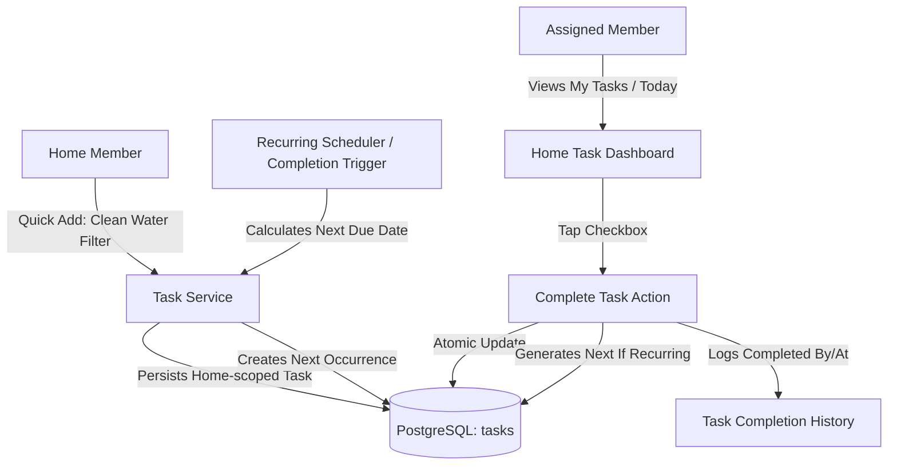

# Ozhzo Verse — Phase 4: Tasks & Household Responsibilities Architecture

## 1. Architectural Philosophy & The Core Home Loop
In Ozhzo Verse, the Tasks module is designed specifically as the household coordination engine answering **"WHAT NEEDS TO BE DONE FOR OUR HOME?"**.

It is strictly **household-focused**, eliminating corporate complexity (sprints, story points, epics, kanban WIP limits) in favor of fast, reliable, collaborative household management.

```
┌─────────────────────────────────────────────────────────────────────────┐
│                       THE OZHZO DIGITAL HOME OS                         │
│                                                                         │
│  1. WHAT DO WE HAVE?        ──►  Inventory & Durable Assets             │
│  2. WHERE IS IT?            ──►  Hierarchical Location Memory           │
│  3. WHO HAS IT?             ──►  Asset Lending & Custody Ledger         │
│  4. WHAT DO WE NEED?        ──►  Home Purchase List                     │
│  5. WHAT NEEDS TO BE DONE?  ──►  Tasks & Household Responsibilities     │
│  6. WHO IS RESPONSIBLE?     ──►  Assigned Home Member (Optional)        │
│  7. WHEN IS IT DUE?         ──►  Due Date & Recurrence Schedule         │
└─────────────────────────────────────────────────────────────────────────┘
```

---

## 2. Core Architectural Pillars

1. **Home-Level Tenant Ownership**:
   - Every task belongs to the `Home` tenant, not individual users.
   - The creator (`created_by`) is logged for audit purposes, but the entire household shares visibility.
2. **Decoupled Creator vs. Assignee**:
   - Any member with `tasks:create` can add a task (e.g. *Vivek adds "Service AC"*).
   - Assignment (`assigned_to`) is completely optional. Unassigned tasks appear on the shared Home Board.
3. **Frictionless Quick Add**:
   - The primary creation interface requires **only the Task Title** (e.g. *Clean water filter*).
   - Priority defaults to `NORMAL`. Due date, recurrence, assignee, and category can be added immediately or configured later.
4. **Deterministic Time-Window Derivation**:
   - Time states (`OVERDUE`, `DUE_TODAY`, `UPCOMING`, `NO_DUE_DATE`) are derived dynamically server-side and client-side based on `due_date` vs. `current_date`, avoiding conflicting database status strings.
5. **Reliable Household Recurrence Engine**:
   - Supports fixed schedule intervals (e.g. *every 7 days*, *every 30 days*, *every 6 months*).
   - Completing a recurring task atomically generates the next occurrence based on the configured recurrence strategy:
     - **Scheduled Date Base**: For calendar obligations (e.g. rent/fees due on the 1st of each month).
     - **Completion Date Base**: For physical maintenance rhythms (e.g. clean filter every 30 days after it was actually cleaned).
6. **Immutable Task Completion History**:
   - When a task is completed, it captures `completed_by` and `completed_at`.
   - Completed tasks remain permanently searchable in the Home Task History to provide a complete maintenance audit trail.
7. **Multi-Home Isolation & RBAC**:
   - Tasks are strictly partitioned by `home_id`.
   - Cross-home access attempts are rejected with `403 Forbidden`.

---

## 3. High-Level System Architecture


