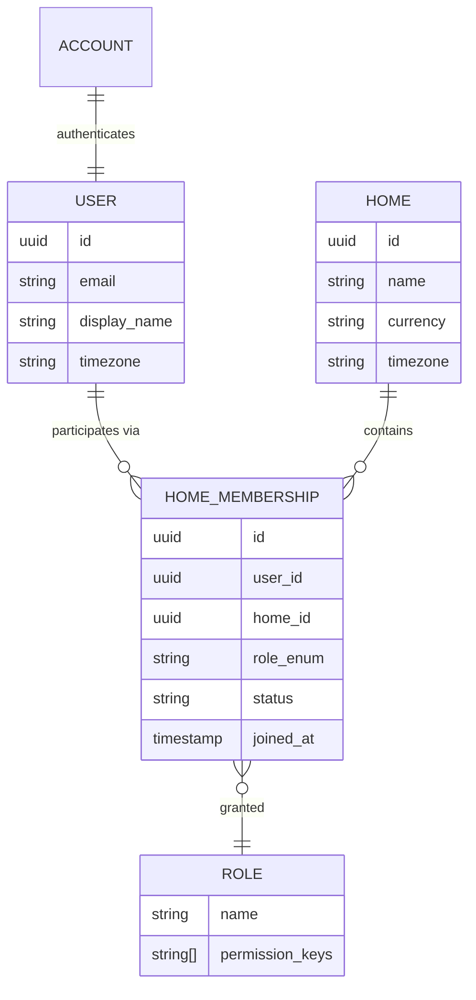

# User Roles & Member Lifecycle Model — Ozhzo Verse

*Document Classification: Definitive Source of Truth*  
*Target Audience: Backend Engineers, Product Architects, Security Auditors, UI/UX Designers*

---

## 0. Two Distinct Authorization Levels: System-Level vs. Home-Level

Ozhzo Verse strictly distinguishes between **System-Level Governance** and **Home-Level Multi-Tenant Roles**:

| Scope | Role Type | Roles | Boundary & Capabilities |
|---|---|---|---|
| **System Level** | Platform Administration | `SUPER_ADMIN`, `PLATFORM_ADMIN`, `SUPPORT_ADMIN`, `ANALYST` | Controls Ozhzo Verse platform, dynamic standard pricing, promotional campaigns, user/home suspension, global feature flags, and platform audit trail. Enforced via `/api/v1/admin/*` routes. |
| **Home Level** | Household Multi-Tenancy | `OWNER`, `HOME_ADMIN`, `MEMBER`, `CHILD`, `GUEST` | Controls a specific household workspace (tasks, shopping, inventory, bills, calendar). Enforced via `/api/v1/homes/{home_id}/*` routes. |

> [!CRITICAL]
> **Strict Non-Inheritance Guarantee**:  
> A `HOME_ADMIN` or `OWNER` of a household **never** inherits `SUPER_ADMIN` rights. Household roles **never** grant access to `/admin/*` endpoints (`HTTP 403 Forbidden`). A user can simultaneously be a `SUPER_ADMIN` at system level and a `MEMBER` in a specific home.

---

## 1. Conceptual Distinction: User vs. Home vs. Membership vs. Role

To prevent architectural confusion, Ozhzo Verse establishes a strict separation between Identity, Workspace, Relational Association, and Authorization Capabilities:

```
┌─────────────────────────────────────────────────────────────────────────────┐
│                            THE 4-LAYER DOMAIN MODEL                         │
├─────────────────┬─────────────────┬───────────────────┬─────────────────────┤
│ 1. USER         │ 2. HOME         │ 3. MEMBERSHIP     │ 4. ROLE             │
│ The universal   │ The independent │ The specific link │ The permissions set │
│ human identity  │ household root  │ binding a User to │ governing what that │
│ (email, name,   │ workspace       │ a specific Home   │ User can do within  │
│ credentials).   │ (data tenant).  │ context.          │ that Home.          │
└─────────────────┴─────────────────┴───────────────────┴─────────────────────┘
```



### Detailed Distinctions:

1. **User (`User`)**:
   - Represents a real-world human being across the entire Ozhzo Verse platform.
   - Holds personal identity (email, password hash, avatar, timezone, personal notification settings).
   - Exists independently of any specific Home. If a user leaves all homes, their user account remains valid.

2. **Home (`Home`)**:
   - The primary multi-tenant root entity representing a physical or digital household.
   - Holds household-level operational data (inventory, shopping lists, chores, bills, calendar).
   - Has its own metadata: name, default currency, address, and subscription status.

3. **Home Membership (`HomeMembership`)**:
   - The relational join entity that connects exactly **one User** to **one Home**.
   - Contains contextual metadata: `joined_at`, `status` (`ACTIVE`, `SUSPENDED`, `INVITED`), and the assigned `role`.

4. **Role (`Role`)**:
   - A defined authorization persona that grants a specific set of granular capabilities within a single Home context.
   - Roles are **never global**; a user's role is evaluated dynamically based on the currently active `home_id`.

---

## 2. Multi-Home Architecture

A single `User` can participate in multiple `Homes` simultaneously with completely independent roles in each:

```
┌─────────────────────────────────────────────────────────────────────────────┐
│                   MULTI-HOME IDENTITY & ROLE RESOLUTION                     │
├─────────────────────────────────────────────────────────────────────────────┤
│                                                                             │
│                            ┌───────────────────┐                            │
│                            │    USER RECORD    │                            │
│                            │   "Alex Rivera"   │                            │
│                            │  (user_id: 1001)  │                            │
│                            └─────────┬─────────┘                            │
│                                      │                                      │
│             ┌────────────────────────┼────────────────────────┐             │
│             ▼                        ▼                        ▼             │
│   ┌───────────────────┐    ┌───────────────────┐    ┌───────────────────┐   │
│   │  HOME MEMBERSHIP  │    │  HOME MEMBERSHIP  │    │  HOME MEMBERSHIP  │   │
│   │   "Rivera Home"   │    │  "Mountain Cabin" │    │  "Parental Home"  │   │
│   ├───────────────────┤    ├───────────────────┤    ├───────────────────┤   │
│   │ Role: OWNER       │    │ Role: HOME ADMIN  │    │ Role: ADULT MEMBER│   │
│   │ Full billing &    │    │ Operational mgmt, │    │ Assists with      │   │
│   │ workspace custody │    │ chore delegation  │    │ chores & shopping │   │
│   └───────────────────┘    └───────────────────┘    └───────────────────┘   │
│                                                                             │
└─────────────────────────────────────────────────────────────────────────────┘
```

---

## 3. Detailed Role Definitions

Ozhzo Verse defines 5 distinct roles within a Home workspace:

```
                  ┌───────────────────────────────┐
                  │          HOME OWNER           │
                  │   (Legal Custody & Billing)   │
                  └───────────────┬───────────────┘
                                  │
                  ┌───────────────▼───────────────┐
                  │          HOME ADMIN           │
                  │ (Household Co-Head & Manager) │
                  └───────────────┬───────────────┘
                                  │
                  ┌───────────────▼───────────────┐
                  │         ADULT MEMBER          │
                  │  (Standard Resident / Roomie) │
                  └───────────────┬───────────────┘
                                  │
                  ┌───────────────┴───────────────┐
                  │                               │
   ┌──────────────▼──────────────┐ ┌──────────────▼──────────────┐
   │            CHILD            │ │            GUEST            │
   │  (Supervised Chore Member)  │ │ (Temporary Visitor / Helper)│
   └─────────────────────────────┘ └─────────────────────────────┘
```

---

### Role 1: `HOME OWNER` (Primary Household Creator)
The individual who established the Home workspace or holds primary legal and financial custody.

- **Capabilities**:
  - Full, unrestricted access to all 13 modules.
  - Manage subscription plans, payment methods, and billing details.
  - Transfer Home Ownership to another verified Admin.
  - Delete or archive the entire Home workspace.
  - Promote/demote any member up to `Home Admin`.
- **Restrictions**:
  - Exactly one active Owner per Home at any given time.
  - Cannot leave the Home without transferring ownership or deleting the workspace.
- **Permissions**: `*` (All permissions).
- **Visibility**: 100% visibility across all household data, audit logs, financials, and member records.
- **Data Access**: Full Read / Write / Delete on all tables.
- **Invitation Rights**: Can invite all roles (`Admin`, `Adult Member`, `Child`, `Guest`).
- **Modification Rights**: Can edit all home settings, records, tasks, bills, and user roles.
- **Removal Rights**: Can remove or suspend any member (`Admin`, `Adult Member`, `Child`, `Guest`).

---

### Role 2: `HOME ADMIN` (Household Co-Head / Manager)
Spouses, partners, co-parents, or trusted flatshare managers who actively run daily operations.

- **Capabilities**:
  - Full operational control over daily pillars: Inventory, Shopping, Tasks, Bills, Calendar.
  - Invite new family members and assign roles up to `Home Admin`.
  - Edit home configuration (Name, Address, Timezone, Currency).
  - Assign chores to any household member.
  - Mark bills as paid and manage recurring payment schedules.
- **Restrictions**:
  - Cannot delete or archive the Home.
  - Cannot modify the Owner's role or remove the Owner.
  - Cannot access or modify the Owner's subscription billing payment methods.
  - Cannot transfer home ownership.
- **Permissions**: `home:view`, `home:edit`, `members:*` (except owner edit), `inventory:*`, `shopping:*`, `tasks:*`, `bills:*`, `calendar:*`, `dashboard:view`, `subscription:view`.
- **Visibility**: Full visibility across all operational modules, member lists, and household bills.
- **Data Access**: Full Read / Write / Delete on all operational domain tables.
- **Invitation Rights**: Can invite `Home Admin`, `Adult Member`, `Child`, `Guest`.
- **Modification Rights**: Can edit all operational records and member roles (except Owner).
- **Removal Rights**: Can remove `Adult Member`, `Child`, `Guest`, or other `Home Admin` members.

---

### Role 3: `ADULT MEMBER` (Standard Resident / Roommate)
Standard adult family members, spouses, adult children, or roommates living in the home.

- **Capabilities**:
  - Create, view, edit, and complete household tasks and chores.
  - Create and edit shopping lists; check off items in real time.
  - Add, adjust, and monitor inventory items; receive low-stock alerts.
  - View shared family calendar and schedule events.
  - View household bills and record bill payment settlements.
- **Restrictions**:
  - Cannot invite new members or manage roles.
  - Cannot modify core home settings (Name, Currency, Timezone).
  - Cannot delete inventory categories or permanently delete bills.
  - Cannot view or manage subscription billing.
- **Permissions**: `home:view`, `members:view`, `inventory:view`, `inventory:create`, `inventory:edit`, `shopping:*` (except list deletion), `tasks:view`, `tasks:create`, `tasks:edit`, `tasks:complete`, `bills:view`, `bills:pay`, `calendar:*`, `dashboard:view`.
- **Visibility**: Full visibility into daily operations, shared schedule, and household bills.
- **Data Access**: Read / Write on operational items; Delete restricted to items they created.
- **Invitation Rights**: None.
- **Modification Rights**: Can edit daily operational items (chores, groceries, inventory counts).
- **Removal Rights**: None (Can only choose to voluntarily leave the home).

---

### Role 4: `CHILD` (Supervised / Teen Family Member)
Children, teenagers, or young family members participating in household chores.

- **Capabilities**:
  - View tasks specifically assigned to them (or unassigned "anyone" chores).
  - Mark their assigned tasks as completed (advancing chore streaks).
  - View the shared family shopping list and check off items while shopping with family.
  - View public family calendar events (birthdays, school events).
- **Restrictions**:
  - **Financial Privacy**: Cannot view the Bills & Reminders module under any circumstances.
  - Cannot view or edit inventory thresholds or cost data.
  - Cannot delete tasks, shopping lists, or calendar events.
  - Cannot invite members or view contact details of other members.
- **Permissions**: `home:view` (limited), `members:view` (names/avatars only), `tasks:view` (assigned only), `tasks:complete` (assigned only), `shopping:view`, `shopping:check`, `calendar:view` (public events), `dashboard:view` (child filtered).
- **Visibility**: Filtered dashboard showing only their personal chore checklist, the family shopping list, and family events.
- **Data Access**: Read-only on shared lists; Write restricted strictly to updating completion state on assigned tasks.
- **Invitation Rights**: None.
- **Modification Rights**: Can only toggle completion status on assigned tasks and shopping items.
- **Removal Rights**: None.

---

### Role 5: `GUEST` (Temporary Visitor / Helper / Sitter)
Houseguests, temporary visitors, babysitters, pet sitters, or cleaning helpers.

- **Capabilities**:
  - View guest-specific tasks assigned to them (e.g. "Feed the dog at 5 PM", "Water plants").
  - View a designated "Guest Shopping List" (if shared by Admin).
  - View general house calendar events relevant to their stay.
- **Restrictions**:
  - Ephemeral access (can be time-bounded by Admin).
  - Zero access to household bills, financial ledgers, or subscription data.
  - Zero access to full member contact lists.
  - Cannot create recurring chores or modify home settings.
- **Permissions**: `home:view` (minimal), `tasks:view` (assigned only), `tasks:complete` (assigned only), `shopping:view` (shared lists only), `calendar:view` (public events only).
- **Visibility**: Strictly scoped to guest-facing assignments.
- **Data Access**: Read-only access to explicitly assigned items.
- **Invitation Rights**: None.
- **Modification Rights**: Can only complete assigned guest tasks.
- **Removal Rights**: None.

---

## 4. Comprehensive Role Permission Matrix

| Granular Permission Key | OWNER | HOME ADMIN | ADULT MEMBER | CHILD | GUEST |
| :--- | :---: | :---: | :---: | :---: | :---: |
| **`home:view`** |  |  |  |  (Filtered) |  (Filtered) |
| **`home:edit`** |  |  | ❌ | ❌ | ❌ |
| **`home:delete`** |  | ❌ | ❌ | ❌ | ❌ |
| **`home:transfer_owner`** |  | ❌ | ❌ | ❌ | ❌ |
| **`members:view`** |  |  |  |  (Names only) | ❌ |
| **`members:invite`** |  |  | ❌ | ❌ | ❌ |
| **`members:edit_role`** |  |  (Non-Owner) | ❌ | ❌ | ❌ |
| **`members:remove`** |  |  (Non-Owner) | ❌ | ❌ | ❌ |
| **`inventory:view`** |  |  |  | ❌ | ❌ |
| **`inventory:create`** |  |  |  | ❌ | ❌ |
| **`inventory:edit`** |  |  |  | ❌ | ❌ |
| **`inventory:delete`** |  |  | ❌ | ❌ | ❌ |
| **`shopping:view`** |  |  |  |  |  (Shared) |
| **`shopping:create`** |  |  |  | ❌ | ❌ |
| **`shopping:check`** |  |  |  |  |  (Shared) |
| **`shopping:delete`** |  |  | ❌ | ❌ | ❌ |
| **`tasks:view_all`** |  |  |  | ❌ | ❌ |
| **`tasks:view_assigned`**|  |  |  |  |  |
| **`tasks:create`** |  |  |  | ❌ | ❌ |
| **`tasks:assign`** |  |  |  | ❌ | ❌ |
| **`tasks:complete`** |  |  |  |  (Assigned) |  (Assigned) |
| **`tasks:delete`** |  |  | ❌ | ❌ | ❌ |
| **`bills:view`** |  |  |  | ❌ | ❌ |
| **`bills:create`** |  |  | ❌ | ❌ | ❌ |
| **`bills:pay`** |  |  |  | ❌ | ❌ |
| **`bills:delete`** |  |  | ❌ | ❌ | ❌ |
| **`calendar:view`** |  |  |  |  (Public) |  (Public) |
| **`calendar:create`** |  |  |  | ❌ | ❌ |
| **`calendar:delete`** |  |  | ❌ | ❌ | ❌ |
| **`subscription:view`** |  |  | ❌ | ❌ | ❌ |
| **`subscription:manage`**|  | ❌ | ❌ | ❌ | ❌ |
