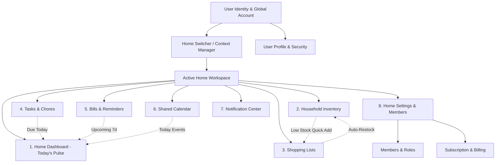

# UX & Information Architecture Specification — Ozhzo Verse

*Document Classification: Definitive Source of Truth*  
*Target Audience: UX/UI Designers, Frontend Engineers, Mobile Engineers, QA Architects*

---

## 1. Information Architecture (IA)

Ozhzo Verse is structured around a **Home-Centric Information Architecture**. All domain workspaces branch out from the currently active `Home`:



---

## 2. Global Navigation Paradigm

1. **Context-Aware Header / App Bar**:
   - Displays the **Home Switcher** (Active Home Name, Avatar, Active Role Badge).
   - Global **Quick Action FAB / Button** (`+` trigger for fast chore, grocery, or bill creation).
   - **Notification Bell** with unread count badge.
   - **User Profile Avatar** triggering account settings.
2. **Instant Home Switching**:
   - Tapping the Home Switcher opens a lightweight modal/sheet listing all homes with 1-tap switching and a "+ Create New Home" trigger.
3. **Role-Adaptive Interface**:
   - Navigation adapts dynamically based on role: `CHILD` and `GUEST` roles do not see `Bills`, `Settings`, or `Subscription` navigation links.

---

## 3. Mobile Navigation Architecture (Flutter)

Mobile uses a **5-Tab Bottom Navigation Bar** optimized for high-frequency one-handed thumb interaction, supplemented by an adaptive App Bar.

```
┌─────────────────────────────────────────────────────────────┐
│ [🏡 Rivera Home ▾]                   [🔔 (2)] [👤 Alex]     │  <-- Top App Bar
├─────────────────────────────────────────────────────────────┤
│                                                             │
│                                                             │
│                      ACTIVE TAB CANVAS                      │
│                                                             │
│                                                             │
├─────────────────────────────────────────────────────────────┤
│   [🏠 Home]   [🛒 Shop]   [📋 Tasks]   [📦 Pantry]   [☰ More]│  <-- Bottom Nav
└─────────────────────────────────────────────────────────────┘
```

- **Tab 1: Dashboard (`🏠 Home`)**: Daily pulse, overdue chores, upcoming bills, today's schedule.
- **Tab 2: Shopping (`🛒 Shop`)**: Interactive grocery checklists with tactile check buttons.
- **Tab 3: Tasks (`📋 Tasks`)**: Household chore board, personal assignments, streak tracker.
- **Tab 4: Inventory (`📦 Pantry`)**: Categorized food/supply stock with status badges.
- **Tab 5: More (`☰ More`)**: Bills & Reminders, Shared Calendar, Members & Roles, Home Settings.

---

## 4. Web Navigation Architecture (Next.js)

Web uses a **Collapsible Desktop Sidebar** with persistent top breadcrumbs and responsive drawer on tablet/mobile viewport.

```
┌──────────────┬──────────────────────────────────────────────────────────────┐
│ OZHZO VERSE  │ Home / Dashboard                      [🔔 (2)] [👤 Alex]    │
│ 🏡 Rivera    │                                                              │
├──────────────┼──────────────────────────────────────────────────────────────┤
│ 📊 Dashboard │                                                              │
│ 📦 Inventory │                                                              │
│ 🛒 Shopping  │                                                              │
│ 📋 Chores    │                      MAIN CONTENT CANVAS                     │
│ 💳 Bills     │                                                              │
│ 📅 Calendar  │                                                              │
├──────────────┤                                                              │
│ ⚙️ Settings  │                                                              │
│ 👥 Members   │                                                              │
│ 💎 Premium   │                                                              │
└──────────────┴──────────────────────────────────────────────────────────────┘
```

---

## 5. Core Operational Workflows

### 5.1. Onboarding Workflow
```
[ Register / Login ] ──► [ Choose Path: Create Home vs Join via Invite ]
                             │
                             ├─► [ Create Home ] ──► [ Name, Currency, Timezone ] ──► [ Invite Members ] ──► [ Dashboard ]
                             │
                             └─► [ Join Home ] ──► [ Enter / Validate Token ] ──► [ Accept & Enter ] ──► [ Dashboard ]
```

### 5.2. Home Dashboard Workflow
- **Load Pulse**: Pulls aggregated chores, low stock items, upcoming bills, and today's schedule.
- **Direct Action**: Tapping any card performs inline action (e.g. complete chore directly from dashboard) or deep-links to module.

### 5.3. Inventory $\leftrightarrow$ Shopping Restock Loop
```
[ Pantry: Low Milk ] ──► [ Tap "+ Add to Shopping List" ] ──► [ Appears in Weekly Groceries ]
                                                                      │
[ Inventory: Stock Restored to 2L ] ◄── [ Tap "Update Inventory?" ] ◄─┴── [ Shopper Checks Item at Supermarket ]
```

### 5.4. Task & Chore Management Workflow
- Create chore $\rightarrow$ Select recurrence $\rightarrow$ Assign to member $\rightarrow$ Push alert sent $\rightarrow$ Member taps checkmark $\rightarrow$ Streak increments $\rightarrow$ Next recurrence instance generated.

### 5.5. Bill Payment Workflow
- Log utility bill $\rightarrow$ Automatic reminder at T-3 days $\rightarrow$ Assigned payer settles bill in bank $\rightarrow$ Taps "Mark Paid" and logs receipt note $\rightarrow$ Bill archives and advances cycle.

### 5.6. Calendar Workflow
- View monthly/weekly view $\rightarrow$ Schedule family maintenance/event $\rightarrow$ Family members RSVP $\rightarrow$ Surfaces on day-of dashboard.

---

## 6. Complete Screen Inventory & Specifications

---

### 6.1. Authentication & Onboarding

#### `SCR-AUTH-01`: Welcome & Sign In
- **Purpose**: Authenticate returning users with email and password.
- **Entry Points**: App launch, logout redirect, session expiry.
- **Exit Points**: `SCR-DASH-01` (Success), `SCR-AUTH-02` (Register), `SCR-AUTH-03` (Forgot Password).
- **Components**: Brand Logo, Email Input, Password Input with Show/Hide toggle, "Sign In" CTA, "Forgot Password?" link, "Create Account" secondary button.
- **Actions**: Submit credentials, toggle password visibility, navigate to register/reset.
- **Permissions**: Public.
- **States**: Default, Loading (Spinner on CTA), Error (Invalid credentials alert).
- **Errors**: "Invalid email or password", "Too many attempts. Try again in 15 minutes."
- **Responsive Behaviour**: Centered card (max 420px) on Web desktop; full-height fluid layout on Mobile.

---

#### `SCR-AUTH-02`: User Registration
- **Purpose**: Onboard new users to Ozhzo Verse.
- **Entry Points**: `SCR-AUTH-01` "Create Account" CTA, direct invite deep-link.
- **Exit Points**: `SCR-ONBD-01` (New user fork), `SCR-AUTH-01` (Sign In).
- **Components**: Full Name Input, Email Input, Password Input with strength meter, Terms Checkbox, "Create Account" CTA.
- **Actions**: Validate inputs, submit registration form.
- **Permissions**: Public.
- **States**: Default, Loading, Field-level validation errors.
- **Errors**: "Email already registered", "Password must be at least 8 characters with 1 number and 1 symbol."
- **Responsive Behaviour**: Centered card on Web; full-height on Mobile.

---

#### `SCR-AUTH-03`: Forgot / Reset Password
- **Purpose**: Request and execute password recovery.
- **Entry Points**: `SCR-AUTH-01` link or email deep-link with reset token.
- **Exit Points**: `SCR-AUTH-01` (after successful reset).
- **Components**: Email Request Form / New Password Reset Form with confirmation input.
- **Actions**: Request reset email, submit new password.
- **Permissions**: Public.
- **States**: Request Form, Sent Confirmation Screen, Reset Password Form, Success State.
- **Errors**: "Reset link expired or invalid."
- **Responsive Behaviour**: Centered card (max 420px).

---

#### `SCR-ONBD-01`: Onboarding Fork (Create vs. Join Home)
- **Purpose**: Guide newly registered users to create their first home or join an existing one.
- **Entry Points**: First login after registration.
- **Exit Points**: `SCR-ONBD-02` (Create Home), `SCR-ONBD-03` (Join Home).
- **Components**: Welcome Illustration, "Create a New Home" Action Card, "Join with Invite Code" Action Card.
- **Actions**: Select onboarding path.
- **Permissions**: Authenticated.
- **States**: Default two-card selection.
- **Errors**: None.
- **Responsive Behaviour**: Side-by-side cards on Web desktop; vertical stacked cards on Mobile.

---

#### `SCR-ONBD-02`: Create Home Wizard
- **Purpose**: Configure a new household workspace.
- **Entry Points**: `SCR-ONBD-01`, Home Switcher "+ Create New Home".
- **Exit Points**: `SCR-DASH-01` (Success).
- **Components**: Home Name Input, Currency Selector, Timezone Dropdown, Optional Address, "Initialize Home" CTA.
- **Actions**: Submit home configuration.
- **Permissions**: Authenticated (Free tier: max 1 home).
- **States**: Default, Loading, Tier limit reached error.
- **Errors**: "You have reached the maximum number of homes for the Free tier. Upgrade to Premium."
- **Responsive Behaviour**: Centered wizard modal.

---

#### `SCR-ONBD-03`: Accept Home Invitation
- **Purpose**: Preview home details and accept an invitation to join.
- **Entry Points**: Deep link (`/invite?token=...`).
- **Exit Points**: `SCR-DASH-01` (Success).
- **Components**: Home Banner & Avatar, Inviter Name, Assigned Role Badge, "Join Home" CTA, "Decline" button.
- **Actions**: Accept invite, decline invite.
- **Permissions**: Authenticated.
- **States**: Preview State, Accepting (Loading), Expired/Invalid Token Error.
- **Errors**: "This invitation has expired or has already been used."
- **Responsive Behaviour**: Centered confirmation modal.

---

### 6.2. Home Dashboard & Notifications

#### `SCR-DASH-01`: Home Dashboard (Daily Pulse Hub)
- **Purpose**: Provide a single-screen morning overview of chores, low stock items, bills, and schedule.
- **Entry Points**: Default post-login landing screen, Tab 1 on Mobile, Sidebar "Dashboard" on Web.
- **Exit Points**: Deep links to Inventory, Shopping, Tasks, Bills, Calendar.
- **Components**:
  - Greeting Header with Home Avatar & Date.
  - "Chores Due Today" Quick Carousel / Checklist.
  - "Low Stock & Expiring Items" Warning Card.
  - "Upcoming Bills (Next 7 Days)" Financial Card (hidden for Child/Guest).
  - "Today's Schedule" Calendar Widget.
  - "Recent Household Activity" Live Stream.
- **Actions**: 1-tap chore completion, 1-tap grocery add, navigate to modules.
- **Permissions**: `dashboard:view` (Role-filtered).
- **States**: Default (Filled), Loading (Shimmer cards), Empty ("All caught up!").
- **Errors**: "Unable to load dashboard. Pull down to refresh."
- **Responsive Behaviour**: 3-column responsive grid on Web; single scrollable column on Mobile.

---

#### `SCR-NOTIF-01`: Notification Center
- **Purpose**: Review and triage domestic notifications, assignments, and reminders.
- **Entry Points**: Top bar Bell icon.
- **Exit Points**: Deep-linked module items, return to previous screen.
- **Components**: Notification List, Category Filters (All, Chores, Bills, Pantry), "Mark All as Read" CTA.
- **Actions**: Tap to open item, mark read, clear notifications.
- **Permissions**: Authenticated.
- **States**: Populated List, Loading, Empty ("You're all caught up!").
- **Errors**: "Failed to load notifications."
- **Responsive Behaviour**: Slide-over drawer on Web; full-screen view on Mobile.

---

### 6.3. Household Inventory

#### `SCR-INV-01`: Inventory Hub
- **Purpose**: Track all household supplies, pantry, fridge, and medicine items.
- **Entry Points**: Tab 4 on Mobile, Sidebar "Inventory" on Web.
- **Exit Points**: `SCR-INV-02` (Add/Edit), `SCR-SHOP-01` (Shopping).
- **Components**:
  - Category Filter Pills (All, Pantry, Fridge, Freezer, Cleaning, Medicine).
  - Status Filter Chips (All, Low Stock, Expiring Soon).
  - Search Bar.
  - Inventory Item Cards with Inline `+` / `-` Quantity Controls & Status Badges.
  - Floating Action Button "+ Add Item".
- **Actions**: Adjust stock, filter categories, 1-tap add to shopping list.
- **Permissions**: `inventory:view` (`OWNER`, `ADMIN`, `MEMBER`).
- **States**: Populated Grid/List, Empty ("No items in this category"), Loading.
- **Errors**: "Failed to update quantity."
- **Responsive Behaviour**: Multi-column responsive card grid on Web; single-column list on Mobile.

---

#### `SCR-INV-02`: Add / Edit Inventory Item Modal
- **Purpose**: Create or modify an inventory item's metadata and thresholds.
- **Entry Points**: `SCR-INV-01` "+ Add Item" CTA or item card click.
- **Exit Points**: Return to `SCR-INV-01`.
- **Components**: Item Name Input, Category Dropdown, Quantity & Unit Stepper, Min Threshold Stepper, Expiry Date Picker, "Save Item" CTA, "Delete Item" (Edit mode).
- **Actions**: Validate and save item, delete item.
- **Permissions**: `inventory:create`, `inventory:edit` (`OWNER`, `ADMIN`, `MEMBER`).
- **States**: New Item Form, Edit Item Form, Saving.
- **Errors**: "Item name required", "Quantity must be positive."
- **Responsive Behaviour**: Centered modal dialog on Web; bottom modal sheet on Mobile.

---

### 6.4. Shopping Lists

#### `SCR-SHOP-01`: Shopping Lists Overview & Interactive Checklist
- **Purpose**: Provide real-time collaborative grocery checklists for store trips.
- **Entry Points**: Tab 2 on Mobile, Sidebar "Shopping" on Web.
- **Exit Points**: `SCR-SHOP-02` (Add Item), `SCR-SHOP-03` (Manage Lists).
- **Components**:
  - List Selector Dropdown ("Weekly Groceries", "Hardware").
  - Quick Add Input Bar ("Add milk, bread, eggs...").
  - Active Unchecked Item List with large tactile checkboxes.
  - Checked / Completed Items Accordion with "Clear Checked" action.
  - Real-time Sync Indicator ("Live with 2 shoppers").
- **Actions**: Check/uncheck item, quick-add item, prompt inventory restock, clear completed.
- **Permissions**: `shopping:view`, `shopping:check` (All roles).
- **States**: Active Checklist, Loading, Empty ("Your shopping list is clear!").
- **Errors**: "Connection lost. Reconnecting to live sync..."
- **Responsive Behaviour**: Split-view with list management on Web; streamlined single-list view on Mobile.

---

#### `SCR-SHOP-02`: Add / Edit Shopping Item Modal
- **Purpose**: Add detailed items with specific quantities, store aisles, or notes.
- **Entry Points**: `SCR-SHOP-01` detail trigger.
- **Exit Points**: Return to `SCR-SHOP-01`.
- **Components**: Item Name, Quantity & Unit, Aisle Category Dropdown, Link to Inventory Item Toggle, "Save" CTA.
- **Actions**: Save shopping item.
- **Permissions**: `shopping:create`, `shopping:edit` (`OWNER`, `ADMIN`, `MEMBER`).
- **States**: Default Form.
- **Errors**: "Item name required."
- **Responsive Behaviour**: Bottom sheet on Mobile; modal on Web.

---

### 6.5. Tasks & Chores

#### `SCR-TASK-01`: Task & Chore Board
- **Purpose**: Organize household chores, recurring responsibilities, and assignees.
- **Entry Points**: Tab 3 on Mobile, Sidebar "Chores" on Web.
- **Exit Points**: `SCR-TASK-02` (Create/Edit Chore), `SCR-TASK-03` (My Chores / Streaks).
- **Components**:
  - Filter Tabs: "All Chores", "My Chores", "Up for Grabs", "Done Today".
  - Chore Cards with Priority Badges (`LOW`, `MED`, `HIGH`, `URGENT`), Due Date Countdown, Assignee Avatar.
  - 1-Tap Completion Checkbox with spring micro-animation.
  - Floating Action Button "+ New Chore".
- **Actions**: Complete chore, assign chore, filter tasks.
- **Permissions**: `tasks:view` (Role-filtered).
- **States**: Populated Board, Empty ("No chores due!"), Loading.
- **Errors**: "Failed to complete chore."
- **Responsive Behaviour**: Kanban column or list toggle on Web; vertical swipeable list on Mobile.

---

#### `SCR-TASK-02`: Create / Edit Task Modal
- **Purpose**: Define a new chore with due dates, assignees, and recurrence schedules.
- **Entry Points**: `SCR-TASK-01` "+ New Chore" CTA.
- **Exit Points**: Return to `SCR-TASK-01`.
- **Components**: Title Input, Description Textarea, Priority Selector, Assignee Dropdown (Family members + "Up for Grabs"), Due Date & Time Picker, Recurrence Selector (None, Daily, Weekly, Monthly), "Create Chore" CTA.
- **Actions**: Validate and create chore.
- **Permissions**: `tasks:create`, `tasks:edit` (`OWNER`, `ADMIN`, `MEMBER`).
- **States**: Create Mode, Edit Mode, Saving.
- **Errors**: "Title is required", "Due date must be valid."
- **Responsive Behaviour**: Modal on Web; bottom sheet on Mobile.

---

#### `SCR-TASK-03`: My Chores & Streak View
- **Purpose**: Personal chore focus screen for family members and teenagers tracking streaks.
- **Entry Points**: Filter tab on `SCR-TASK-01` or Profile.
- **Exit Points**: Return to `SCR-TASK-01`.
- **Components**: Personal Chore Checklist, Active Streak Counter ("🔥 7 Day Streak!"), Weekly Completion Progress Ring.
- **Actions**: Check off personal chores.
- **Permissions**: All roles.
- **States**: Active Chores, All Chores Done Celebration State.
- **Errors**: None.
- **Responsive Behaviour**: Responsive card on Web; full tab on Mobile.

---

### 6.6. Bills & Reminders

#### `SCR-BILL-01`: Bills & Reminders Ledger
- **Purpose**: Track household utility, rent, and subscription bills and avoid missed due dates.
- **Entry Points**: Sidebar "Bills" on Web, `SCR-DASH-01` Bills card, Tab 5 "More $\rightarrow$ Bills" on Mobile.
- **Exit Points**: `SCR-BILL-02` (Add Bill), `SCR-BILL-03` (Record Payment).
- **Components**:
  - Summary Header: Total Unpaid This Month, Next Due Bill Countdown.
  - Status Filter Tabs: "Upcoming", "Paid", "Overdue".
  - Bill Rows with Title, Category Icon, Amount & Currency, Due Date Badge, Assigned Payer Avatar, "Mark Paid" CTA.
  - "+ Add Bill" Button.
- **Actions**: Mark bill paid, edit bill, view historical payment receipts.
- **Permissions**: `bills:view` (`OWNER`, `ADMIN`, `MEMBER` only; hidden from Child/Guest).
- **States**: Populated Ledger, Empty ("No bills logged"), Loading.
- **Errors**: "Failed to load bills ledger."
- **Responsive Behaviour**: Data table on Web; structured card list on Mobile.

---

#### `SCR-BILL-02`: Add / Edit Bill Modal
- **Purpose**: Register a new recurring or one-time utility bill.
- **Entry Points**: `SCR-BILL-01` "+ Add Bill" CTA.
- **Exit Points**: Return to `SCR-BILL-01`.
- **Components**: Title Input, Category Dropdown (Electricity, Water, Internet, Rent, Subscriptions), Amount Input, Currency, Due Date Picker, Recurrence Interval Dropdown, Default Payer Dropdown, "Save Bill" CTA.
- **Actions**: Validate and store bill record.
- **Permissions**: `bills:create`, `bills:edit` (`OWNER`, `ADMIN`).
- **States**: Default Form, Saving.
- **Errors**: "Amount must be greater than 0."
- **Responsive Behaviour**: Modal dialog on Web; bottom sheet on Mobile.

---

#### `SCR-BILL-03`: Record Payment Settlement Dialog
- **Purpose**: Log that a bill was paid and advance recurring schedules.
- **Entry Points**: `SCR-BILL-01` "Mark Paid" CTA.
- **Exit Points**: Return to `SCR-BILL-01`.
- **Components**: Amount Paid Input, Paid By Member Selector, Payment Date Picker, Reference Notes (Transaction ID/Receipt Note), "Confirm Payment" CTA.
- **Actions**: Submit settlement record.
- **Permissions**: `bills:pay` (`OWNER`, `ADMIN`, `MEMBER`).
- **States**: Default Dialog.
- **Errors**: "Payment amount required."
- **Responsive Behaviour**: Compact confirmation modal.

---

### 6.7. Shared Calendar

#### `SCR-CAL-01`: Shared Household Calendar
- **Purpose**: Unified schedule for family events, appointments, and maintenance.
- **Entry Points**: Sidebar "Calendar" on Web, Tab 5 "More $\rightarrow$ Calendar" on Mobile.
- **Exit Points**: `SCR-CAL-02` (Schedule Event), `SCR-CAL-03` (Event Details).
- **Components**: Month / Week View Toggle, Calendar Grid with Event Chips & Chore Indicators, Day Agenda Drawer, "+ Schedule Event" CTA.
- **Actions**: Switch month/week, click day to view events, RSVP to events.
- **Permissions**: `calendar:view` (All roles).
- **States**: Populated Calendar, Loading, Empty Day.
- **Errors**: "Failed to load calendar events."
- **Responsive Behaviour**: Full interactive month grid on Web; 2-week strip with vertical day agenda on Mobile.

---

#### `SCR-CAL-02`: Schedule Event Modal
- **Purpose**: Create a new shared family event or appointment.
- **Entry Points**: `SCR-CAL-01` "+ Schedule Event" CTA.
- **Exit Points**: Return to `SCR-CAL-01`.
- **Components**: Title Input, Category Dropdown (Family, Maintenance, Social), Start Time & End Time Pickers, All-Day Toggle, Location/Notes Textarea, "Save Event" CTA.
- **Actions**: Validate and create calendar event.
- **Permissions**: `calendar:create` (`OWNER`, `ADMIN`, `MEMBER`).
- **States**: Default Form.
- **Errors**: "End time cannot be before start time."
- **Responsive Behaviour**: Modal on Web; bottom sheet on Mobile.

---

### 6.8. Settings, Members & Subscriptions

#### `SCR-SETT-01`: Home Settings & Profile
- **Purpose**: Manage home configuration, address, currency, and general workspace properties.
- **Entry Points**: Sidebar "Settings" on Web, Tab 5 "More $\rightarrow$ Settings" on Mobile.
- **Exit Points**: `SCR-MEMB-01` (Members), `SCR-SUB-01` (Subscription), Delete Home Confirmation.
- **Components**: Home Name Input, Avatar Upload Button, Currency Selector, Timezone Selector, Address Textarea, "Save Settings" CTA, "Danger Zone" (Delete Home).
- **Actions**: Update settings, trigger home deletion.
- **Permissions**: `home:edit` (`OWNER`, `ADMIN`).
- **States**: Populated Settings, Saving.
- **Errors**: "Failed to update home settings."
- **Responsive Behaviour**: Single-column settings layout.

---

#### `SCR-MEMB-01`: Household Members & Roles Roster
- **Purpose**: View member roster, manage roles, and remove members.
- **Entry Points**: `SCR-SETT-01`, Sidebar "Members" on Web.
- **Exit Points**: `SCR-MEMB-02` (Invite Member).
- **Components**: Member List with Display Names, Avatars, Role Badges, Role Selector Dropdowns (for Admins), "Remove Member" action, "+ Invite Member" CTA.
- **Actions**: Change member role, remove member, open invite dialog.
- **Permissions**: `members:view`, `members:edit` (`OWNER`, `ADMIN`).
- **States**: Member List, Pending Invites List.
- **Errors**: "Cannot remove the Home Owner."
- **Responsive Behaviour**: Data list with inline actions on Web; card list on Mobile.

---

#### `SCR-MEMB-02`: Invite Member Dialog
- **Purpose**: Dispatch invitations via shareable link or email.
- **Entry Points**: `SCR-MEMB-01` "+ Invite Member" CTA.
- **Exit Points**: Return to `SCR-MEMB-01`.
- **Components**: Role Selection Radio Group (`HOME ADMIN`, `ADULT MEMBER`, `CHILD`, `GUEST`), Recipient Email Input, "Copy Shareable Link" Button, "Send Invite Email" CTA.
- **Actions**: Generate invite link, copy to clipboard, dispatch email.
- **Permissions**: `members:invite` (`OWNER`, `ADMIN`).
- **States**: Default Form, Link Generated, Member limit reached error.
- **Errors**: "Home member limit reached. Upgrade to Premium to invite more family members."
- **Responsive Behaviour**: Centered modal dialog.

---

#### `SCR-PROF-01`: User Profile & Security Settings
- **Purpose**: Manage personal user profile, password, and notification preferences.
- **Entry Points**: Header User Avatar.
- **Exit Points**: Return to previous screen, Logout.
- **Components**: Avatar Upload, Display Name Input, Contact Phone, Timezone Selector, Change Password Form, Notification Toggles (Push, Email), "Sign Out" CTA.
- **Actions**: Update profile, change password, logout.
- **Permissions**: Authenticated.
- **States**: Populated Profile, Saving.
- **Errors**: "Current password incorrect."
- **Responsive Behaviour**: Centered settings card.

---

#### `SCR-SUB-01`: Subscription & Tier Billing Hub
- **Purpose**: View subscription tier, check usage limits, and execute upgrades.
- **Entry Points**: Sidebar "Premium" on Web, `SCR-SETT-01` "Billing" tab.
- **Exit Points**: Stripe Checkout redirect, return to Settings.
- **Components**: Current Tier Card (Free / Premium), Member & Item Usage Progress Bars, Plan Comparison Table, "Upgrade to Premium" CTA, Billing Portal Link (for existing Premium).
- **Actions**: Initiate Stripe checkout, manage invoice settings.
- **Permissions**: `subscription:view` (`OWNER`, `ADMIN`), `subscription:manage` (`OWNER` only).
- **States**: Free Tier Active, Premium Active, Processing Checkout.
- **Errors**: "Payment failed. Please update payment method."
- **Responsive Behaviour**: Pricing comparison cards on Web; vertical stacked cards on Mobile.
